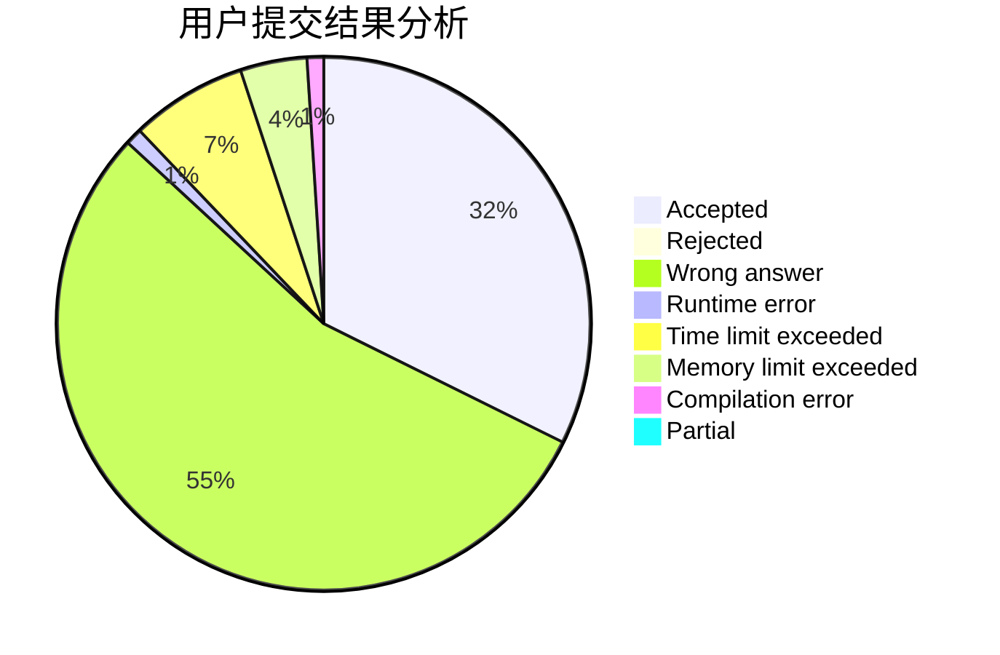
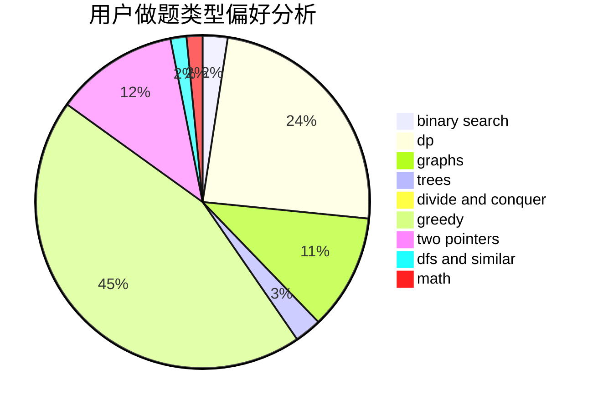

# LQL

<!-- tabs:start -->

#### **用户提交结果分析**

#### **用户做题类型偏好分析**

<!-- tabs:end -->
# 推荐题目
[1501B](https://codeforces.com/contest/1501/problem/B)
[759D](https://codeforces.com/contest/759/problem/D)
[1013E](https://codeforces.com/contest/1013/problem/E)
[223C](https://codeforces.com/contest/223/problem/C)
[1154E](https://codeforces.com/contest/1154/problem/E)
[1029A](https://codeforces.com/contest/1029/problem/A)
[1164Q](https://codeforces.com/contest/1164/problem/Q)
[721A](https://codeforces.com/contest/721/problem/A)
[645E](https://codeforces.com/contest/645/problem/E)
[166E](https://codeforces.com/contest/166/problem/E)
