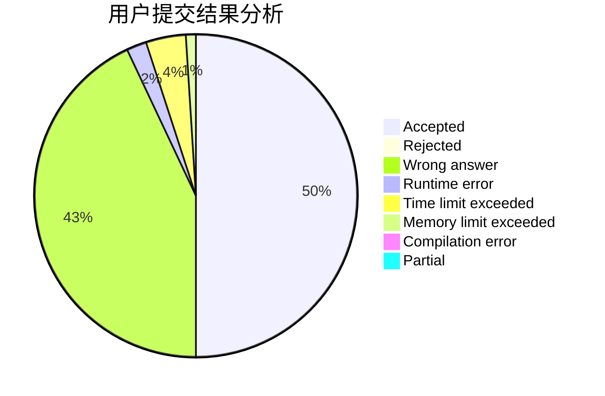
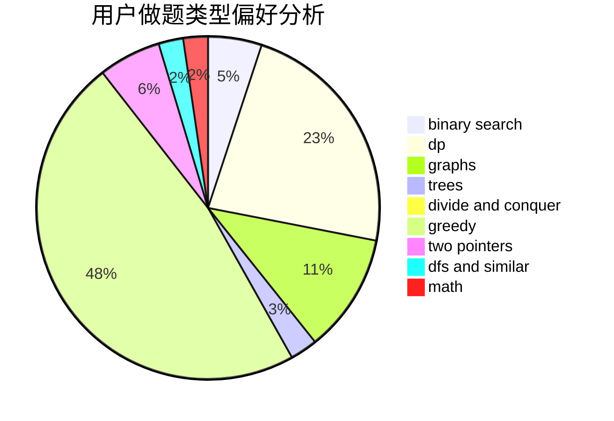

# LRJf

<!-- tabs:start -->

#### **用户提交结果分析**

#### **用户做题类型偏好分析**

<!-- tabs:end -->
# 推荐题目
[788B](https://codeforces.com/contest/788/problem/B)
[212E](https://codeforces.com/contest/212/problem/E)
[766C](https://codeforces.com/contest/766/problem/C)
[1151E](https://codeforces.com/contest/1151/problem/E)
[426B](https://codeforces.com/contest/426/problem/B)
[112A](https://codeforces.com/contest/112/problem/A)
[1211A](https://codeforces.com/contest/1211/problem/A)
[11652](https://codeforces.com/contest/1165/problem/2)
[703C](https://codeforces.com/contest/703/problem/C)
[165A](https://codeforces.com/contest/165/problem/A)
