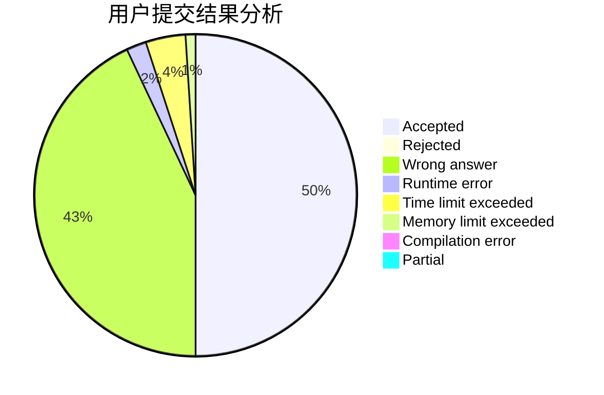
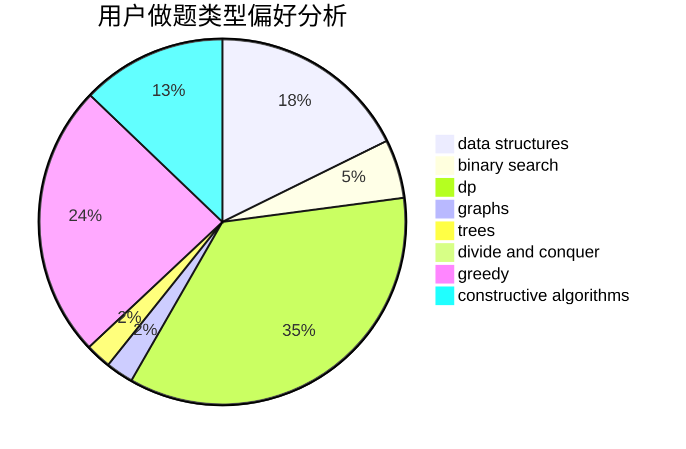
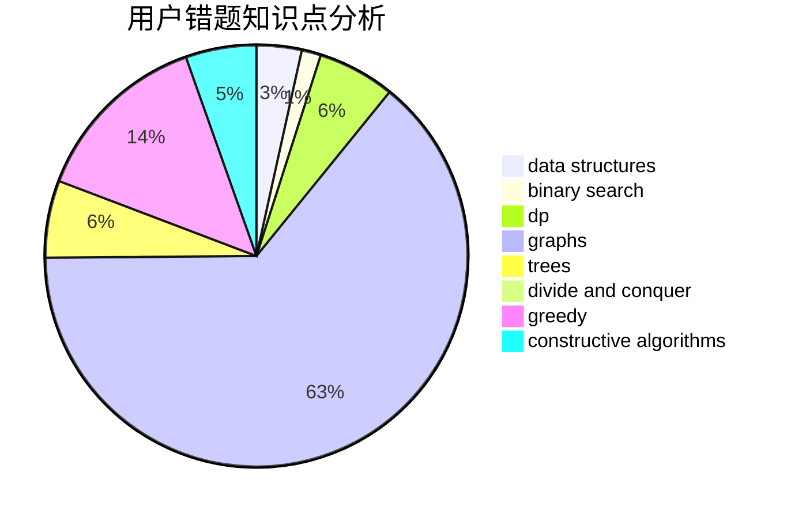

# LRJf

<!-- tabs:start -->

#### **用户提交结果分析**

#### **用户做题类型偏好分析**

#### **用户错题知识点分析**

<!-- tabs:end -->
# 推荐题目
[768C](https://codeforces.com/contest/768/problem/C)		brute force,
                        dp,
                        implementation,
                        sortings		  
[189A](https://codeforces.com/contest/189/problem/A)		brute force,
                        dp		  
[746G](https://codeforces.com/contest/746/problem/G)		constructive algorithms,
                        graphs,
                        trees		  
[114B](https://codeforces.com/contest/114/problem/B)		bitmasks,
                        brute force,
                        graphs		  
[39D](https://codeforces.com/contest/39/problem/D)		math		  
[1120B](https://codeforces.com/contest/1120/problem/B)		constructive algorithms,
                        greedy,
                        implementation,
                        math		  
[1207A](https://codeforces.com/contest/1207/problem/A)		brute force,
                        greedy,
                        implementation,
                        math		  
[1163D](https://codeforces.com/contest/1163/problem/D)		dp,
                        strings		  
[679E](https://codeforces.com/contest/679/problem/E)		data structures		  
[1510E](https://codeforces.com/contest/1510/problem/E)		nan		  
