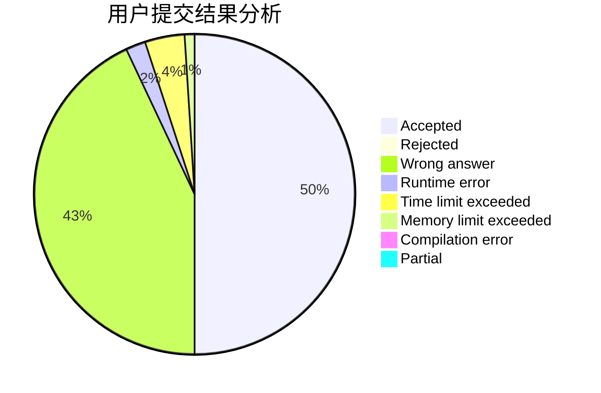
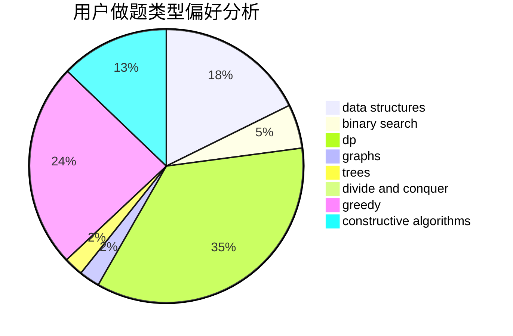
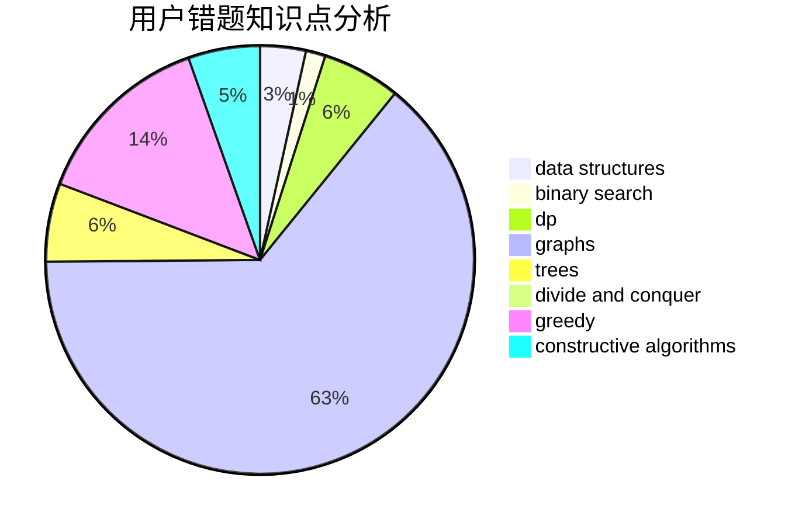

# LRJf
<!-- tabs:start -->
#### **用户提交结果分析**

#### **用户做题类型偏好分析**

#### **用户错题知识点分析**

<!-- tabs:end -->
# 推荐题目
[New Roads](http://codeforces.com/problemset/problem/746/G)		constructive algorithms,
                        graphs,
                        trees		  
[Jon Snow and his Favourite Number](http://codeforces.com/problemset/problem/768/C)		brute force,
                        dp,
                        implementation,
                        sortings		  
[Cut Ribbon](http://codeforces.com/problemset/problem/189/A)		brute force,
                        dp		  
[PE Lesson](http://codeforces.com/problemset/problem/316/D2)		dp		  
[PFAST Inc.](http://codeforces.com/problemset/problem/114/B)		bitmasks,
                        brute force,
                        graphs		  
[Minimal string](http://codeforces.com/problemset/problem/797/C)		data structures,
                        greedy,
                        strings		  
[Mysterious Code](http://codeforces.com/problemset/problem/1163/D)		dp,
                        strings		  
[Cubical Planet](http://codeforces.com/problemset/problem/39/D)		math		  
[Session in BSU](http://codeforces.com/problemset/problem/1027/F)		binary search,
                        dfs and similar,
                        dsu,
                        graph matchings,
                        graphs		  
[MADMAX](http://codeforces.com/problemset/problem/917/B)		dfs and similar,
                        dp,
                        games,
                        graphs		  
<!-- tabs:start -->
#### **data structures**
[New Roads](http://codeforces.com/problemset/problem/797/C)		data structures,
                        greedy,
                        strings		  
[Jon Snow and his Favourite Number](http://codeforces.com/problemset/problem/1476/F)		binary search,
                        data structures,
                        dp		  
[Cut Ribbon](http://codeforces.com/problemset/problem/1379/D)		binary search,
                        brute force,
                        data structures,
                        sortings,
                        two pointers		  
[PE Lesson](http://codeforces.com/problemset/problem/679/E)		data structures		  
[PFAST Inc.](http://codeforces.com/problemset/problem/1462/F)		binary search,
                        data structures,
                        greedy		  
[Minimal string](http://codeforces.com/problemset/problem/1492/C)		binary search,
                        data structures,
                        dp,
                        greedy,
                        two pointers		  
[Mysterious Code](http://codeforces.com/problemset/problem/1490/G)		binary search,
                        data structures,
                        math		  
[Cubical Planet](http://codeforces.com/problemset/problem/1479/D)		binary search,
                        bitmasks,
                        brute force,
                        data structures,
                        probabilities,
                        trees		  
[Session in BSU](http://codeforces.com/problemset/problem/1497/A)		brute force,
                        data structures,
                        greedy,
                        sortings		  
[MADMAX](http://codeforces.com/problemset/problem/1491/C)		brute force,
                        data structures,
                        dp,
                        greedy,
                        implementation		  
#### **binary search**
[New Roads](http://codeforces.com/problemset/problem/1027/F)		binary search,
                        dfs and similar,
                        dsu,
                        graph matchings,
                        graphs		  
[Jon Snow and his Favourite Number](http://codeforces.com/problemset/problem/620/D)		binary search,
                        two pointers		  
[Cut Ribbon](http://codeforces.com/problemset/problem/1476/F)		binary search,
                        data structures,
                        dp		  
[PE Lesson](http://codeforces.com/problemset/problem/1379/D)		binary search,
                        brute force,
                        data structures,
                        sortings,
                        two pointers		  
[PFAST Inc.](http://codeforces.com/problemset/problem/1462/F)		binary search,
                        data structures,
                        greedy		  
[Minimal string](http://codeforces.com/problemset/problem/1492/C)		binary search,
                        data structures,
                        dp,
                        greedy,
                        two pointers		  
[Mysterious Code](http://codeforces.com/problemset/problem/1463/D)		binary search,
                        constructive algorithms,
                        greedy,
                        two pointers		  
[Cubical Planet](http://codeforces.com/problemset/problem/1490/G)		binary search,
                        data structures,
                        math		  
[Session in BSU](http://codeforces.com/problemset/problem/1479/D)		binary search,
                        bitmasks,
                        brute force,
                        data structures,
                        probabilities,
                        trees		  
[MADMAX](http://codeforces.com/problemset/problem/1436/E)		binary search,
                        data structures,
                        two pointers		  
#### **dp**
[New Roads](http://codeforces.com/problemset/problem/768/C)		brute force,
                        dp,
                        implementation,
                        sortings		  
[Jon Snow and his Favourite Number](http://codeforces.com/problemset/problem/189/A)		brute force,
                        dp		  
[Cut Ribbon](http://codeforces.com/problemset/problem/316/D2)		dp		  
[PE Lesson](http://codeforces.com/problemset/problem/1163/D)		dp,
                        strings		  
[PFAST Inc.](http://codeforces.com/problemset/problem/917/B)		dfs and similar,
                        dp,
                        games,
                        graphs		  
[Minimal string](http://codeforces.com/problemset/problem/1185/G2)		combinatorics,
                        dp		  
[Mysterious Code](http://codeforces.com/problemset/problem/1472/G)		dfs and similar,
                        dp,
                        graphs,
                        shortest paths		  
[Cubical Planet](http://codeforces.com/problemset/problem/1188/D)		dp		  
[Session in BSU](https://codeforces.com/contest/1261/problem/D1)		dp		  
[MADMAX](http://codeforces.com/problemset/problem/1476/F)		binary search,
                        data structures,
                        dp		  
#### **graph**
[New Roads](http://codeforces.com/problemset/problem/746/G)		constructive algorithms,
                        graphs,
                        trees		  
[Jon Snow and his Favourite Number](http://codeforces.com/problemset/problem/114/B)		bitmasks,
                        brute force,
                        graphs		  
[Cut Ribbon](http://codeforces.com/problemset/problem/1027/F)		binary search,
                        dfs and similar,
                        dsu,
                        graph matchings,
                        graphs		  
[PE Lesson](http://codeforces.com/problemset/problem/917/B)		dfs and similar,
                        dp,
                        games,
                        graphs		  
[PFAST Inc.](http://codeforces.com/problemset/problem/1472/G)		dfs and similar,
                        dp,
                        graphs,
                        shortest paths		  
[Minimal string](https://codeforces.com/contest/1382/problem/E)		constructive algorithms,
                        graph matchings,
                        greedy,
                        implementation,
                        sortings,
                        two pointers		  
[Mysterious Code](http://codeforces.com/problemset/problem/1340/B)		bitmasks,
                        dp,
                        graphs,
                        greedy		  
[Cubical Planet](http://codeforces.com/problemset/problem/1487/C)		brute force,
                        constructive algorithms,
                        dfs and similar,
                        graphs,
                        greedy,
                        implementation,
                        math		  
[Session in BSU](http://codeforces.com/problemset/problem/1437/C)		dp,
                        flows,
                        graph matchings,
                        greedy,
                        math,
                        sortings		  
[MADMAX](http://codeforces.com/problemset/problem/1470/D)		constructive algorithms,
                        dfs and similar,
                        graph matchings,
                        graphs,
                        greedy		  
#### **trees**
[New Roads](http://codeforces.com/problemset/problem/746/G)		constructive algorithms,
                        graphs,
                        trees		  
[Jon Snow and his Favourite Number](http://codeforces.com/problemset/problem/1479/D)		binary search,
                        bitmasks,
                        brute force,
                        data structures,
                        probabilities,
                        trees		  
[Cut Ribbon](http://codeforces.com/problemset/problem/1511/C)		brute force,
                        data structures,
                        implementation,
                        trees		  
[PE Lesson](http://codeforces.com/problemset/problem/1499/F)		combinatorics,
                        dfs and similar,
                        dp,
                        trees		  
[PFAST Inc.](http://codeforces.com/problemset/problem/1491/E)		brute force,
                        dfs and similar,
                        divide and conquer,
                        number theory,
                        trees		  
[Minimal string](http://codeforces.com/problemset/problem/1466/D)		data structures,
                        greedy,
                        sortings,
                        trees		  
[Mysterious Code](http://codeforces.com/problemset/problem/1495/D)		combinatorics,
                        dfs and similar,
                        graphs,
                        math,
                        shortest paths,
                        trees		  
[Cubical Planet](http://codeforces.com/problemset/problem/1303/G)		data structures,
                        divide and conquer,
                        geometry,
                        trees		  
[Session in BSU](http://codeforces.com/problemset/problem/1454/E)		combinatorics,
                        dfs and similar,
                        graphs,
                        trees		  
[MADMAX](http://codeforces.com/problemset/problem/1494/D)		constructive algorithms,
                        data structures,
                        dfs and similar,
                        divide and conquer,
                        dsu,
                        greedy,
                        sortings,
                        trees		  
#### **divide and conquer**
[New Roads](http://codeforces.com/problemset/problem/1461/D)		binary search,
                        brute force,
                        data structures,
                        divide and conquer,
                        implementation,
                        sortings		  
[Jon Snow and his Favourite Number](http://codeforces.com/problemset/problem/1466/G)		combinatorics,
                        divide and conquer,
                        hashing,
                        math,
                        string suffix structures,
                        strings		  
[Cut Ribbon](http://codeforces.com/problemset/problem/1490/D)		dfs and similar,
                        divide and conquer,
                        implementation		  
[PE Lesson](https://codeforces.com/contest/1483/problem/C)		data structures,
                        divide and conquer,
                        dp		  
[PFAST Inc.](http://codeforces.com/problemset/problem/1491/E)		brute force,
                        dfs and similar,
                        divide and conquer,
                        number theory,
                        trees		  
[Minimal string](http://codeforces.com/problemset/problem/1303/G)		data structures,
                        divide and conquer,
                        geometry,
                        trees		  
[Mysterious Code](http://codeforces.com/problemset/problem/1494/D)		constructive algorithms,
                        data structures,
                        dfs and similar,
                        divide and conquer,
                        dsu,
                        greedy,
                        sortings,
                        trees		  
[Cubical Planet](http://codeforces.com/problemset/problem/1482/E)		data structures,
                        divide and conquer,
                        dp		  
[Session in BSU](http://codeforces.com/problemset/problem/566/C)		dfs and similar,
                        divide and conquer,
                        trees		  
[MADMAX](http://codeforces.com/problemset/problem/1428/F)		binary search,
                        data structures,
                        divide and conquer,
                        dp,
                        two pointers		  
#### **greedy**
[New Roads](http://codeforces.com/problemset/problem/797/C)		data structures,
                        greedy,
                        strings		  
[Jon Snow and his Favourite Number](http://codeforces.com/problemset/problem/1207/A)		brute force,
                        greedy,
                        implementation,
                        math		  
[Cut Ribbon](http://codeforces.com/problemset/problem/1083/B)		greedy,
                        strings		  
[PE Lesson](http://codeforces.com/problemset/problem/1004/B)		constructive algorithms,
                        greedy,
                        implementation,
                        math		  
[PFAST Inc.](http://codeforces.com/problemset/problem/1120/B)		constructive algorithms,
                        greedy,
                        implementation,
                        math		  
[Minimal string](https://codeforces.com/contest/1382/problem/E)		constructive algorithms,
                        graph matchings,
                        greedy,
                        implementation,
                        sortings,
                        two pointers		  
[Mysterious Code](http://codeforces.com/problemset/problem/1340/B)		bitmasks,
                        dp,
                        graphs,
                        greedy		  
[Cubical Planet](http://codeforces.com/problemset/problem/1108/C)		brute force,
                        greedy,
                        math		  
[Session in BSU](http://codeforces.com/problemset/problem/1462/F)		binary search,
                        data structures,
                        greedy		  
[MADMAX](http://codeforces.com/problemset/problem/1492/C)		binary search,
                        data structures,
                        dp,
                        greedy,
                        two pointers		  
#### **constructive algorithms**
[New Roads](http://codeforces.com/problemset/problem/746/G)		constructive algorithms,
                        graphs,
                        trees		  
[Jon Snow and his Favourite Number](http://codeforces.com/problemset/problem/1004/B)		constructive algorithms,
                        greedy,
                        implementation,
                        math		  
[Cut Ribbon](http://codeforces.com/problemset/problem/1120/B)		constructive algorithms,
                        greedy,
                        implementation,
                        math		  
[PE Lesson](https://codeforces.com/contest/1382/problem/E)		constructive algorithms,
                        graph matchings,
                        greedy,
                        implementation,
                        sortings,
                        two pointers		  
[PFAST Inc.](http://codeforces.com/problemset/problem/1493/A)		constructive algorithms,
                        greedy		  
[Minimal string](http://codeforces.com/problemset/problem/1463/D)		binary search,
                        constructive algorithms,
                        greedy,
                        two pointers		  
[Mysterious Code](https://codeforces.com/contest/1456/problem/B)		bitmasks,
                        brute force,
                        constructive algorithms		  
[Cubical Planet](http://codeforces.com/problemset/problem/1492/D)		bitmasks,
                        constructive algorithms,
                        greedy,
                        math		  
[Session in BSU](https://codeforces.com/contest/1504/problem/D)		constructive algorithms,
                        games,
                        interactive		  
[MADMAX](https://codeforces.com/contest/1483/problem/A)		brute force,
                        constructive algorithms,
                        greedy,
                        implementation		  
#### **sortings**
[New Roads](http://codeforces.com/problemset/problem/768/C)		brute force,
                        dp,
                        implementation,
                        sortings		  
[Jon Snow and his Favourite Number](http://codeforces.com/problemset/problem/1379/D)		binary search,
                        brute force,
                        data structures,
                        sortings,
                        two pointers		  
[Cut Ribbon](https://codeforces.com/contest/1382/problem/E)		constructive algorithms,
                        graph matchings,
                        greedy,
                        implementation,
                        sortings,
                        two pointers		  
[PE Lesson](http://codeforces.com/problemset/problem/13/C)		dp,
                        sortings		  
[PFAST Inc.](https://codeforces.com/contest/1496/problem/C)		geometry,
                        greedy,
                        math,
                        sortings		  
[Minimal string](http://codeforces.com/problemset/problem/1495/A)		geometry,
                        greedy,
                        math,
                        sortings		  
[Mysterious Code](http://codeforces.com/problemset/problem/1497/A)		brute force,
                        data structures,
                        greedy,
                        sortings		  
[Cubical Planet](http://codeforces.com/problemset/problem/1427/A)		math,
                        sortings		  
[Session in BSU](http://codeforces.com/problemset/problem/1461/D)		binary search,
                        brute force,
                        data structures,
                        divide and conquer,
                        implementation,
                        sortings		  
[MADMAX](http://codeforces.com/problemset/problem/1437/C)		dp,
                        flows,
                        graph matchings,
                        greedy,
                        math,
                        sortings		  
<!-- tabs:end -->
