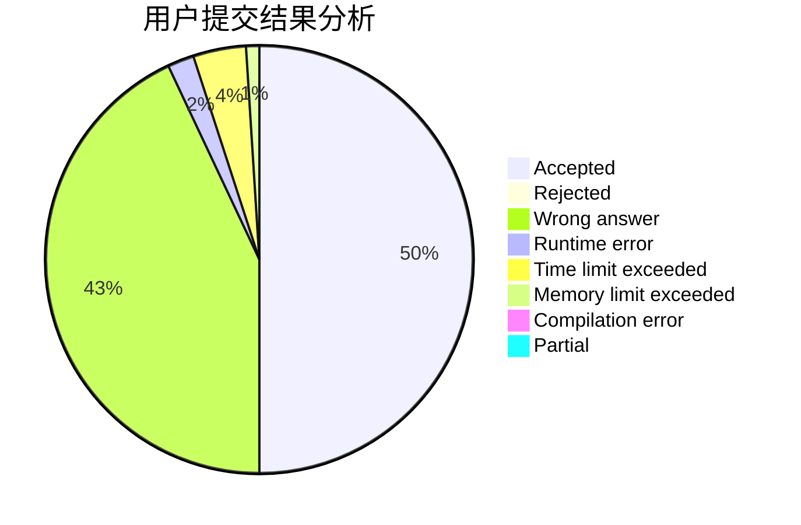
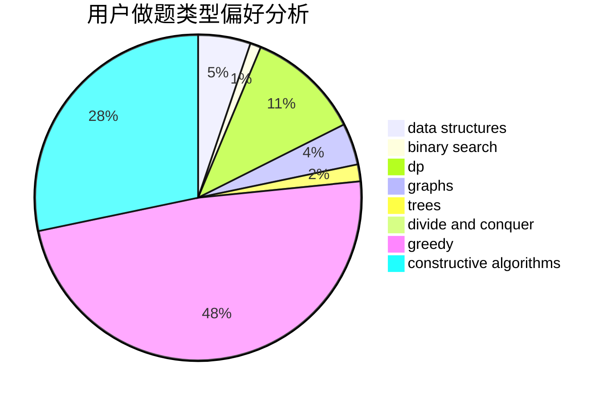
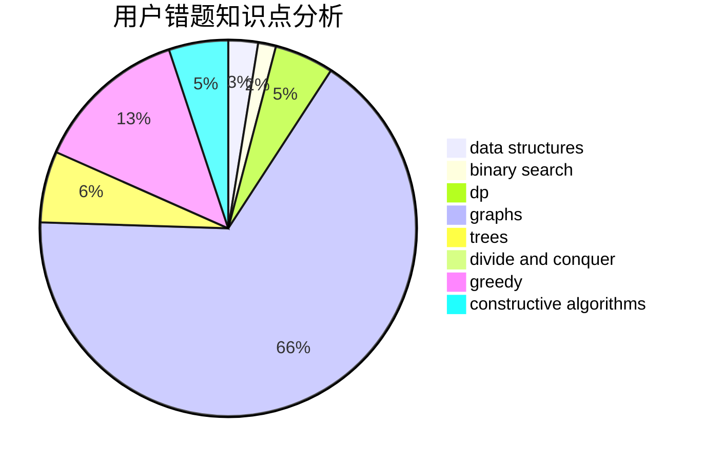

# LRJf

<!-- tabs:start -->

#### **用户提交结果分析**

#### **用户做题类型偏好分析**

#### **用户错题知识点分析**

<!-- tabs:end -->
# 推荐题目
[788B](https://codeforces.com/contest/788/problem/B)		combinatorics,
                        constructive algorithms,
                        dfs and similar,
                        dsu,
                        graphs		  
[212E](https://codeforces.com/contest/212/problem/E)		dfs and similar,
                        dp,
                        trees		  
[766C](https://codeforces.com/contest/766/problem/C)		brute force,
                        dp,
                        greedy,
                        strings		  
[1151E](https://codeforces.com/contest/1151/problem/E)		combinatorics,
                        data structures,
                        dp,
                        math		  
[426B](https://codeforces.com/contest/426/problem/B)		implementation		  
[112A](https://codeforces.com/contest/112/problem/A)		implementation,
                        strings		  
[1211A](https://codeforces.com/contest/1211/problem/A)		*special problem,
                        implementation		  
[11652](https://codeforces.com/contest/1165/problem/2)		dsu,graphs,sortings,trees		  
[703C](https://codeforces.com/contest/703/problem/C)		geometry,
                        implementation		  
[165A](https://codeforces.com/contest/165/problem/A)		implementation		  
