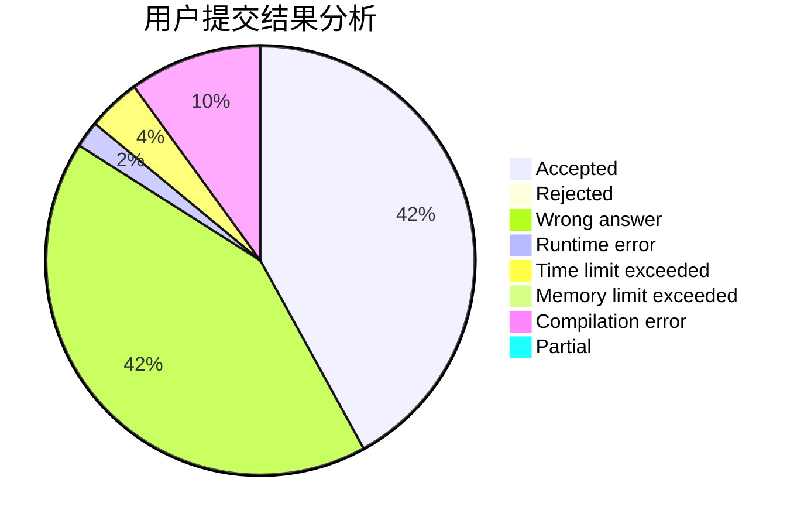
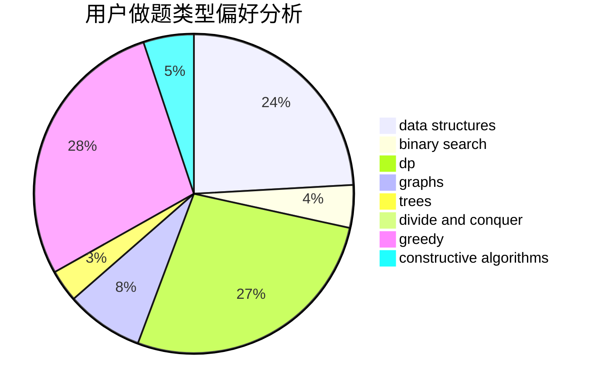

# 541907230305

<!-- tabs:start -->

#### **用户提交结果分析**

#### **用户做题类型偏好分析**

#### **用户错题知识点分析**

<!-- tabs:end -->
# 推荐题目
[1386A](https://codeforces.com/contest/1386/problem/A)		*special problem,
                        binary search,
                        constructive algorithms,
                        interactive		  
[1384B1](https://codeforces.com/contest/1384B/problem/1)		brute force,
                        dp,
                        greedy		  
[1139D](https://codeforces.com/contest/1139/problem/D)		dp,
                        math,
                        number theory,
                        probabilities		  
[1349F1](https://codeforces.com/contest/1349F/problem/1)		dp,
                        fft,
                        math		  
[1385F](https://codeforces.com/contest/1385/problem/F)		data structures,
                        greedy,
                        implementation,
                        trees		  
[1384A](https://codeforces.com/contest/1384/problem/A)		constructive algorithms,
                        greedy,
                        strings		  
[1384E](https://codeforces.com/contest/1384/problem/E)		dsu,graphs,sortings,trees		  
[1383C](https://codeforces.com/contest/1383/problem/C)		bitmasks,
                        dp,
                        graphs,
                        trees		  
[1031C](https://codeforces.com/contest/1031/problem/C)		greedy		  
[1178D](https://codeforces.com/contest/1178/problem/D)		constructive algorithms,
                        greedy,
                        math,
                        number theory		  
