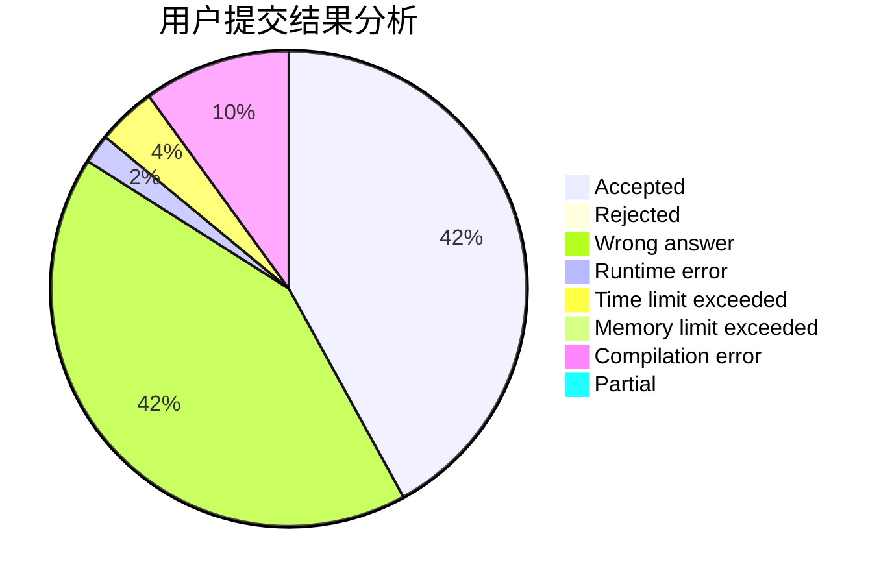
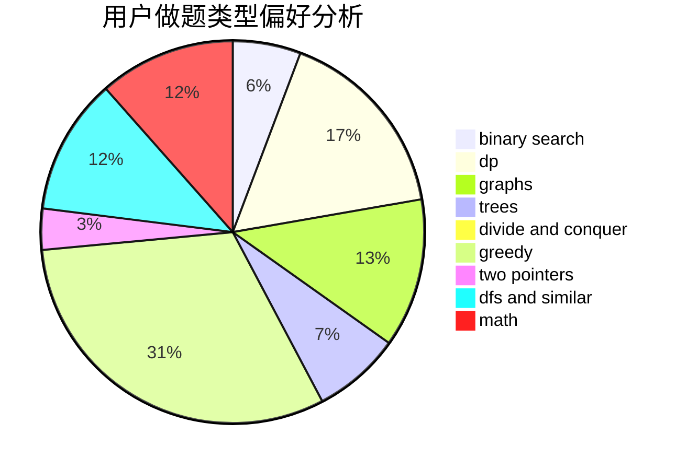

# 541907230305

<!-- tabs:start -->

#### **用户提交结果分析**

#### **用户做题类型偏好分析**

<!-- tabs:end -->
# 推荐题目
[1396B](https://codeforces.com/contest/1396/problem/B)
[1394A](https://codeforces.com/contest/1394/problem/A)
[11411](https://codeforces.com/contest/1141/problem/1)
[13571](https://codeforces.com/contest/1357/problem/1)
[1395F](https://codeforces.com/contest/1395/problem/F)
[1393D](https://codeforces.com/contest/1393/problem/D)
[1394E](https://codeforces.com/contest/1394/problem/E)
[13932](https://codeforces.com/contest/1393/problem/2)
[1032E](https://codeforces.com/contest/1032/problem/E)
[1180C](https://codeforces.com/contest/1180/problem/C)
