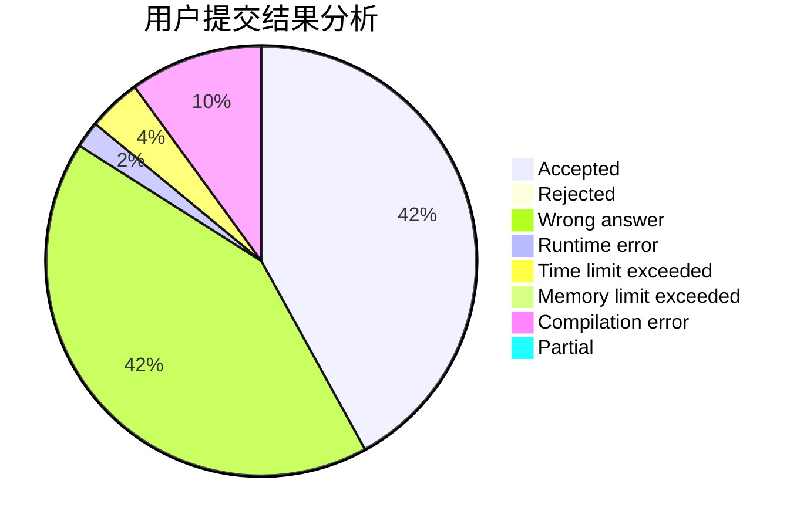
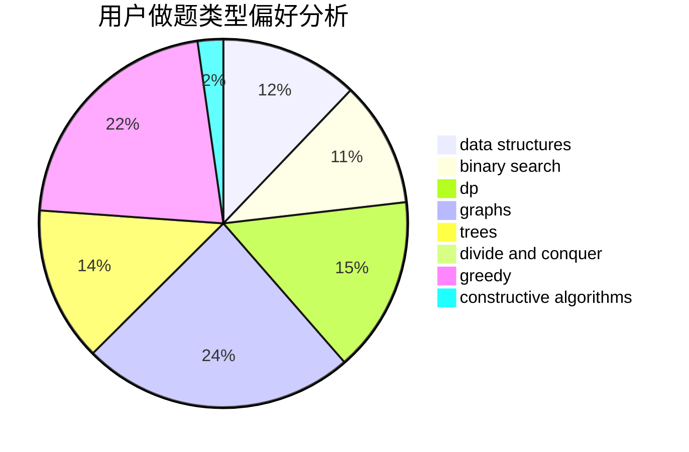

# 541907230305

<!-- tabs:start -->

#### **用户提交结果分析**

#### **用户做题类型偏好分析**

#### **用户错题知识点分析**

<!-- tabs:end -->
# 推荐题目
[1396B](https://codeforces.com/contest/1396/problem/B)		brute force,
                        constructive algorithms,
                        games,
                        greedy		  
[1394A](https://codeforces.com/contest/1394/problem/A)		dp,
                        greedy,
                        sortings,
                        two pointers		  
[11411](https://codeforces.com/contest/1141/problem/1)		dsu,graphs,sortings,trees		  
[13571](https://codeforces.com/contest/1357/problem/1)		dsu,graphs,sortings,trees		  
[1395F](https://codeforces.com/contest/1395/problem/F)		dsu,graphs,sortings,trees		  
[1393D](https://codeforces.com/contest/1393/problem/D)		dfs and similar,
                        dp,
                        implementation,
                        shortest paths		  
[1394E](https://codeforces.com/contest/1394/problem/E)		strings		  
[13932](https://codeforces.com/contest/1393/problem/2)		dsu,graphs,sortings,trees		  
[1032E](https://codeforces.com/contest/1032/problem/E)		dp,
                        math		  
[1180C](https://codeforces.com/contest/1180/problem/C)		dsu,graphs,sortings,trees		  
