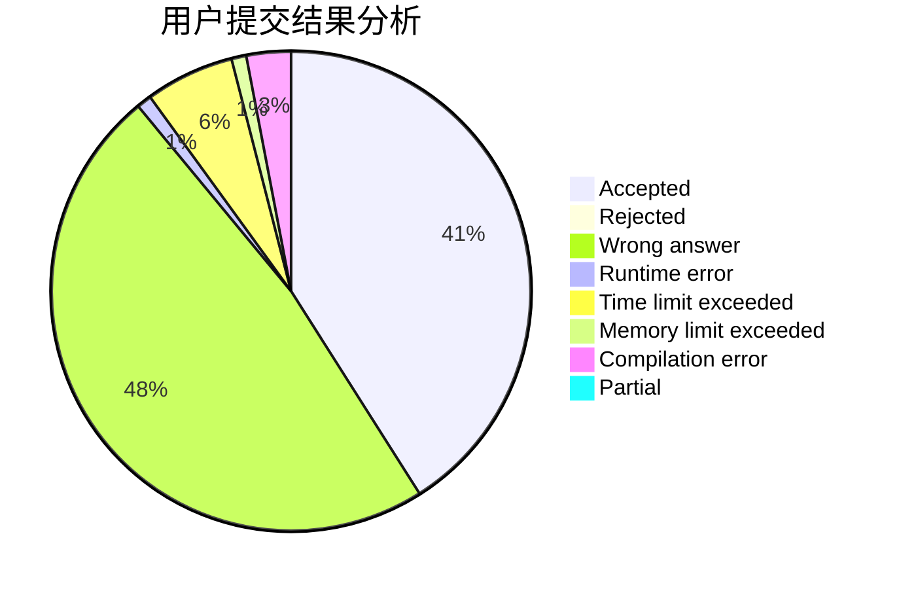
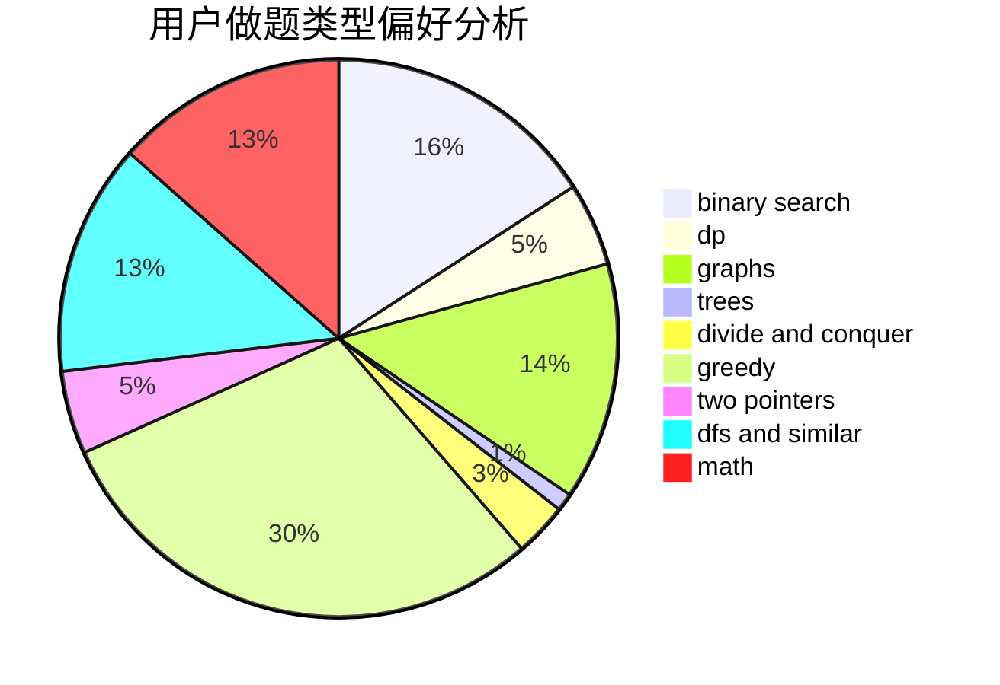

# LRL65

<!-- tabs:start -->

#### **用户提交结果分析**

#### **用户做题类型偏好分析**

<!-- tabs:end -->
# 推荐题目
[1117C](https://codeforces.com/contest/1117/problem/C)
[678A](https://codeforces.com/contest/678/problem/A)
[600C](https://codeforces.com/contest/600/problem/C)
[171H](https://codeforces.com/contest/171/problem/H)
[1059B](https://codeforces.com/contest/1059/problem/B)
[145B](https://codeforces.com/contest/145/problem/B)
[825F](https://codeforces.com/contest/825/problem/F)
[1197E](https://codeforces.com/contest/1197/problem/E)
[232A](https://codeforces.com/contest/232/problem/A)
[568A](https://codeforces.com/contest/568/problem/A)
