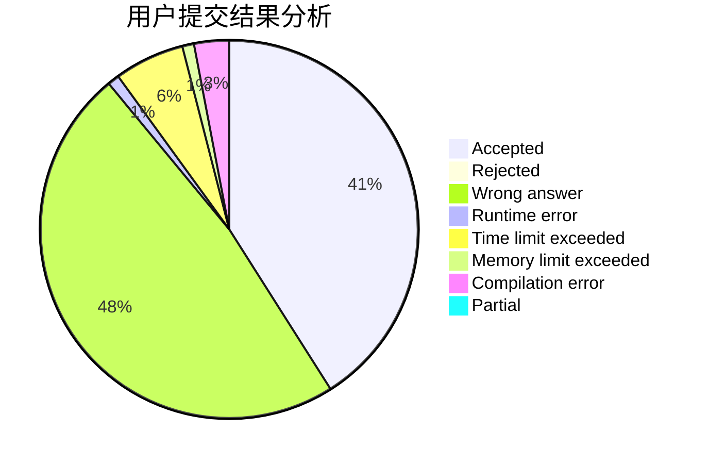
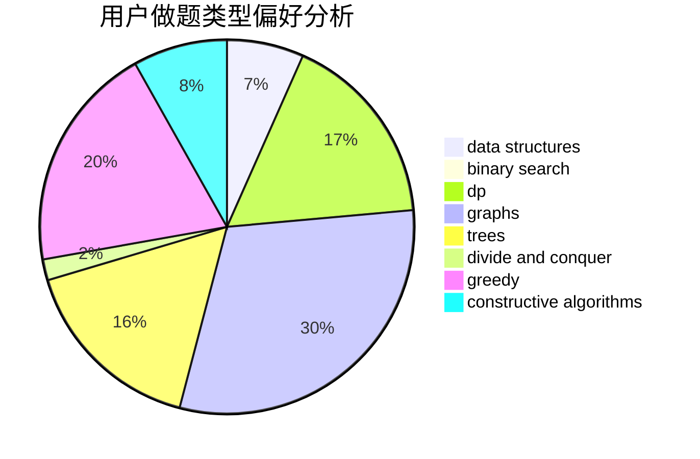
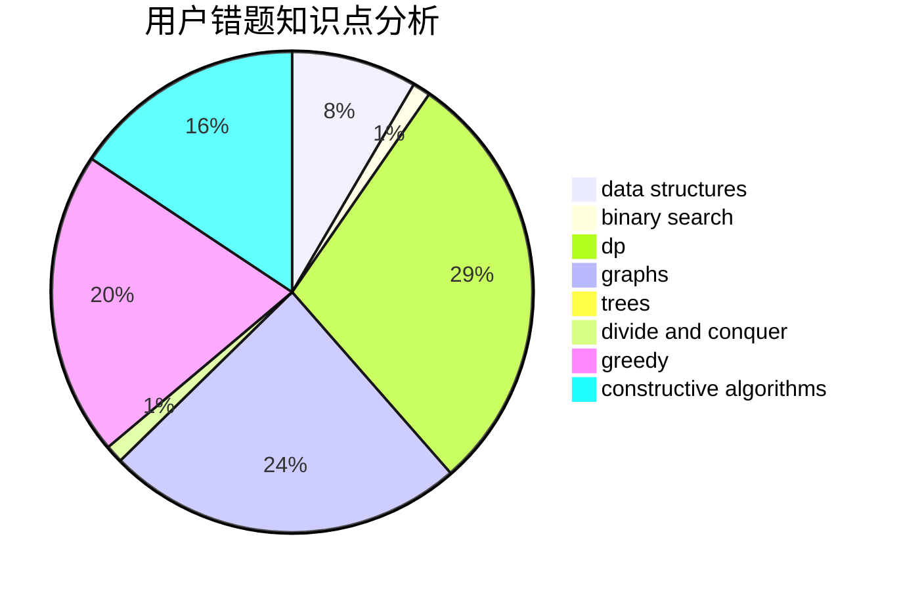

# LRL65

<!-- tabs:start -->

#### **用户提交结果分析**

#### **用户做题类型偏好分析**

#### **用户错题知识点分析**

<!-- tabs:end -->
# 推荐题目
[1115U3](https://codeforces.com/contest/1115U/problem/3)		*special problem		  
[653E](https://codeforces.com/contest/653/problem/E)		dfs and similar,
                        dsu,
                        graphs,
                        trees		  
[580A](https://codeforces.com/contest/580/problem/A)		brute force,
                        dp,
                        implementation		  
[1513A](https://codeforces.com/contest/1513/problem/A)		constructive algorithms,
                        implementation		  
[1058D](https://codeforces.com/contest/1058/problem/D)		dsu,graphs,sortings,trees		  
[1451B](https://codeforces.com/contest/1451/problem/B)		dp,
                        greedy,
                        implementation,
                        strings		  
[808G](https://codeforces.com/contest/808/problem/G)		dp,
                        strings		  
[1191F](https://codeforces.com/contest/1191/problem/F)		dsu,graphs,sortings,trees		  
[212A](https://codeforces.com/contest/212/problem/A)		flows,
                        graphs		  
[543E](https://codeforces.com/contest/543/problem/E)		constructive algorithms,
                        data structures		  
