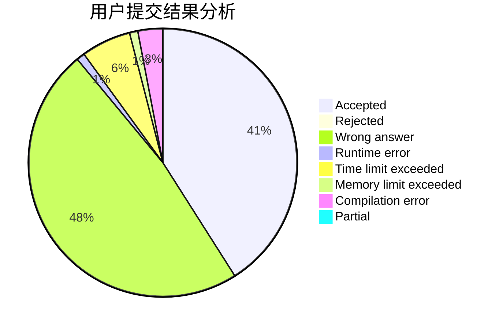
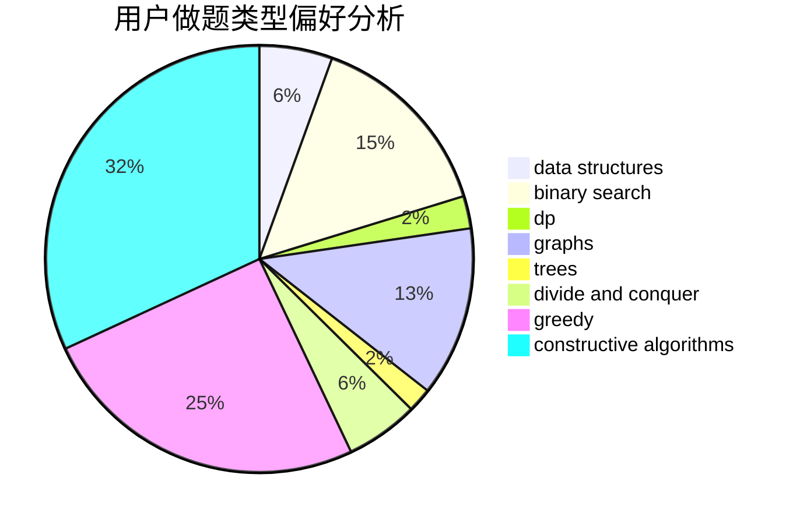
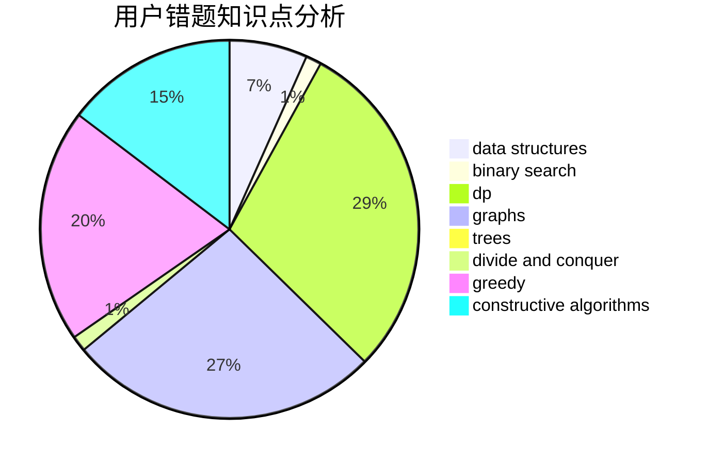

# LRL65

<!-- tabs:start -->

#### **用户提交结果分析**

#### **用户做题类型偏好分析**

#### **用户错题知识点分析**

<!-- tabs:end -->
# 推荐题目
[1117C](https://codeforces.com/contest/1117/problem/C)		binary search		  
[678A](https://codeforces.com/contest/678/problem/A)		implementation,
                        math		  
[600C](https://codeforces.com/contest/600/problem/C)		constructive algorithms,
                        greedy,
                        strings		  
[171H](https://codeforces.com/contest/171/problem/H)		*special problem,
                        implementation		  
[1059B](https://codeforces.com/contest/1059/problem/B)		implementation		  
[145B](https://codeforces.com/contest/145/problem/B)		constructive algorithms		  
[825F](https://codeforces.com/contest/825/problem/F)		dp,
                        hashing,
                        string suffix structures,
                        strings		  
[1197E](https://codeforces.com/contest/1197/problem/E)		binary search,
                        combinatorics,
                        data structures,
                        dp,
                        shortest paths,
                        sortings		  
[232A](https://codeforces.com/contest/232/problem/A)		binary search,
                        constructive algorithms,
                        graphs,
                        greedy		  
[568A](https://codeforces.com/contest/568/problem/A)		brute force,
                        implementation,
                        math,
                        number theory		  
