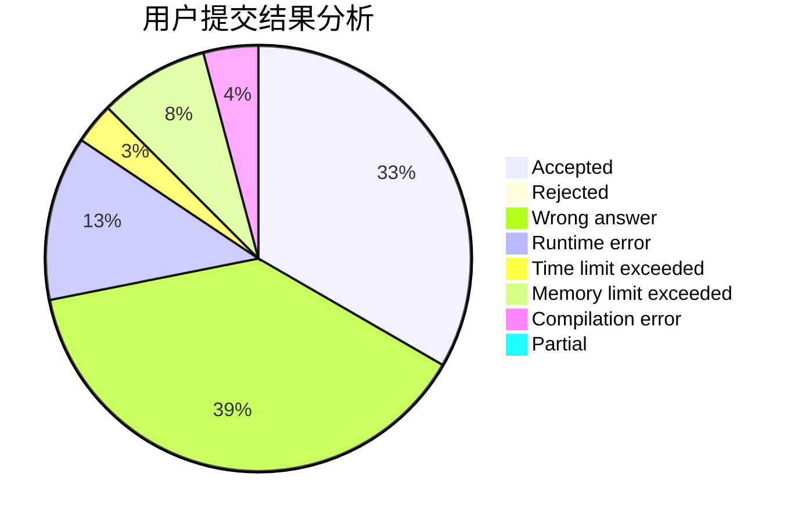
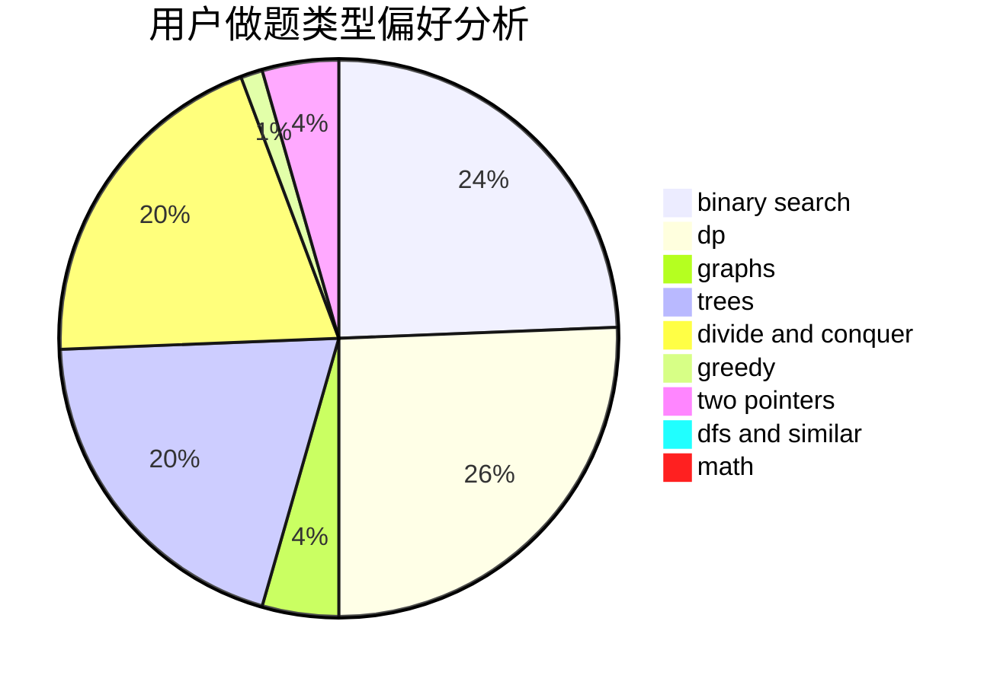

# LTb

<!-- tabs:start -->

#### **用户提交结果分析**

#### **用户做题类型偏好分析**

<!-- tabs:end -->
# 推荐题目
[833C](https://codeforces.com/contest/833/problem/C)
[798A](https://codeforces.com/contest/798/problem/A)
[201D](https://codeforces.com/contest/201/problem/D)
[55A](https://codeforces.com/contest/55/problem/A)
[1493B](https://codeforces.com/contest/1493/problem/B)
[1252A](https://codeforces.com/contest/1252/problem/A)
[1490C](https://codeforces.com/contest/1490/problem/C)
[1497B](https://codeforces.com/contest/1497/problem/B)
[1491C](https://codeforces.com/contest/1491/problem/C)
[1484C](https://codeforces.com/contest/1484/problem/C)
