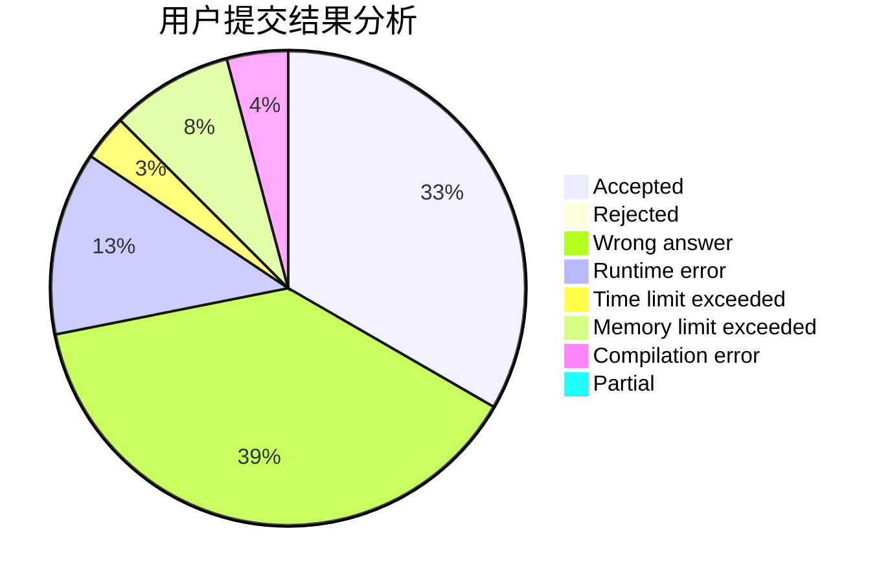
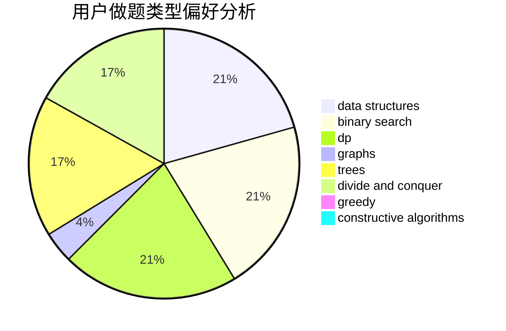
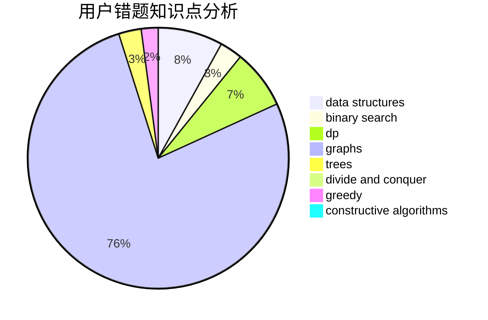

# LTb

<!-- tabs:start -->

#### **用户提交结果分析**

#### **用户做题类型偏好分析**

#### **用户错题知识点分析**

<!-- tabs:end -->
# 推荐题目
[833C](https://codeforces.com/contest/833/problem/C)		brute force,
                        combinatorics,
                        greedy,
                        math		  
[798A](https://codeforces.com/contest/798/problem/A)		brute force,
                        constructive algorithms,
                        strings		  
[201D](https://codeforces.com/contest/201/problem/D)		bitmasks,
                        brute force,
                        dp		  
[55A](https://codeforces.com/contest/55/problem/A)		implementation,
                        math		  
[1493B](https://codeforces.com/contest/1493/problem/B)		brute force,
                        implementation		  
[1252A](https://codeforces.com/contest/1252/problem/A)		nan		  
[1490C](https://codeforces.com/contest/1490/problem/C)		binary search,
                        brute force,
                        brute force,
                        math		  
[1497B](https://codeforces.com/contest/1497/problem/B)		constructive algorithms,
                        greedy,
                        math		  
[1491C](https://codeforces.com/contest/1491/problem/C)		brute force,
                        data structures,
                        dp,
                        greedy,
                        implementation		  
[1484C](https://codeforces.com/contest/1484/problem/C)		dsu,graphs,sortings,trees		  
