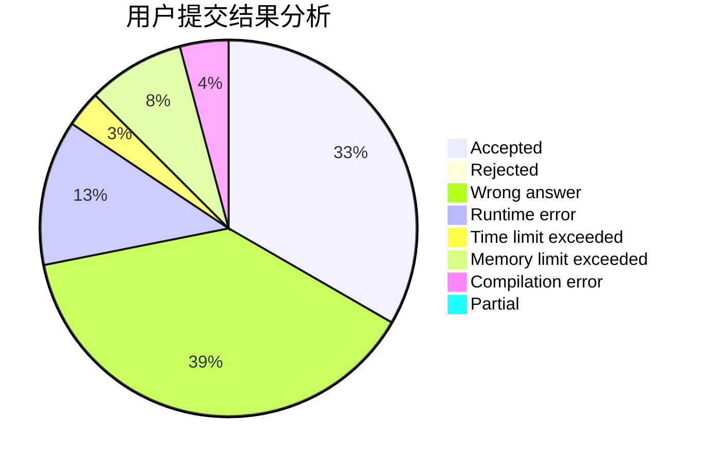
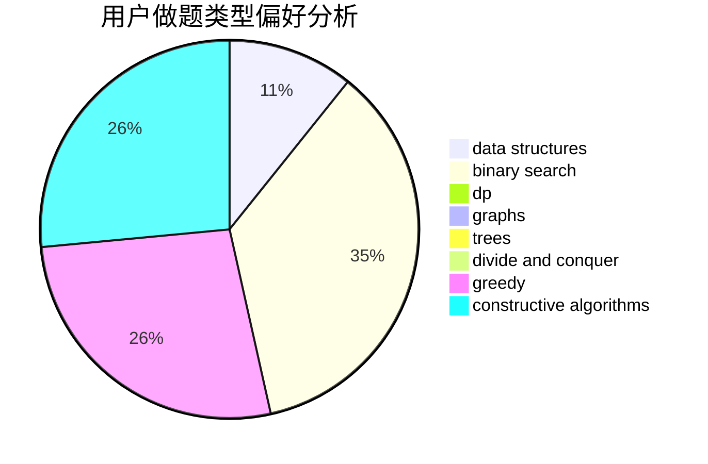
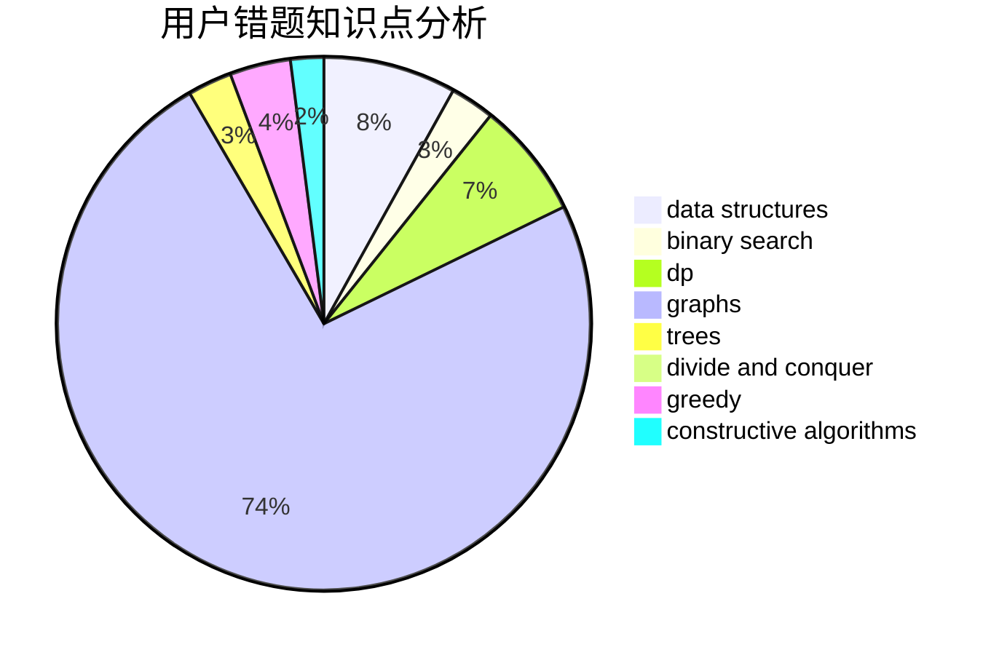

# LTb

<!-- tabs:start -->

#### **用户提交结果分析**

#### **用户做题类型偏好分析**

#### **用户错题知识点分析**

<!-- tabs:end -->
# 推荐题目
[814E](https://codeforces.com/contest/814/problem/E)		combinatorics,
                        dp,
                        graphs,
                        shortest paths		  
[779E](https://codeforces.com/contest/779/problem/E)		dsu,graphs,sortings,trees		  
[176E](https://codeforces.com/contest/176/problem/E)		data structures,
                        dfs and similar,
                        trees		  
[538G](https://codeforces.com/contest/538/problem/G)		constructive algorithms,
                        math,
                        sortings		  
[1485F](https://codeforces.com/contest/1485/problem/F)		combinatorics,
                        data structures,
                        dp,
                        sortings		  
[1248A](https://codeforces.com/contest/1248/problem/A)		geometry,
                        math		  
[1482E](https://codeforces.com/contest/1482/problem/E)		data structures,
                        divide and conquer,
                        dp		  
[1489D](https://codeforces.com/contest/1489/problem/D)		dsu,graphs,sortings,trees		  
[1483E](https://codeforces.com/contest/1483/problem/E)		dsu,graphs,sortings,trees		  
[1475F](https://codeforces.com/contest/1475/problem/F)		2-sat,
                        brute force,
                        constructive algorithms		  
