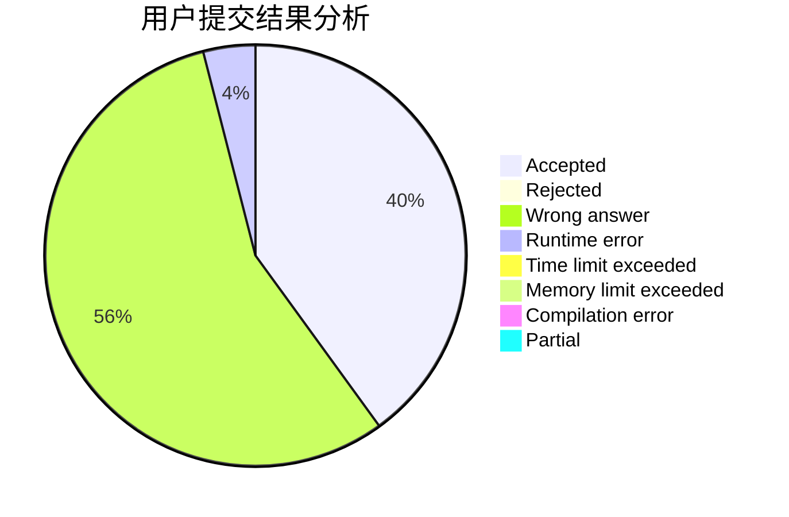
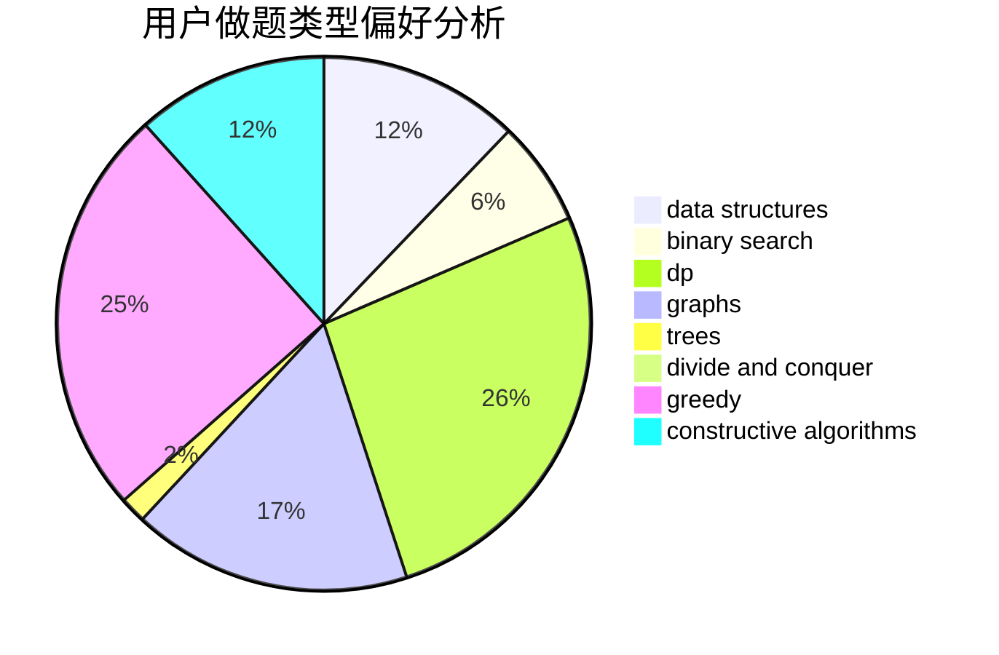
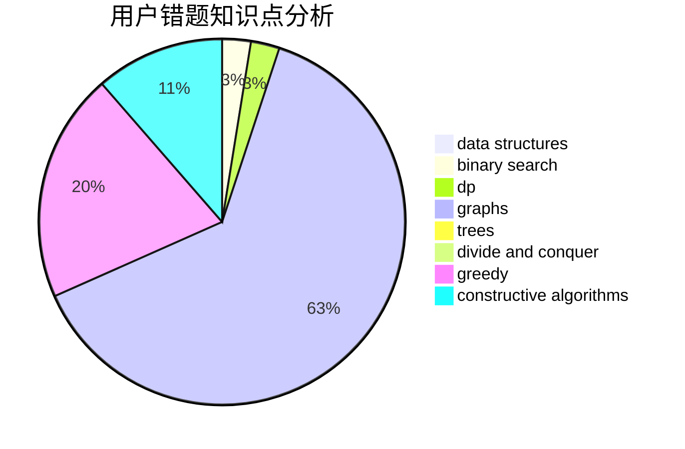

# LWLAymh

<!-- tabs:start -->

#### **用户提交结果分析**

#### **用户做题类型偏好分析**

#### **用户错题知识点分析**

<!-- tabs:end -->
# 推荐题目
[1479D](https://codeforces.com/contest/1479/problem/D)		binary search,
                        bitmasks,
                        brute force,
                        data structures,
                        probabilities,
                        trees		  
[1281B](https://codeforces.com/contest/1281/problem/B)		greedy		  
[1136E](https://codeforces.com/contest/1136/problem/E)		binary search,
                        data structures		  
[582A](https://codeforces.com/contest/582/problem/A)		constructive algorithms,
                        greedy,
                        number theory		  
[1031D](https://codeforces.com/contest/1031/problem/D)		greedy		  
[1092F](https://codeforces.com/contest/1092/problem/F)		dfs and similar,
                        dp,
                        trees		  
[316B1](https://codeforces.com/contest/316B/problem/1)		brute force,
                        dfs and similar		  
[1099B](https://codeforces.com/contest/1099/problem/B)		binary search,
                        constructive algorithms,
                        math		  
[588B](https://codeforces.com/contest/588/problem/B)		math		  
[341D](https://codeforces.com/contest/341/problem/D)		data structures		  
