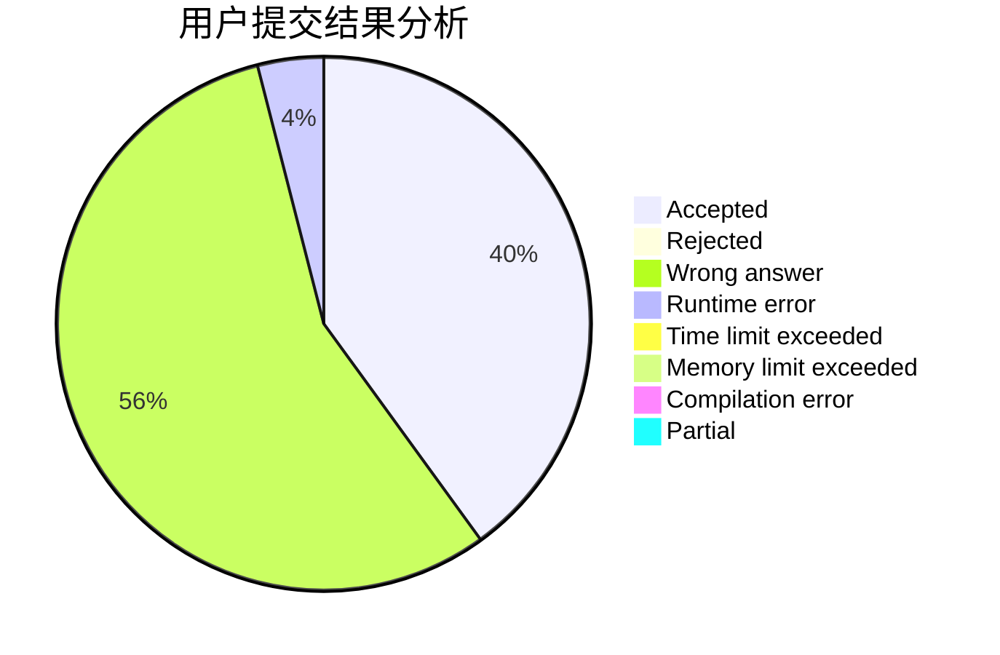
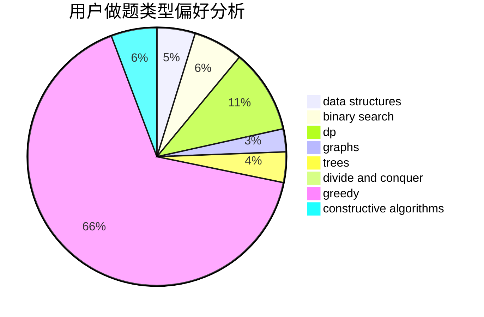
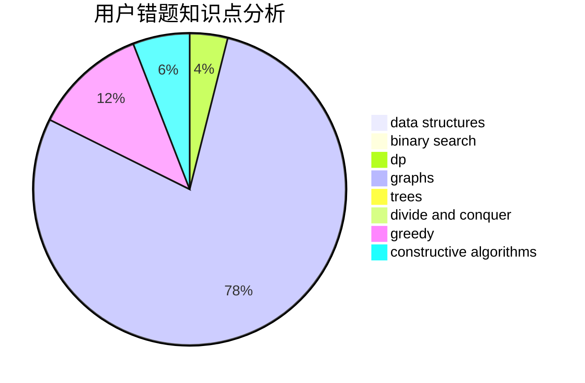

# LWLAymh

<!-- tabs:start -->

#### **用户提交结果分析**

#### **用户做题类型偏好分析**

#### **用户错题知识点分析**

<!-- tabs:end -->
# 推荐题目
[1488B](https://codeforces.com/contest/1488/problem/B)		*special problem,
                        greedy		  
[1287B](https://codeforces.com/contest/1287/problem/B)		brute force,
                        data structures,
                        implementation		  
[1139A](https://codeforces.com/contest/1139/problem/A)		implementation,
                        strings		  
[603A](https://codeforces.com/contest/603/problem/A)		dp,
                        greedy,
                        math		  
[1032F](https://codeforces.com/contest/1032/problem/F)		dp,
                        trees		  
[1093C](https://codeforces.com/contest/1093/problem/C)		greedy		  
[33C](https://codeforces.com/contest/33/problem/C)		greedy		  
[1099E](https://codeforces.com/contest/1099/problem/E)		dsu,graphs,sortings,trees		  
[608D](https://codeforces.com/contest/608/problem/D)		dsu,graphs,sortings,trees		  
[369A](https://codeforces.com/contest/369/problem/A)		greedy,
                        implementation		  
