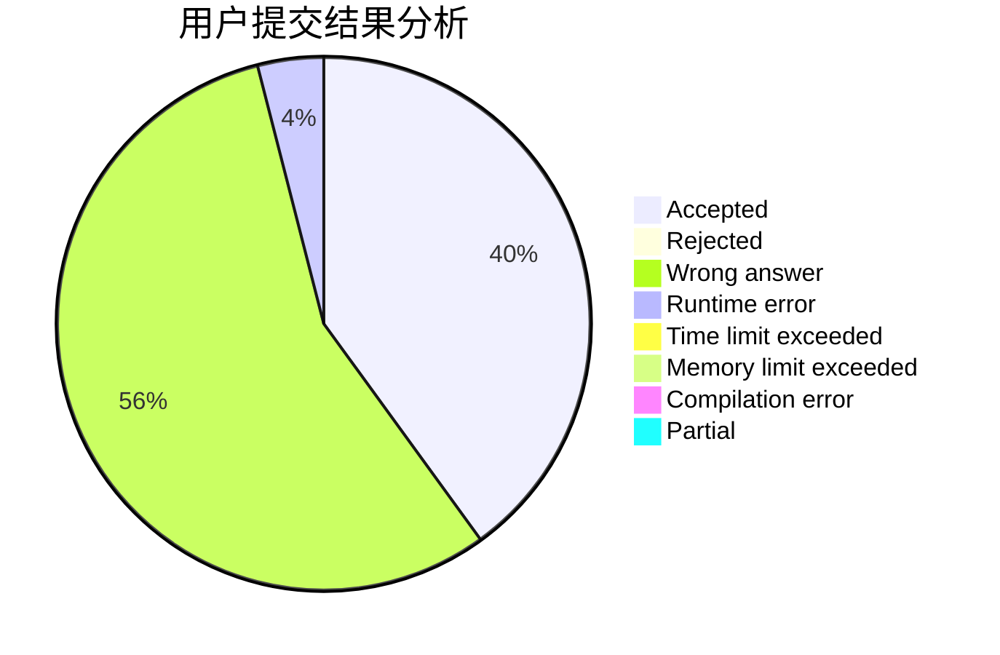
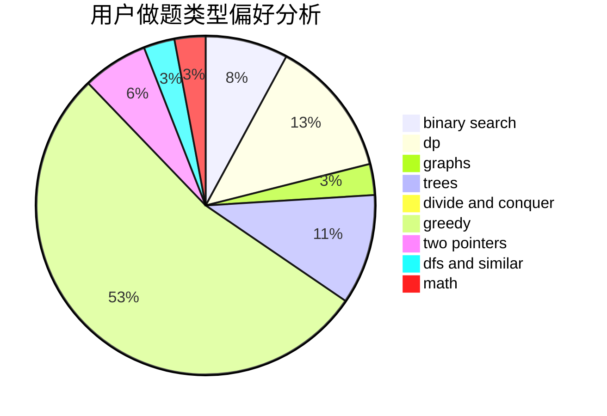

# LWLAymh

<!-- tabs:start -->

#### **用户提交结果分析**

#### **用户做题类型偏好分析**

<!-- tabs:end -->
# 推荐题目
[1488B](https://codeforces.com/contest/1488/problem/B)
[1287B](https://codeforces.com/contest/1287/problem/B)
[1139A](https://codeforces.com/contest/1139/problem/A)
[603A](https://codeforces.com/contest/603/problem/A)
[1032F](https://codeforces.com/contest/1032/problem/F)
[1093C](https://codeforces.com/contest/1093/problem/C)
[33C](https://codeforces.com/contest/33/problem/C)
[1099E](https://codeforces.com/contest/1099/problem/E)
[608D](https://codeforces.com/contest/608/problem/D)
[369A](https://codeforces.com/contest/369/problem/A)
