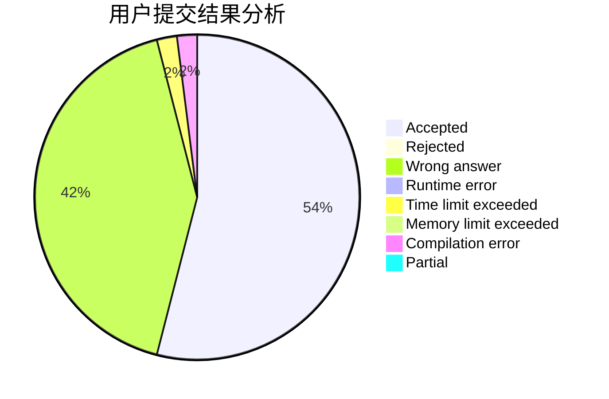
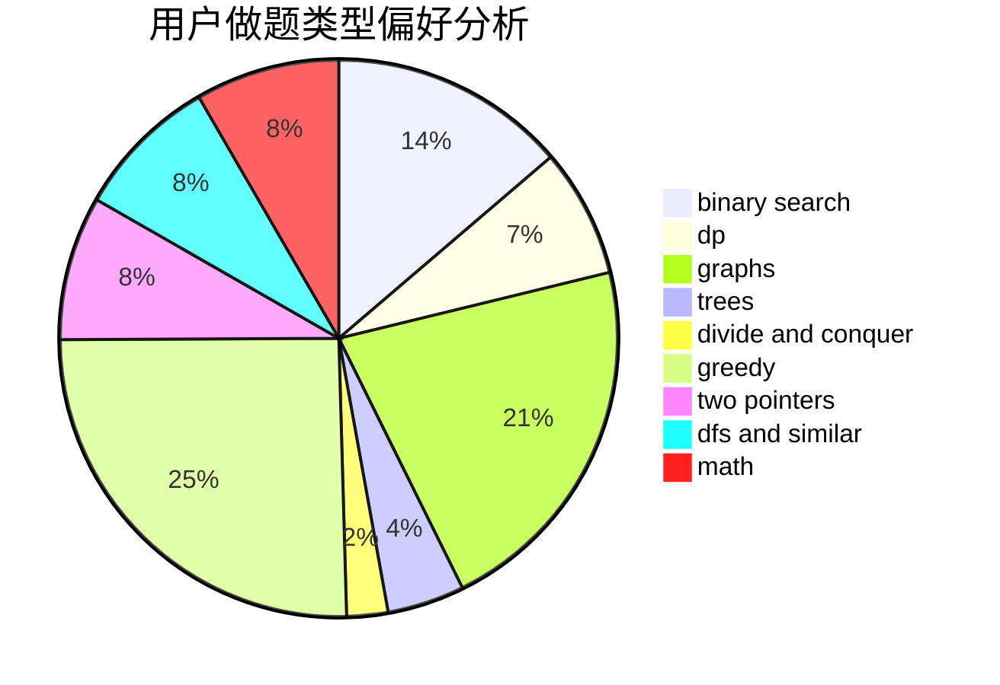

# LXFLXJX

<!-- tabs:start -->

#### **用户提交结果分析**

#### **用户做题类型偏好分析**

<!-- tabs:end -->
# 推荐题目
[76C](https://codeforces.com/contest/76/problem/C)
[575A](https://codeforces.com/contest/575/problem/A)
[1350E](https://codeforces.com/contest/1350/problem/E)
[710F](https://codeforces.com/contest/710/problem/F)
[254A](https://codeforces.com/contest/254/problem/A)
[835E](https://codeforces.com/contest/835/problem/E)
[1047D](https://codeforces.com/contest/1047/problem/D)
[386C](https://codeforces.com/contest/386/problem/C)
[737C](https://codeforces.com/contest/737/problem/C)
[6702](https://codeforces.com/contest/670/problem/2)
