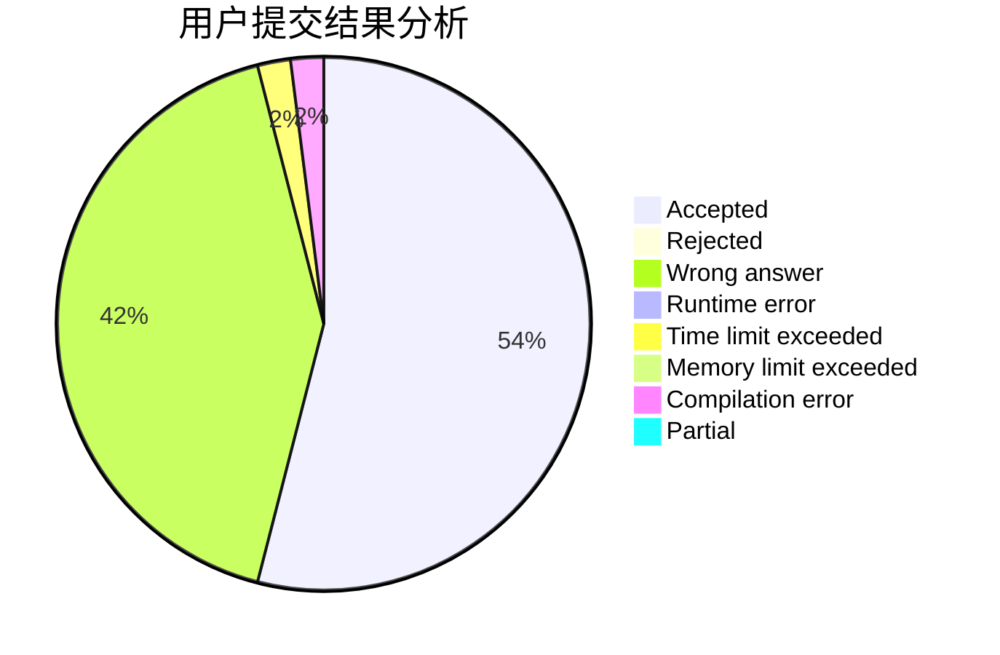
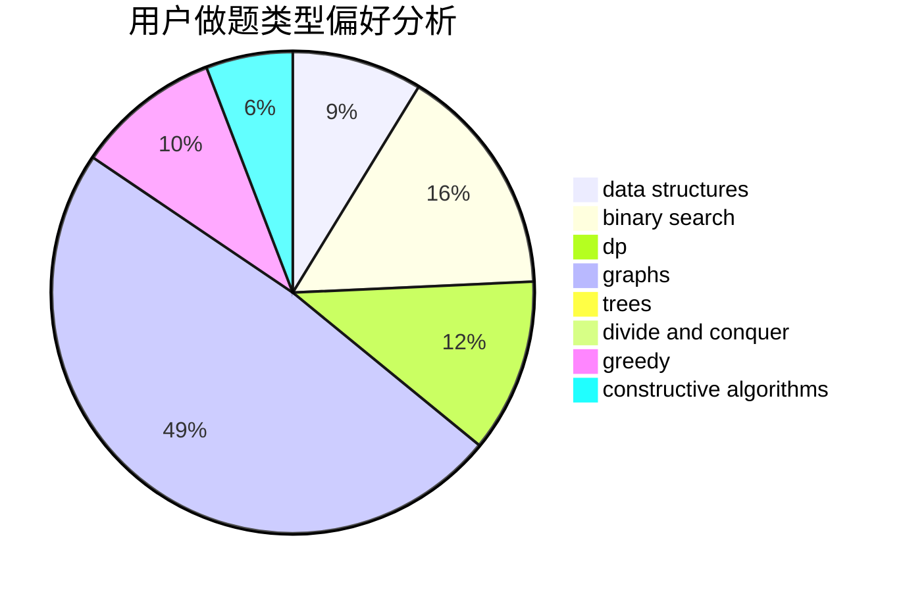
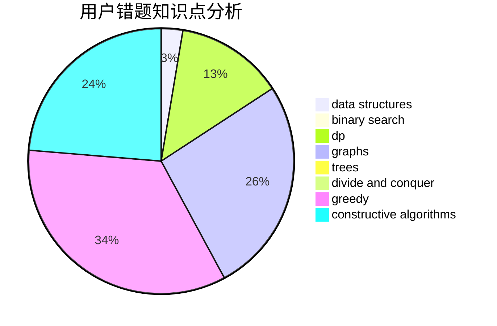

# LXFLXJX

<!-- tabs:start -->

#### **用户提交结果分析**

#### **用户做题类型偏好分析**

#### **用户错题知识点分析**

<!-- tabs:end -->
# 推荐题目
[76C](https://codeforces.com/contest/76/problem/C)		bitmasks,
                        dp,
                        math		  
[575A](https://codeforces.com/contest/575/problem/A)		data structures,
                        math,
                        matrices		  
[1350E](https://codeforces.com/contest/1350/problem/E)		dsu,graphs,sortings,trees		  
[710F](https://codeforces.com/contest/710/problem/F)		brute force,
                        data structures,
                        hashing,
                        interactive,
                        string suffix structures,
                        strings		  
[254A](https://codeforces.com/contest/254/problem/A)		constructive algorithms,
                        sortings		  
[835E](https://codeforces.com/contest/835/problem/E)		binary search,
                        constructive algorithms,
                        interactive		  
[1047D](https://codeforces.com/contest/1047/problem/D)		dsu,graphs,sortings,trees		  
[386C](https://codeforces.com/contest/386/problem/C)		dp,
                        strings,
                        two pointers		  
[737C](https://codeforces.com/contest/737/problem/C)		dsu,graphs,sortings,trees		  
[6702](https://codeforces.com/contest/670/problem/2)		dsu,graphs,sortings,trees		  
