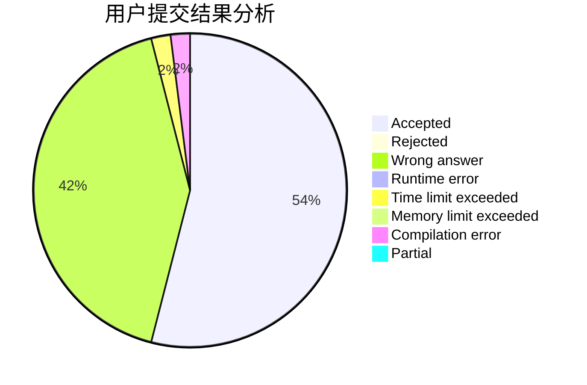
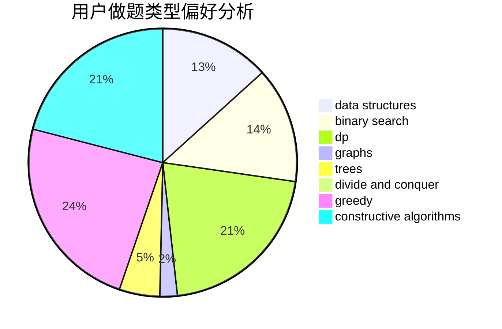
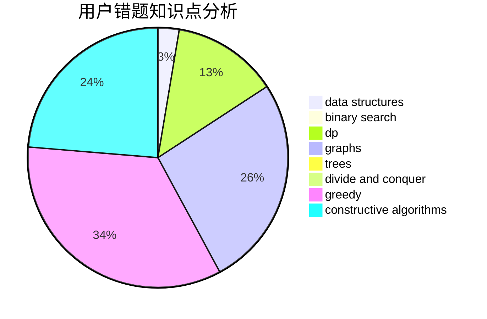

# LXFLXJX

<!-- tabs:start -->

#### **用户提交结果分析**

#### **用户做题类型偏好分析**

#### **用户错题知识点分析**

<!-- tabs:end -->
# 推荐题目
[750C](https://codeforces.com/contest/750/problem/C)		binary search,
                        greedy,
                        math		  
[54A](https://codeforces.com/contest/54/problem/A)		implementation		  
[1344A](https://codeforces.com/contest/1344/problem/A)		math,
                        number theory,
                        sortings		  
[691B](https://codeforces.com/contest/691/problem/B)		implementation,
                        strings		  
[232B](https://codeforces.com/contest/232/problem/B)		bitmasks,
                        combinatorics,
                        dp,
                        math		  
[816D](https://codeforces.com/contest/816/problem/D)		dsu,graphs,sortings,trees		  
[1047A](https://codeforces.com/contest/1047/problem/A)		math		  
[359C](https://codeforces.com/contest/359/problem/C)		math,
                        number theory		  
[720C](https://codeforces.com/contest/720/problem/C)		constructive algorithms		  
[641E](https://codeforces.com/contest/641/problem/E)		data structures		  
