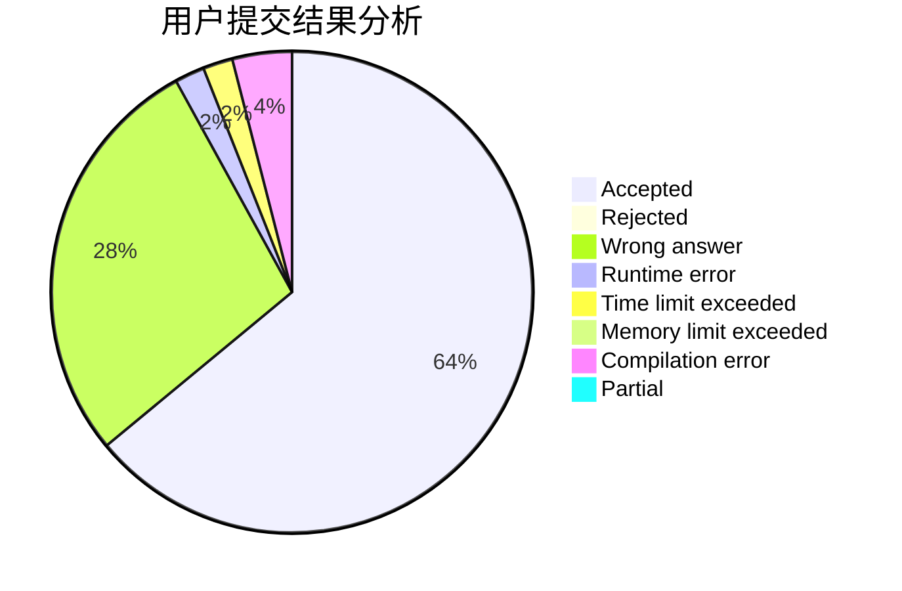
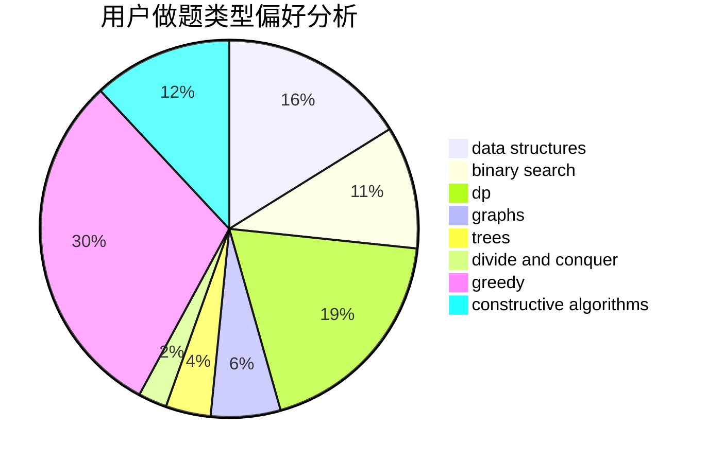

# LYATXDY

<!-- tabs:start -->

#### **用户提交结果分析**

#### **用户做题类型偏好分析**

#### **用户错题知识点分析**

<!-- tabs:end -->
# 推荐题目
[1028A](https://codeforces.com/contest/1028/problem/A)		implementation		  
[1174C](https://codeforces.com/contest/1174/problem/C)		constructive algorithms,
                        number theory		  
[248E](https://codeforces.com/contest/248/problem/E)		dp,
                        math,
                        probabilities		  
[1148H](https://codeforces.com/contest/1148/problem/H)		data structures		  
[527C](https://codeforces.com/contest/527/problem/C)		binary search,
                        data structures,
                        implementation		  
[599D](https://codeforces.com/contest/599/problem/D)		brute force,
                        math		  
[907D](https://codeforces.com/contest/907/problem/D)		dsu,graphs,sortings,trees		  
[760A](https://codeforces.com/contest/760/problem/A)		implementation,
                        math		  
[1267C](https://codeforces.com/contest/1267/problem/C)		constructive algorithms		  
[821D](https://codeforces.com/contest/821/problem/D)		dfs and similar,
                        graphs,
                        shortest paths		  
