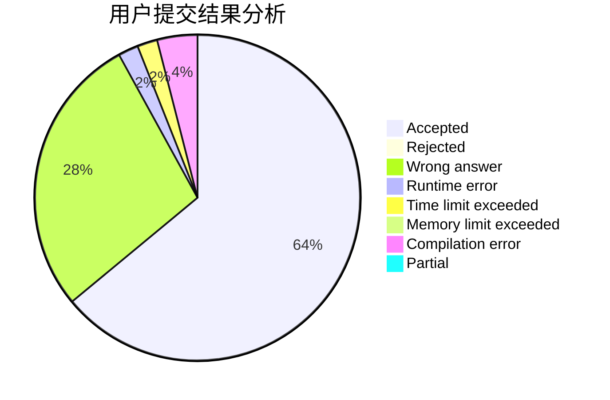
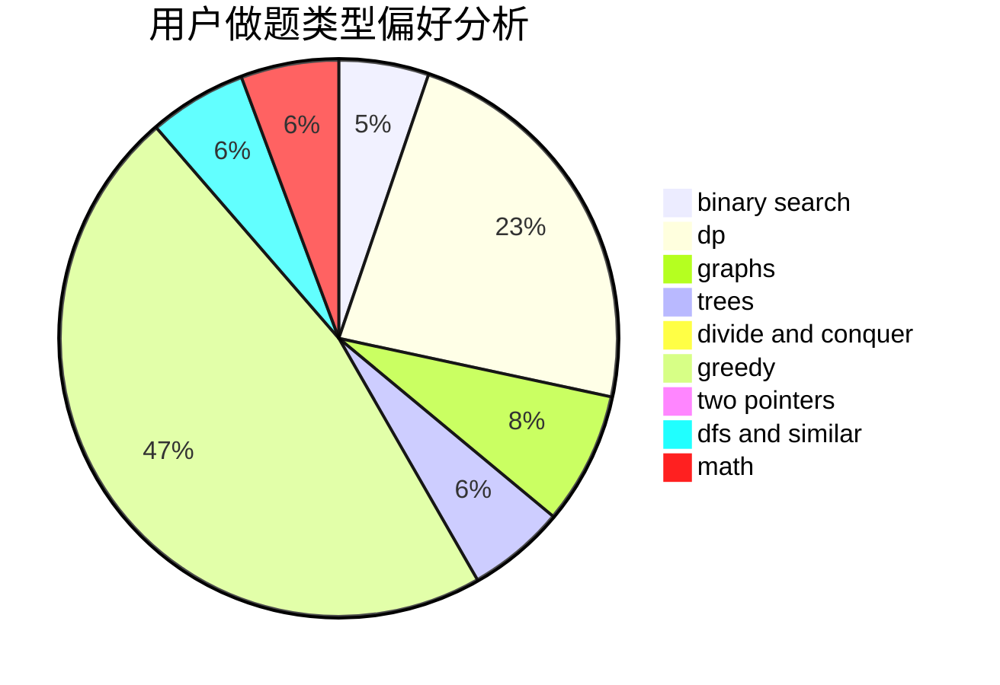

# LYATXDY

<!-- tabs:start -->

#### **用户提交结果分析**

#### **用户做题类型偏好分析**

<!-- tabs:end -->
# 推荐题目
[1028D](https://codeforces.com/contest/1028/problem/D)
[1176E](https://codeforces.com/contest/1176/problem/E)
[268B](https://codeforces.com/contest/268/problem/B)
[1150C](https://codeforces.com/contest/1150/problem/C)
[551C](https://codeforces.com/contest/551/problem/C)
[617E](https://codeforces.com/contest/617/problem/E)
[922A](https://codeforces.com/contest/922/problem/A)
[77E](https://codeforces.com/contest/77/problem/E)
[1272F](https://codeforces.com/contest/1272/problem/F)
[841C](https://codeforces.com/contest/841/problem/C)
