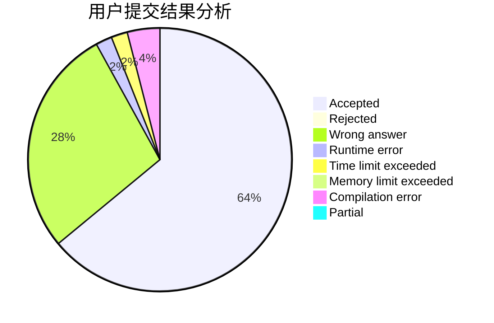
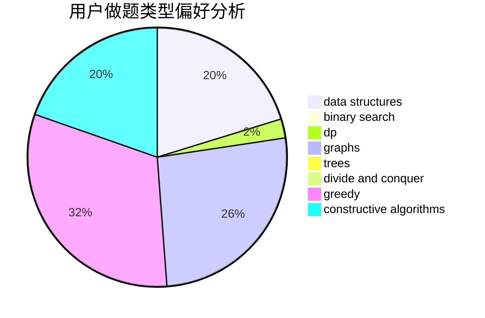

# LYATXDY

<!-- tabs:start -->

#### **用户提交结果分析**

#### **用户做题类型偏好分析**

#### **用户错题知识点分析**

<!-- tabs:end -->
# 推荐题目
[1028D](https://codeforces.com/contest/1028/problem/D)		combinatorics,
                        data structures,
                        greedy		  
[1176E](https://codeforces.com/contest/1176/problem/E)		dfs and similar,
                        dsu,
                        graphs,
                        shortest paths,
                        trees		  
[268B](https://codeforces.com/contest/268/problem/B)		implementation,
                        math		  
[1150C](https://codeforces.com/contest/1150/problem/C)		dsu,graphs,sortings,trees		  
[551C](https://codeforces.com/contest/551/problem/C)		binary search,
                        greedy		  
[617E](https://codeforces.com/contest/617/problem/E)		data structures		  
[922A](https://codeforces.com/contest/922/problem/A)		implementation		  
[77E](https://codeforces.com/contest/77/problem/E)		geometry		  
[1272F](https://codeforces.com/contest/1272/problem/F)		dp,
                        strings,
                        two pointers		  
[841C](https://codeforces.com/contest/841/problem/C)		dsu,graphs,sortings,trees		  
