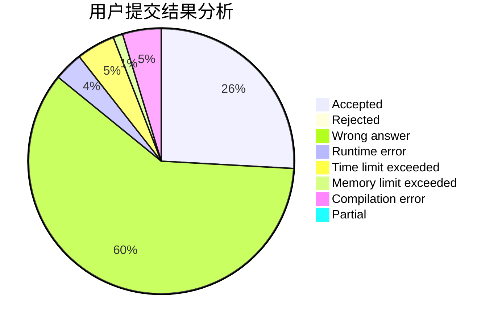
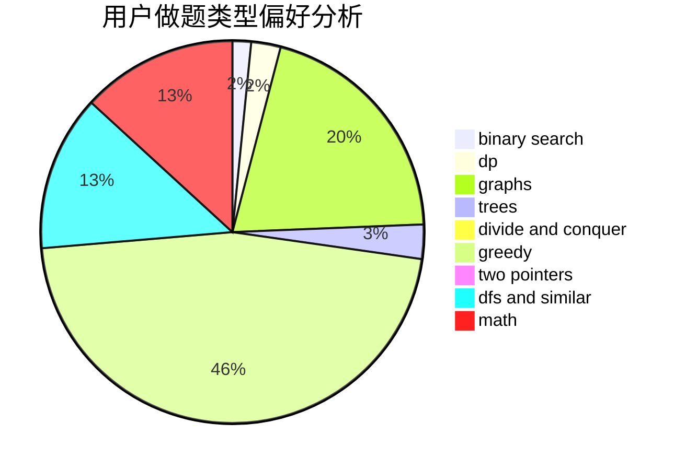

# LYC.

<!-- tabs:start -->

#### **用户提交结果分析**

#### **用户做题类型偏好分析**

<!-- tabs:end -->
# 推荐题目
[1296F](https://codeforces.com/contest/1296/problem/F)
[1267I](https://codeforces.com/contest/1267/problem/I)
[903G](https://codeforces.com/contest/903/problem/G)
[659D](https://codeforces.com/contest/659/problem/D)
[967A](https://codeforces.com/contest/967/problem/A)
[356C](https://codeforces.com/contest/356/problem/C)
[527B](https://codeforces.com/contest/527/problem/B)
[1214E](https://codeforces.com/contest/1214/problem/E)
[1372F](https://codeforces.com/contest/1372/problem/F)
[966E](https://codeforces.com/contest/966/problem/E)
