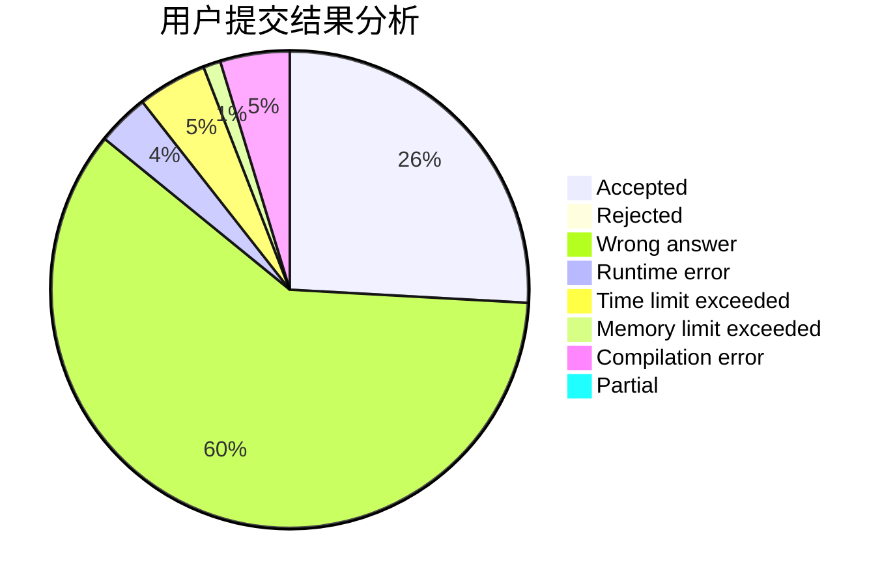
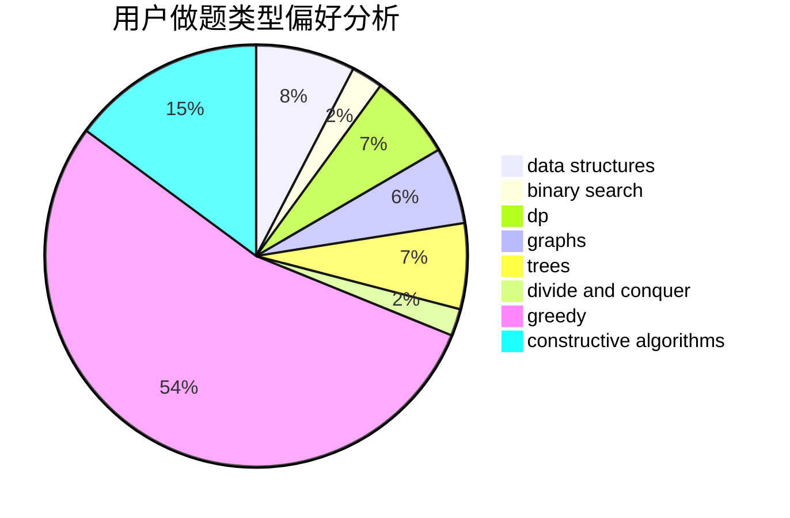
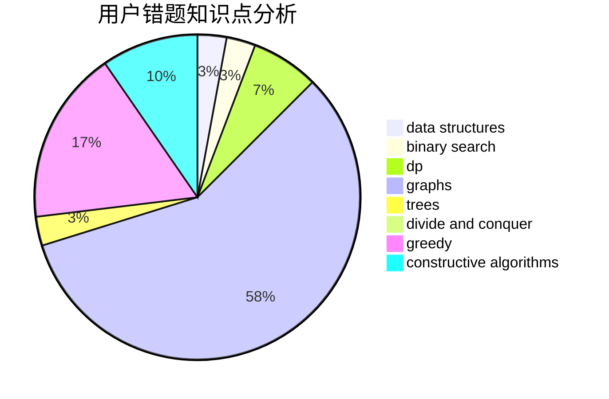

# LYC.

<!-- tabs:start -->

#### **用户提交结果分析**

#### **用户做题类型偏好分析**

#### **用户错题知识点分析**

<!-- tabs:end -->
# 推荐题目
[1296F](https://codeforces.com/contest/1296/problem/F)		constructive algorithms,
                        dfs and similar,
                        greedy,
                        sortings,
                        trees		  
[1267I](https://codeforces.com/contest/1267/problem/I)		brute force,
                        constructive algorithms,
                        implementation,
                        interactive,
                        sortings		  
[903G](https://codeforces.com/contest/903/problem/G)		data structures,
                        flows,
                        graphs		  
[659D](https://codeforces.com/contest/659/problem/D)		geometry,
                        implementation,
                        math		  
[967A](https://codeforces.com/contest/967/problem/A)		implementation		  
[356C](https://codeforces.com/contest/356/problem/C)		combinatorics,
                        constructive algorithms,
                        greedy,
                        implementation		  
[527B](https://codeforces.com/contest/527/problem/B)		greedy		  
[1214E](https://codeforces.com/contest/1214/problem/E)		constructive algorithms,
                        graphs,
                        math,
                        sortings,
                        trees		  
[1372F](https://codeforces.com/contest/1372/problem/F)		binary search,
                        divide and conquer,
                        interactive		  
[966E](https://codeforces.com/contest/966/problem/E)		dsu,graphs,sortings,trees		  
