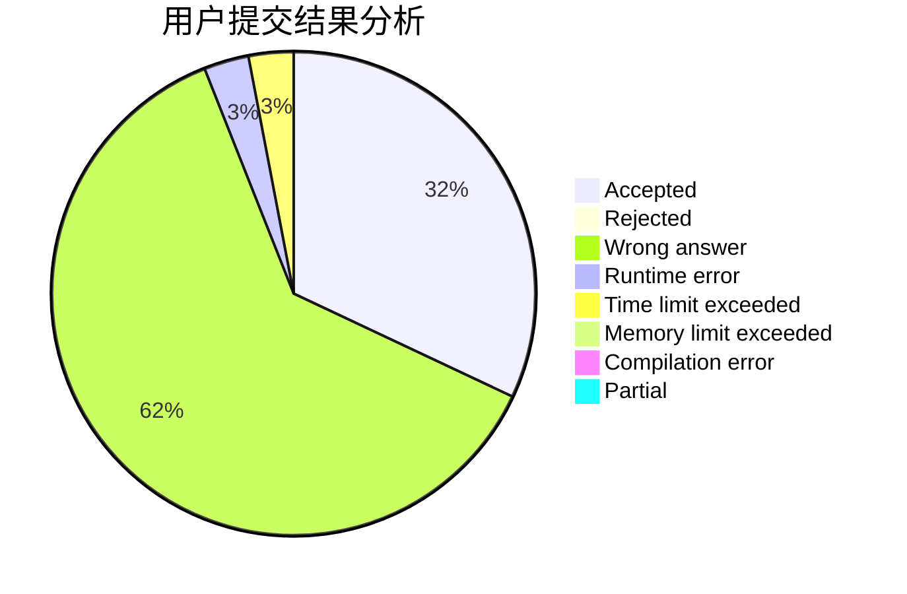
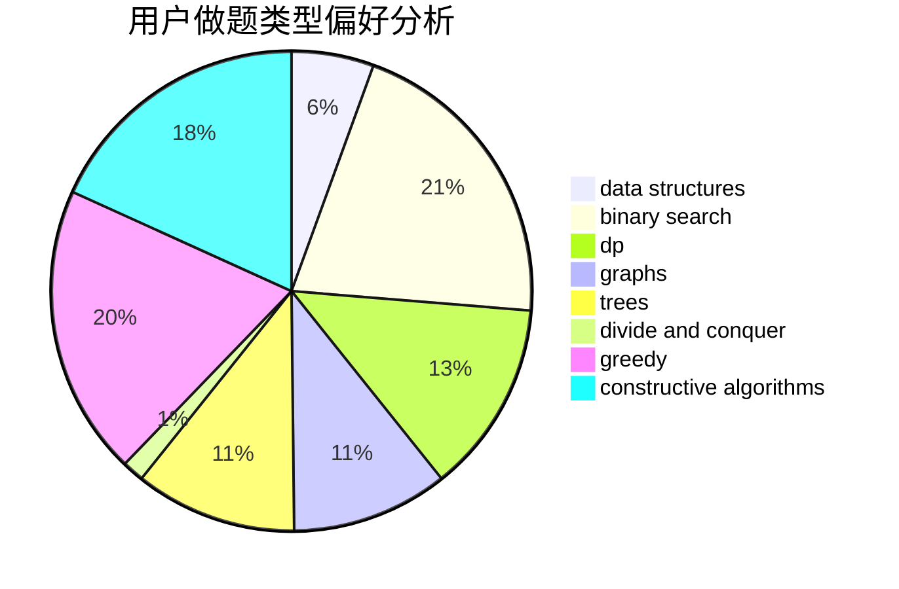

# LYFer
<!-- tabs:start -->
#### **用户提交结果分析**

#### **用户做题类型偏好分析**

#### **用户错题知识点分析**

<!-- tabs:end -->
# 推荐题目
[K-th Largest Value](http://codeforces.com/problemset/problem/1491/A)		brute force,
                        greedy,
                        implementation		  
[Painting the Array II](https://codeforces.com/contest/1480/problem/D2)		constructive algorithms,
                        data structures,
                        dp,
                        greedy,
                        implementation		  
[Alice and the List of Presents](http://codeforces.com/problemset/problem/1236/B)		combinatorics,
                        math		  
[Rectangles](http://codeforces.com/problemset/problem/1028/C)		geometry,
                        implementation,
                        sortings		  
[Mike and Geometry Problem](http://codeforces.com/problemset/problem/689/E)		combinatorics,
                        data structures,
                        dp,
                        geometry,
                        implementation		  
[Tachibana Kanade's Tofu](https://codeforces.com/contest/434/problem/C)		dp		  
[Xor on Figures](http://codeforces.com/problemset/problem/1270/I)		constructive algorithms,
                        fft,
                        math		  
[Three Blocks Palindrome (hard version)](http://codeforces.com/problemset/problem/1335/E2)		brute force,
                        data structures,
                        dp,
                        two pointers		  
[The Wall (easy)](http://codeforces.com/problemset/problem/690/D1)		nan		  
[Madness](http://codeforces.com/problemset/problem/822/F)		constructive algorithms,
                        dfs and similar,
                        trees		  
<!-- tabs:start -->
#### **data structures**
[K-th Largest Value](https://codeforces.com/contest/1480/problem/D2)		constructive algorithms,
                        data structures,
                        dp,
                        greedy,
                        implementation		  
[Painting the Array II](http://codeforces.com/problemset/problem/689/E)		combinatorics,
                        data structures,
                        dp,
                        geometry,
                        implementation		  
[Alice and the List of Presents](http://codeforces.com/problemset/problem/1335/E2)		brute force,
                        data structures,
                        dp,
                        two pointers		  
[Rectangles](http://codeforces.com/problemset/problem/610/E)		data structures,
                        strings		  
[Mike and Geometry Problem](http://codeforces.com/problemset/problem/226/E)		data structures,
                        trees		  
[Tachibana Kanade's Tofu](http://codeforces.com/problemset/problem/601/D)		data structures,
                        dfs and similar,
                        dsu,
                        hashing,
                        strings,
                        trees		  
[Xor on Figures](http://codeforces.com/problemset/problem/1381/A1)		constructive algorithms,
                        data structures,
                        strings		  
[Three Blocks Palindrome (hard version)](http://codeforces.com/problemset/problem/568/E)		data structures,
                        dp		  
[The Wall (easy)](http://codeforces.com/problemset/problem/1497/E1)		data structures,
                        dp,
                        greedy,
                        math,
                        number theory,
                        two pointers		  
[Madness](http://codeforces.com/problemset/problem/86/D)		data structures,
                        implementation,
                        math,
                        two pointers		  
#### **binary search**
[K-th Largest Value](http://codeforces.com/problemset/problem/1366/E)		binary search,
                        brute force,
                        combinatorics,
                        constructive algorithms,
                        dp,
                        two pointers		  
[Painting the Array II](http://codeforces.com/problemset/problem/1166/D)		binary search,
                        brute force,
                        greedy,
                        math		  
[Alice and the List of Presents](http://codeforces.com/problemset/problem/1492/C)		binary search,
                        data structures,
                        dp,
                        greedy,
                        two pointers		  
[Rectangles](http://codeforces.com/problemset/problem/1463/D)		binary search,
                        constructive algorithms,
                        greedy,
                        two pointers		  
[Mike and Geometry Problem](http://codeforces.com/problemset/problem/1490/G)		binary search,
                        data structures,
                        math		  
[Tachibana Kanade's Tofu](http://codeforces.com/problemset/problem/1479/D)		binary search,
                        bitmasks,
                        brute force,
                        data structures,
                        probabilities,
                        trees		  
[Xor on Figures](http://codeforces.com/problemset/problem/1436/E)		binary search,
                        data structures,
                        two pointers		  
[Three Blocks Palindrome (hard version)](http://codeforces.com/problemset/problem/1461/D)		binary search,
                        brute force,
                        data structures,
                        divide and conquer,
                        implementation,
                        sortings		  
[The Wall (easy)](http://codeforces.com/problemset/problem/1493/C)		binary search,
                        brute force,
                        constructive algorithms,
                        greedy,
                        strings		  
[Madness](http://codeforces.com/problemset/problem/1487/D)		binary search,
                        brute force,
                        math,
                        number theory		  
#### **dp**
[K-th Largest Value](https://codeforces.com/contest/1480/problem/D2)		constructive algorithms,
                        data structures,
                        dp,
                        greedy,
                        implementation		  
[Painting the Array II](http://codeforces.com/problemset/problem/689/E)		combinatorics,
                        data structures,
                        dp,
                        geometry,
                        implementation		  
[Alice and the List of Presents](https://codeforces.com/contest/434/problem/C)		dp		  
[Rectangles](http://codeforces.com/problemset/problem/1335/E2)		brute force,
                        data structures,
                        dp,
                        two pointers		  
[Mike and Geometry Problem](http://codeforces.com/problemset/problem/822/D)		brute force,
                        dp,
                        greedy,
                        math,
                        number theory		  
[Tachibana Kanade's Tofu](http://codeforces.com/problemset/problem/486/D)		dfs and similar,
                        dp,
                        math,
                        trees		  
[Xor on Figures](http://codeforces.com/problemset/problem/1366/E)		binary search,
                        brute force,
                        combinatorics,
                        constructive algorithms,
                        dp,
                        two pointers		  
[Three Blocks Palindrome (hard version)](http://codeforces.com/problemset/problem/1392/H)		combinatorics,
                        dp,
                        math,
                        probabilities		  
[The Wall (easy)](http://codeforces.com/problemset/problem/704/C)		dp,
                        graphs,
                        implementation,
                        math		  
[Madness](http://codeforces.com/problemset/problem/568/E)		data structures,
                        dp		  
#### **graph**
[K-th Largest Value](http://codeforces.com/problemset/problem/1067/B)		dfs and similar,
                        graphs,
                        shortest paths		  
[Painting the Array II](http://codeforces.com/problemset/problem/704/C)		dp,
                        graphs,
                        implementation,
                        math		  
[Alice and the List of Presents](http://codeforces.com/problemset/problem/555/E)		dfs and similar,
                        graphs,
                        trees		  
[Rectangles](http://codeforces.com/problemset/problem/1487/C)		brute force,
                        constructive algorithms,
                        dfs and similar,
                        graphs,
                        greedy,
                        implementation,
                        math		  
[Mike and Geometry Problem](http://codeforces.com/problemset/problem/1437/C)		dp,
                        flows,
                        graph matchings,
                        greedy,
                        math,
                        sortings		  
[Tachibana Kanade's Tofu](http://codeforces.com/problemset/problem/1470/D)		constructive algorithms,
                        dfs and similar,
                        graph matchings,
                        graphs,
                        greedy		  
[Xor on Figures](http://codeforces.com/problemset/problem/1476/C)		dp,
                        graphs,
                        greedy		  
[Three Blocks Palindrome (hard version)](http://codeforces.com/problemset/problem/1304/D)		constructive algorithms,
                        graphs,
                        greedy,
                        two pointers		  
[The Wall (easy)](http://codeforces.com/problemset/problem/1475/C)		combinatorics,
                        graphs,
                        math		  
[Madness](http://codeforces.com/problemset/problem/553/E)		dp,
                        fft,
                        graphs,
                        math,
                        probabilities		  
#### **trees**
[K-th Largest Value](http://codeforces.com/problemset/problem/822/F)		constructive algorithms,
                        dfs and similar,
                        trees		  
[Painting the Array II](http://codeforces.com/problemset/problem/486/D)		dfs and similar,
                        dp,
                        math,
                        trees		  
[Alice and the List of Presents](http://codeforces.com/problemset/problem/226/E)		data structures,
                        trees		  
[Rectangles](http://codeforces.com/problemset/problem/601/D)		data structures,
                        dfs and similar,
                        dsu,
                        hashing,
                        strings,
                        trees		  
[Mike and Geometry Problem](http://codeforces.com/problemset/problem/555/E)		dfs and similar,
                        graphs,
                        trees		  
[Tachibana Kanade's Tofu](http://codeforces.com/problemset/problem/516/D)		dfs and similar,
                        dp,
                        dsu,
                        trees,
                        two pointers		  
[Xor on Figures](http://codeforces.com/problemset/problem/1479/D)		binary search,
                        bitmasks,
                        brute force,
                        data structures,
                        probabilities,
                        trees		  
[Three Blocks Palindrome (hard version)](http://codeforces.com/problemset/problem/1511/C)		brute force,
                        data structures,
                        implementation,
                        trees		  
[The Wall (easy)](http://codeforces.com/problemset/problem/1499/F)		combinatorics,
                        dfs and similar,
                        dp,
                        trees		  
[Madness](http://codeforces.com/problemset/problem/1491/E)		brute force,
                        dfs and similar,
                        divide and conquer,
                        number theory,
                        trees		  
#### **divide and conquer**
[K-th Largest Value](http://codeforces.com/problemset/problem/1461/D)		binary search,
                        brute force,
                        data structures,
                        divide and conquer,
                        implementation,
                        sortings		  
[Painting the Array II](http://codeforces.com/problemset/problem/1466/G)		combinatorics,
                        divide and conquer,
                        hashing,
                        math,
                        string suffix structures,
                        strings		  
[Alice and the List of Presents](http://codeforces.com/problemset/problem/1490/D)		dfs and similar,
                        divide and conquer,
                        implementation		  
[Rectangles](https://codeforces.com/contest/1483/problem/C)		data structures,
                        divide and conquer,
                        dp		  
[Mike and Geometry Problem](http://codeforces.com/problemset/problem/1491/E)		brute force,
                        dfs and similar,
                        divide and conquer,
                        number theory,
                        trees		  
[Tachibana Kanade's Tofu](http://codeforces.com/problemset/problem/1303/G)		data structures,
                        divide and conquer,
                        geometry,
                        trees		  
[Xor on Figures](http://codeforces.com/problemset/problem/1494/D)		constructive algorithms,
                        data structures,
                        dfs and similar,
                        divide and conquer,
                        dsu,
                        greedy,
                        sortings,
                        trees		  
[Three Blocks Palindrome (hard version)](http://codeforces.com/problemset/problem/1482/E)		data structures,
                        divide and conquer,
                        dp		  
[The Wall (easy)](http://codeforces.com/problemset/problem/566/C)		dfs and similar,
                        divide and conquer,
                        trees		  
[Madness](http://codeforces.com/problemset/problem/1428/F)		binary search,
                        data structures,
                        divide and conquer,
                        dp,
                        two pointers		  
#### **greedy**
[K-th Largest Value](http://codeforces.com/problemset/problem/1491/A)		brute force,
                        greedy,
                        implementation		  
[Painting the Array II](https://codeforces.com/contest/1480/problem/D2)		constructive algorithms,
                        data structures,
                        dp,
                        greedy,
                        implementation		  
[Alice and the List of Presents](http://codeforces.com/problemset/problem/1249/D1)		greedy		  
[Rectangles](http://codeforces.com/problemset/problem/822/D)		brute force,
                        dp,
                        greedy,
                        math,
                        number theory		  
[Mike and Geometry Problem](https://codeforces.com/contest/497/problem/C)		greedy,
                        sortings		  
[Tachibana Kanade's Tofu](http://codeforces.com/problemset/problem/305/C)		greedy,
                        implementation		  
[Xor on Figures](http://codeforces.com/problemset/problem/1292/E)		constructive algorithms,
                        greedy,
                        interactive,
                        math		  
[Three Blocks Palindrome (hard version)](http://codeforces.com/problemset/problem/1166/D)		binary search,
                        brute force,
                        greedy,
                        math		  
[The Wall (easy)](http://codeforces.com/problemset/problem/1497/E1)		data structures,
                        dp,
                        greedy,
                        math,
                        number theory,
                        two pointers		  
[Madness](http://codeforces.com/problemset/problem/1265/A)		constructive algorithms,
                        greedy		  
#### **constructive algorithms**
[K-th Largest Value](https://codeforces.com/contest/1480/problem/D2)		constructive algorithms,
                        data structures,
                        dp,
                        greedy,
                        implementation		  
[Painting the Array II](http://codeforces.com/problemset/problem/1270/I)		constructive algorithms,
                        fft,
                        math		  
[Alice and the List of Presents](http://codeforces.com/problemset/problem/822/F)		constructive algorithms,
                        dfs and similar,
                        trees		  
[Rectangles](http://codeforces.com/problemset/problem/1366/E)		binary search,
                        brute force,
                        combinatorics,
                        constructive algorithms,
                        dp,
                        two pointers		  
[Mike and Geometry Problem](http://codeforces.com/problemset/problem/1292/E)		constructive algorithms,
                        greedy,
                        interactive,
                        math		  
[Tachibana Kanade's Tofu](http://codeforces.com/problemset/problem/1381/A1)		constructive algorithms,
                        data structures,
                        strings		  
[Xor on Figures](http://codeforces.com/problemset/problem/1265/A)		constructive algorithms,
                        greedy		  
[Three Blocks Palindrome (hard version)](http://codeforces.com/problemset/problem/1493/A)		constructive algorithms,
                        greedy		  
[The Wall (easy)](http://codeforces.com/problemset/problem/1463/D)		binary search,
                        constructive algorithms,
                        greedy,
                        two pointers		  
[Madness](https://codeforces.com/contest/1456/problem/B)		bitmasks,
                        brute force,
                        constructive algorithms		  
#### **sortings**
[K-th Largest Value](http://codeforces.com/problemset/problem/1028/C)		geometry,
                        implementation,
                        sortings		  
[Painting the Array II](https://codeforces.com/contest/497/problem/C)		greedy,
                        sortings		  
[Alice and the List of Presents](https://codeforces.com/contest/876/problem/D)		dsu,
                        implementation,
                        sortings,
                        two pointers		  
[Rectangles](https://codeforces.com/contest/1496/problem/C)		geometry,
                        greedy,
                        math,
                        sortings		  
[Mike and Geometry Problem](http://codeforces.com/problemset/problem/1495/A)		geometry,
                        greedy,
                        math,
                        sortings		  
[Tachibana Kanade's Tofu](http://codeforces.com/problemset/problem/1497/A)		brute force,
                        data structures,
                        greedy,
                        sortings		  
[Xor on Figures](http://codeforces.com/problemset/problem/1427/A)		math,
                        sortings		  
[Three Blocks Palindrome (hard version)](http://codeforces.com/problemset/problem/1461/D)		binary search,
                        brute force,
                        data structures,
                        divide and conquer,
                        implementation,
                        sortings		  
[The Wall (easy)](http://codeforces.com/problemset/problem/1437/C)		dp,
                        flows,
                        graph matchings,
                        greedy,
                        math,
                        sortings		  
[Madness](http://codeforces.com/problemset/problem/1473/A)		greedy,
                        implementation,
                        math,
                        sortings		  
<!-- tabs:end -->
