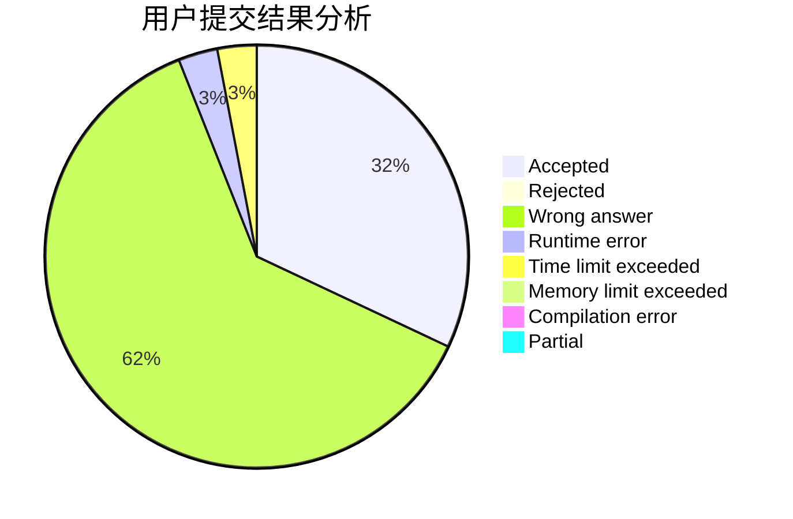
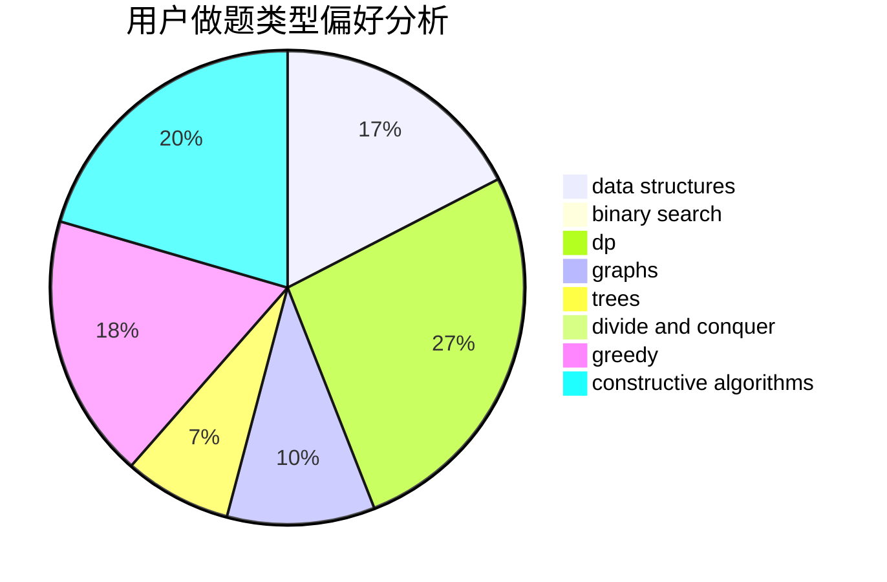
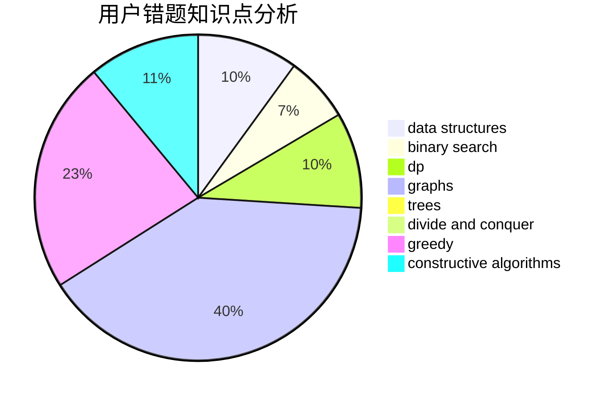

# LYFer

<!-- tabs:start -->

#### **用户提交结果分析**

#### **用户做题类型偏好分析**

#### **用户错题知识点分析**

<!-- tabs:end -->
# 推荐题目
[1028G](https://codeforces.com/contest/1028/problem/G)		dp,
                        interactive		  
[246A](https://codeforces.com/contest/246/problem/A)		constructive algorithms,
                        greedy,
                        sortings		  
[710D](https://codeforces.com/contest/710/problem/D)		math,
                        number theory		  
[842C](https://codeforces.com/contest/842/problem/C)		dfs and similar,
                        graphs,
                        math,
                        number theory,
                        trees		  
[70E](https://codeforces.com/contest/70/problem/E)		dp,
                        implementation,
                        trees		  
[1499G](https://codeforces.com/contest/1499/problem/G)		data structures,
                        graphs,
                        interactive		  
[455B](https://codeforces.com/contest/455/problem/B)		dfs and similar,
                        dp,
                        games,
                        implementation,
                        strings,
                        trees		  
[580B](https://codeforces.com/contest/580/problem/B)		binary search,
                        sortings,
                        two pointers		  
[1240E](https://codeforces.com/contest/1240/problem/E)		dsu,graphs,sortings,trees		  
[225D](https://codeforces.com/contest/225/problem/D)		bitmasks,
                        dfs and similar,
                        graphs,
                        implementation		  
