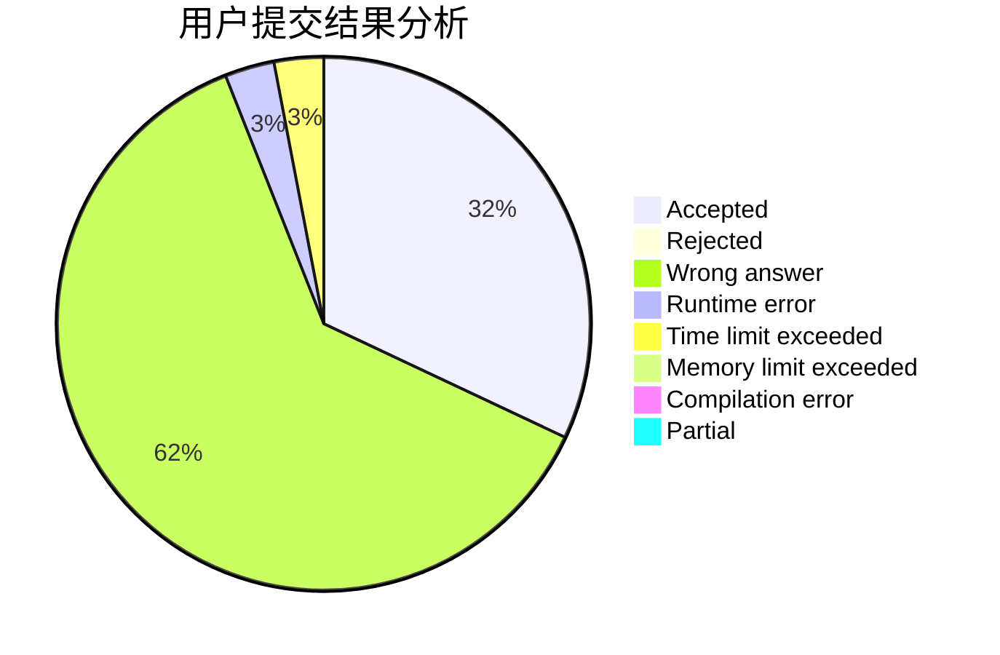
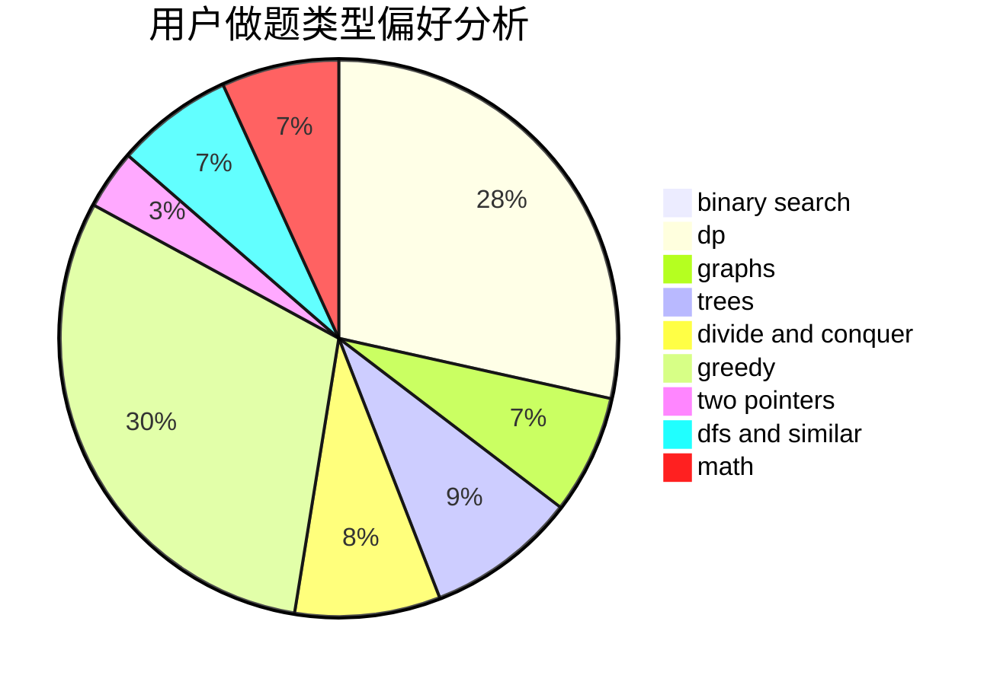

# LYFer

<!-- tabs:start -->

#### **用户提交结果分析**

#### **用户做题类型偏好分析**

<!-- tabs:end -->
# 推荐题目
[1028G](https://codeforces.com/contest/1028/problem/G)
[246A](https://codeforces.com/contest/246/problem/A)
[710D](https://codeforces.com/contest/710/problem/D)
[842C](https://codeforces.com/contest/842/problem/C)
[70E](https://codeforces.com/contest/70/problem/E)
[1499G](https://codeforces.com/contest/1499/problem/G)
[455B](https://codeforces.com/contest/455/problem/B)
[580B](https://codeforces.com/contest/580/problem/B)
[1240E](https://codeforces.com/contest/1240/problem/E)
[225D](https://codeforces.com/contest/225/problem/D)
