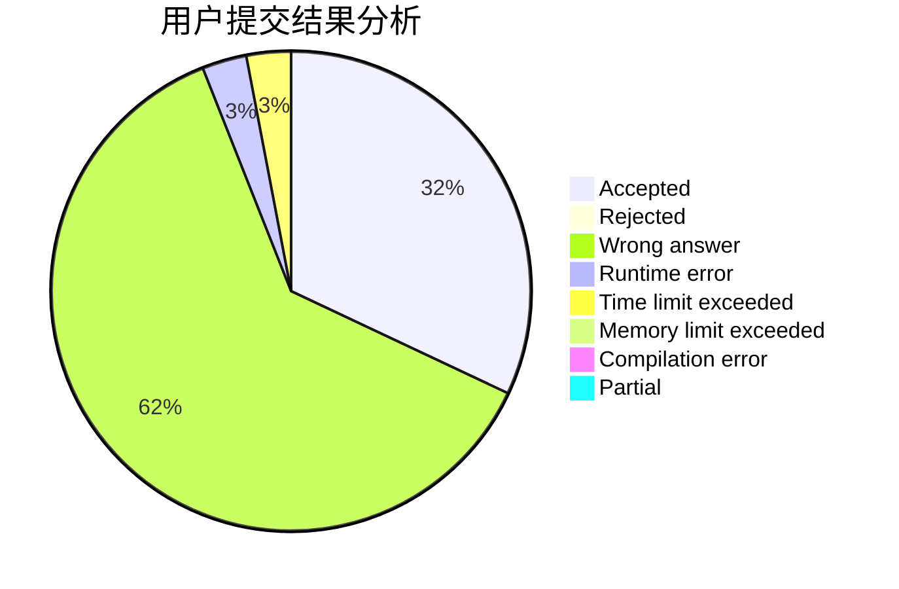
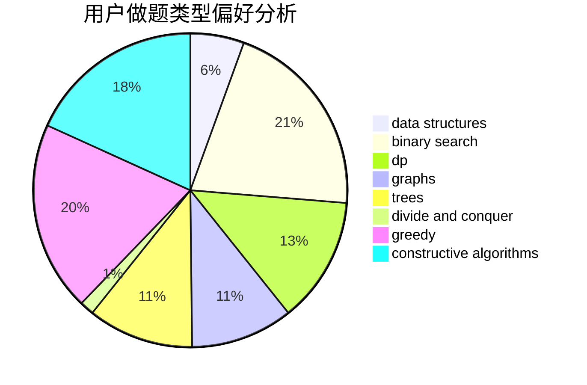

# LYFer

<!-- tabs:start -->

#### **用户提交结果分析**

#### **用户做题类型偏好分析**

#### **用户错题知识点分析**

<!-- tabs:end -->
# 推荐题目
[1028C](https://codeforces.com/contest/1028/problem/C)		geometry,
                        implementation,
                        sortings		  
[226E](https://codeforces.com/contest/226/problem/E)		data structures,
                        trees		  
[690D1](https://codeforces.com/contest/690D/problem/1)		nan		  
[822D](https://codeforces.com/contest/822/problem/D)		brute force,
                        dp,
                        greedy,
                        math,
                        number theory		  
[689E](https://codeforces.com/contest/689/problem/E)		combinatorics,
                        data structures,
                        dp,
                        geometry,
                        implementation		  
[1491A](https://codeforces.com/contest/1491/problem/A)		brute force,
                        greedy,
                        implementation		  
[434C](https://codeforces.com/contest/434/problem/C)		dsu,graphs,sortings,trees		  
[555E](https://codeforces.com/contest/555/problem/E)		dfs and similar,
                        graphs,
                        trees		  
[1236B](https://codeforces.com/contest/1236/problem/B)		combinatorics,
                        math		  
[200B](https://codeforces.com/contest/200/problem/B)		implementation,
                        math		  
