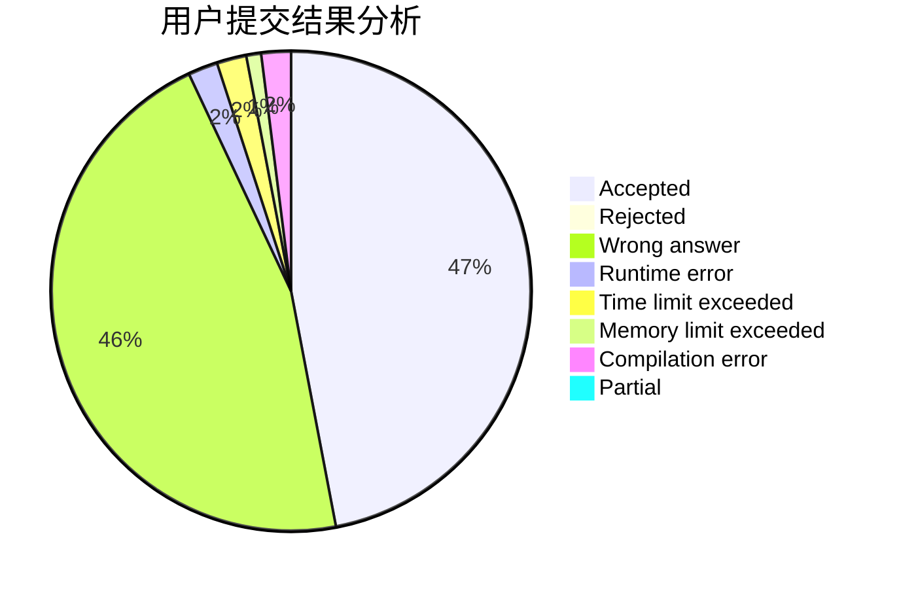
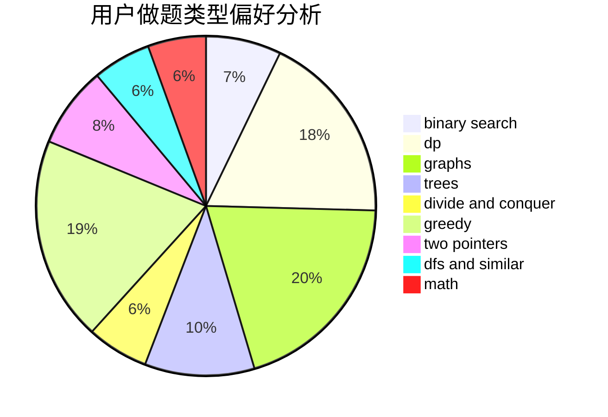

# LZFeng

<!-- tabs:start -->

#### **用户提交结果分析**

#### **用户做题类型偏好分析**

<!-- tabs:end -->
# 推荐题目
[261D](https://codeforces.com/contest/261/problem/D)
[607E](https://codeforces.com/contest/607/problem/E)
[198B](https://codeforces.com/contest/198/problem/B)
[1473G](https://codeforces.com/contest/1473/problem/G)
[145C](https://codeforces.com/contest/145/problem/C)
[723C](https://codeforces.com/contest/723/problem/C)
[622A](https://codeforces.com/contest/622/problem/A)
[652D](https://codeforces.com/contest/652/problem/D)
[218C](https://codeforces.com/contest/218/problem/C)
[1046I](https://codeforces.com/contest/1046/problem/I)
