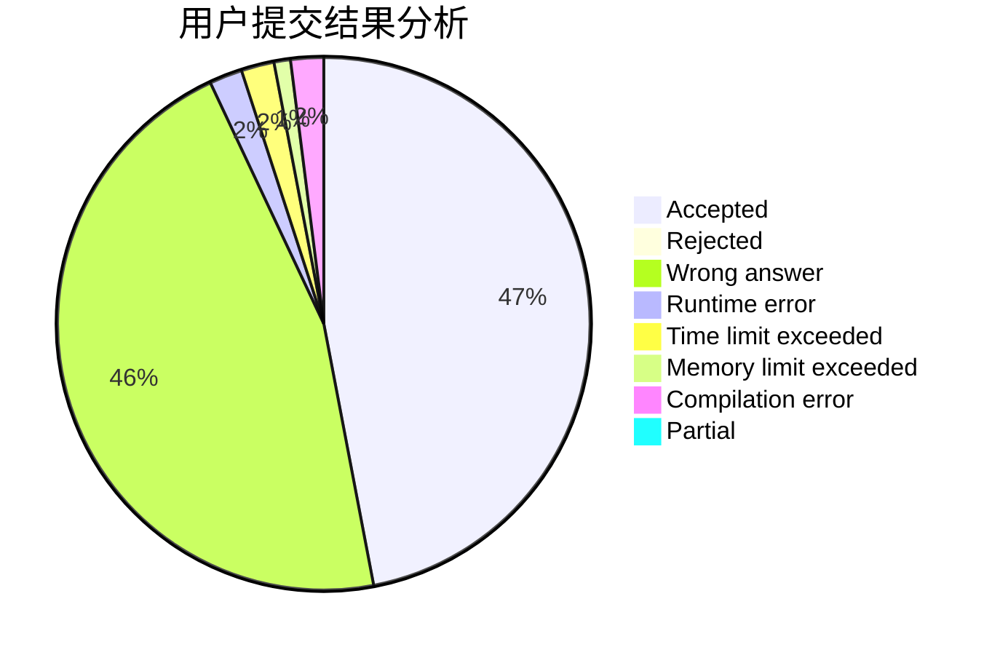
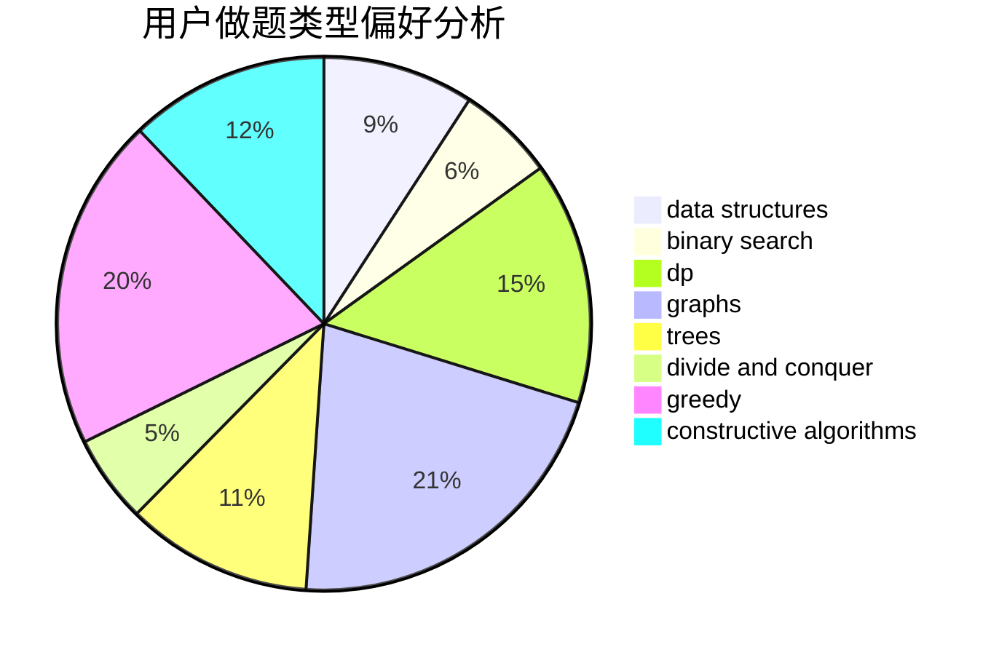
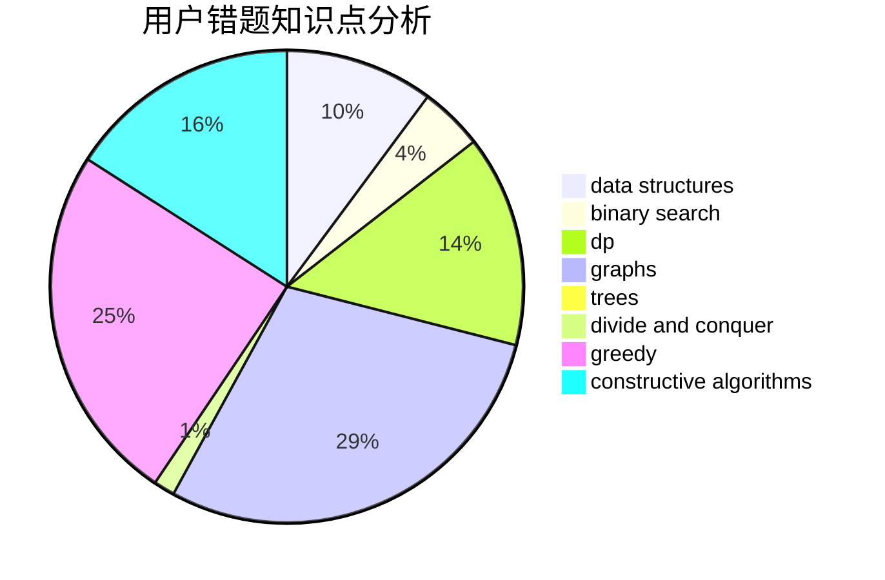

# LZFeng

<!-- tabs:start -->

#### **用户提交结果分析**

#### **用户做题类型偏好分析**

#### **用户错题知识点分析**

<!-- tabs:end -->
# 推荐题目
[261D](https://codeforces.com/contest/261/problem/D)		dp		  
[607E](https://codeforces.com/contest/607/problem/E)		binary search,
                        geometry		  
[198B](https://codeforces.com/contest/198/problem/B)		shortest paths		  
[1473G](https://codeforces.com/contest/1473/problem/G)		combinatorics,
                        dp,
                        fft,
                        math		  
[145C](https://codeforces.com/contest/145/problem/C)		combinatorics,
                        dp,
                        math		  
[723C](https://codeforces.com/contest/723/problem/C)		greedy		  
[622A](https://codeforces.com/contest/622/problem/A)		implementation,
                        math		  
[652D](https://codeforces.com/contest/652/problem/D)		data structures,
                        sortings		  
[218C](https://codeforces.com/contest/218/problem/C)		dsu,graphs,sortings,trees		  
[1046I](https://codeforces.com/contest/1046/problem/I)		geometry		  
