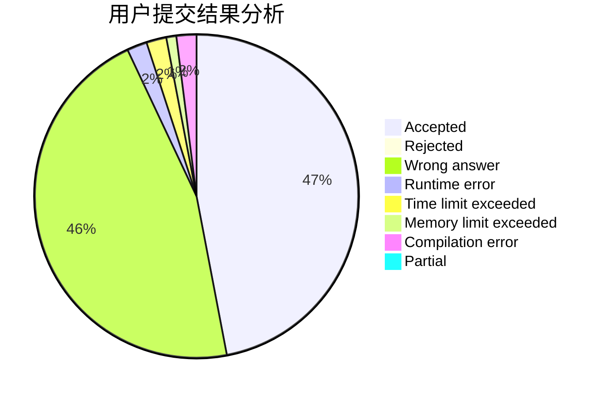
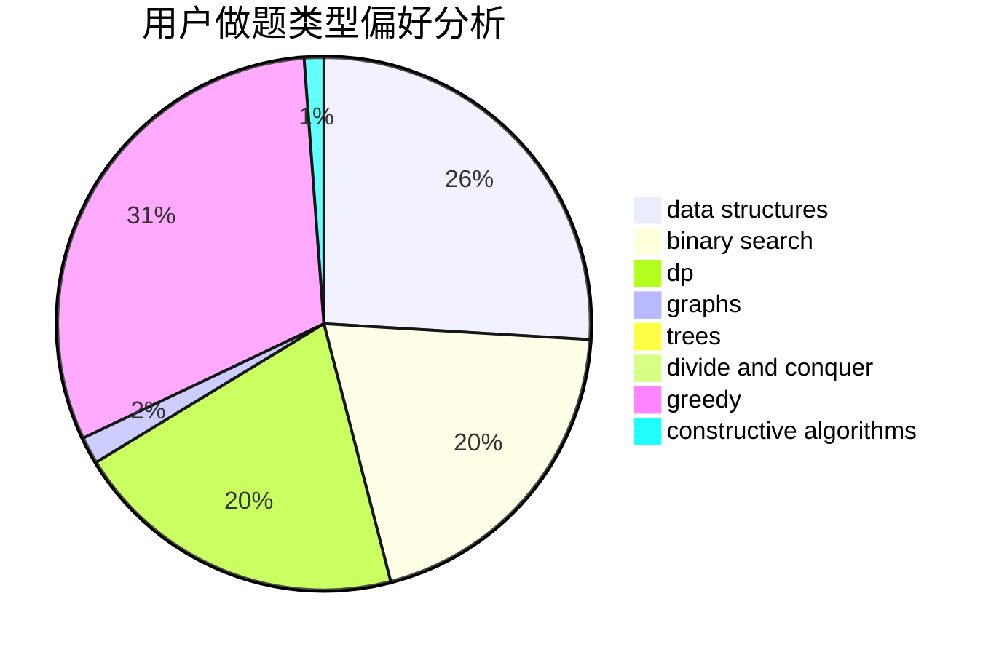
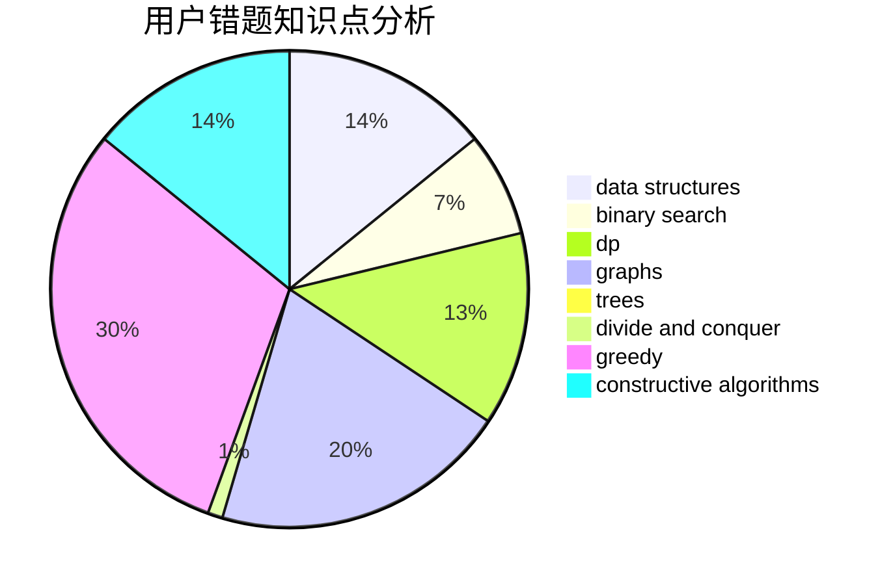

# LZFeng

<!-- tabs:start -->

#### **用户提交结果分析**

#### **用户做题类型偏好分析**

#### **用户错题知识点分析**

<!-- tabs:end -->
# 推荐题目
[240F](https://codeforces.com/contest/240/problem/F)		data structures		  
[587D](https://codeforces.com/contest/587/problem/D)		2-sat,
                        binary search		  
[171B](https://codeforces.com/contest/171/problem/B)		*special problem,
                        combinatorics		  
[1466G](https://codeforces.com/contest/1466/problem/G)		combinatorics,
                        divide and conquer,
                        hashing,
                        math,
                        string suffix structures,
                        strings		  
[1451C](https://codeforces.com/contest/1451/problem/C)		dp,
                        greedy,
                        hashing,
                        implementation,
                        strings		  
[704C](https://codeforces.com/contest/704/problem/C)		dp,
                        graphs,
                        implementation,
                        math		  
[603C](https://codeforces.com/contest/603/problem/C)		games,
                        math		  
[625E](https://codeforces.com/contest/625/problem/E)		data structures,
                        greedy		  
[195C](https://codeforces.com/contest/195/problem/C)		expression parsing,
                        implementation		  
[1045J](https://codeforces.com/contest/1045/problem/J)		data structures,
                        strings,
                        trees		  
