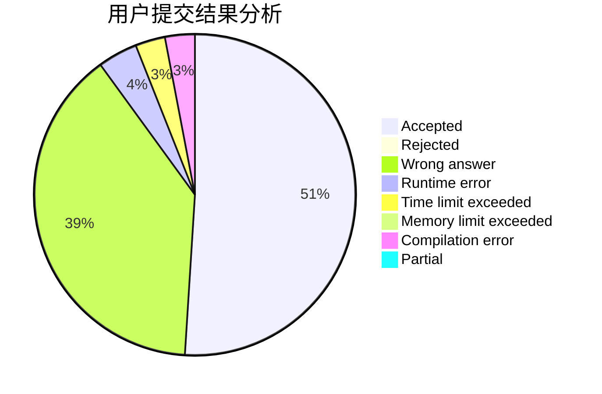
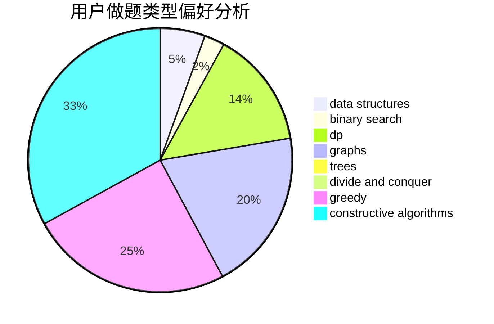
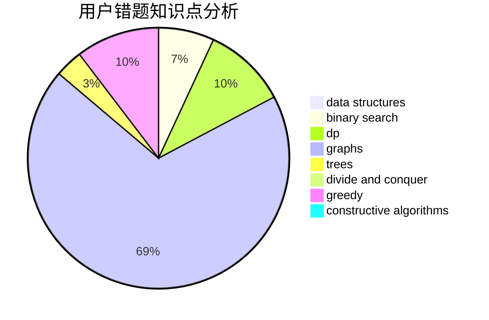

# LZHlzh
<!-- tabs:start -->
#### **用户提交结果分析**

#### **用户做题类型偏好分析**

#### **用户错题知识点分析**

<!-- tabs:end -->
# 推荐题目
[Unusual Matrix](http://codeforces.com/problemset/problem/1475/F)		2-sat,
                        brute force,
                        constructive algorithms		  
[Equalize Prices Again](https://codeforces.com/contest/1432/problem/C)		math		  
[Tree Queries](http://codeforces.com/problemset/problem/1254/D)		data structures,
                        probabilities,
                        trees		  
[Timofey and our friends animals](http://codeforces.com/problemset/problem/763/E)		data structures,
                        divide and conquer,
                        dsu		  
[Cubical Planet](http://codeforces.com/problemset/problem/39/D)		math		  
[Lucky Year](http://codeforces.com/problemset/problem/808/A)		implementation		  
[Covered Points](http://codeforces.com/problemset/problem/1036/E)		fft,
                        geometry,
                        number theory		  
[Fence](http://codeforces.com/problemset/problem/363/B)		brute force,
                        dp		  
[Periodical Numbers](http://codeforces.com/problemset/problem/215/E)		combinatorics,
                        dp,
                        number theory		  
[Distinct Characters Queries](http://codeforces.com/problemset/problem/1234/D)		data structures		  
<!-- tabs:start -->
#### **data structures**
[Tree Queries](http://codeforces.com/problemset/problem/1254/D)		data structures,
                        probabilities,
                        trees		  
[Timofey and our friends animals](http://codeforces.com/problemset/problem/763/E)		data structures,
                        divide and conquer,
                        dsu		  
[Distinct Characters Queries](http://codeforces.com/problemset/problem/1234/D)		data structures		  
[Pictures with Kittens (hard version)](http://codeforces.com/problemset/problem/1077/F2)		data structures,
                        dp		  
[Most Dangerous Shark](http://codeforces.com/problemset/problem/1131/G)		data structures,
                        dp,
                        two pointers		  
[Case of Fugitive](http://codeforces.com/problemset/problem/555/B)		data structures,
                        greedy,
                        sortings		  
[Shortest Path Queries](http://codeforces.com/problemset/problem/938/G)		bitmasks,
                        data structures,
                        dsu,
                        graphs		  
[K Integers](http://codeforces.com/problemset/problem/1268/C)		binary search,
                        data structures		  
[Hotelier](http://codeforces.com/problemset/problem/1200/A)		brute force,
                        data structures,
                        implementation		  
[Maximum width](http://codeforces.com/problemset/problem/1492/C)		binary search,
                        data structures,
                        dp,
                        greedy,
                        two pointers		  
#### **binary search**
[Cellular Network](http://codeforces.com/problemset/problem/702/C)		binary search,
                        implementation,
                        two pointers		  
[Legendary Tree](http://codeforces.com/problemset/problem/1129/E)		binary search,
                        interactive,
                        trees		  
[K Integers](http://codeforces.com/problemset/problem/1268/C)		binary search,
                        data structures		  
[Maximum width](http://codeforces.com/problemset/problem/1492/C)		binary search,
                        data structures,
                        dp,
                        greedy,
                        two pointers		  
[Pairs](http://codeforces.com/problemset/problem/1463/D)		binary search,
                        constructive algorithms,
                        greedy,
                        two pointers		  
[Old Floppy Drive](http://codeforces.com/problemset/problem/1490/G)		binary search,
                        data structures,
                        math		  
[Odd Mineral Resource](http://codeforces.com/problemset/problem/1479/D)		binary search,
                        bitmasks,
                        brute force,
                        data structures,
                        probabilities,
                        trees		  
[Complicated Computations](http://codeforces.com/problemset/problem/1436/E)		binary search,
                        data structures,
                        two pointers		  
[Divide and Summarize](http://codeforces.com/problemset/problem/1461/D)		binary search,
                        brute force,
                        data structures,
                        divide and conquer,
                        implementation,
                        sortings		  
[K-beautiful Strings](http://codeforces.com/problemset/problem/1493/C)		binary search,
                        brute force,
                        constructive algorithms,
                        greedy,
                        strings		  
#### **dp**
[Fence](http://codeforces.com/problemset/problem/363/B)		brute force,
                        dp		  
[Periodical Numbers](http://codeforces.com/problemset/problem/215/E)		combinatorics,
                        dp,
                        number theory		  
[Bear and Tree Jumps](http://codeforces.com/problemset/problem/771/C)		dfs and similar,
                        dp,
                        trees		  
[Subarray Cuts](http://codeforces.com/problemset/problem/513/E1)		dp		  
[Pictures with Kittens (hard version)](http://codeforces.com/problemset/problem/1077/F2)		data structures,
                        dp		  
[Most Dangerous Shark](http://codeforces.com/problemset/problem/1131/G)		data structures,
                        dp,
                        two pointers		  
[Ksenia and Combinatorics](http://codeforces.com/problemset/problem/382/E)		combinatorics,
                        dp		  
[You Are Given a Decimal String...](http://codeforces.com/problemset/problem/1202/B)		brute force,
                        dp,
                        shortest paths		  
[Axel and Marston in Bitland](http://codeforces.com/problemset/problem/780/F)		bitmasks,
                        dp,
                        graphs,
                        matrices		  
[Painting Fence](http://codeforces.com/problemset/problem/448/C)		divide and conquer,
                        dp,
                        greedy		  
#### **graph**
[Royal Questions](http://codeforces.com/problemset/problem/875/F)		dsu,
                        graphs,
                        greedy		  
[Dungeons and Candies](http://codeforces.com/problemset/problem/436/C)		dsu,
                        graphs,
                        greedy,
                        trees		  
[Snake](http://codeforces.com/problemset/problem/225/D)		bitmasks,
                        dfs and similar,
                        graphs,
                        implementation		  
[Axel and Marston in Bitland](http://codeforces.com/problemset/problem/780/F)		bitmasks,
                        dp,
                        graphs,
                        matrices		  
[George and Interesting Graph](http://codeforces.com/problemset/problem/387/D)		graph matchings		  
[Shortest Path Queries](http://codeforces.com/problemset/problem/938/G)		bitmasks,
                        data structures,
                        dsu,
                        graphs		  
[Power Tree](http://codeforces.com/problemset/problem/1120/D)		dfs and similar,
                        dp,
                        dsu,
                        graphs,
                        greedy,
                        trees		  
[Min Cost String](http://codeforces.com/problemset/problem/1511/D)		brute force,
                        constructive algorithms,
                        graphs,
                        greedy,
                        strings		  
[Minimum Ties](http://codeforces.com/problemset/problem/1487/C)		brute force,
                        constructive algorithms,
                        dfs and similar,
                        graphs,
                        greedy,
                        implementation,
                        math		  
[Chef Monocarp](http://codeforces.com/problemset/problem/1437/C)		dp,
                        flows,
                        graph matchings,
                        greedy,
                        math,
                        sortings		  
#### **trees**
[Tree Queries](http://codeforces.com/problemset/problem/1254/D)		data structures,
                        probabilities,
                        trees		  
[Bear and Tree Jumps](http://codeforces.com/problemset/problem/771/C)		dfs and similar,
                        dp,
                        trees		  
[Hashing Trees](http://codeforces.com/problemset/problem/901/A)		constructive algorithms,
                        trees		  
[Dungeons and Candies](http://codeforces.com/problemset/problem/436/C)		dsu,
                        graphs,
                        greedy,
                        trees		  
[The Majestic Brown Tree Snake](http://codeforces.com/problemset/problem/1381/D)		dfs and similar,
                        dp,
                        greedy,
                        trees,
                        two pointers		  
[Power Tree](http://codeforces.com/problemset/problem/1120/D)		dfs and similar,
                        dp,
                        dsu,
                        graphs,
                        greedy,
                        trees		  
[Legendary Tree](http://codeforces.com/problemset/problem/1129/E)		binary search,
                        interactive,
                        trees		  
[Odd Mineral Resource](http://codeforces.com/problemset/problem/1479/D)		binary search,
                        bitmasks,
                        brute force,
                        data structures,
                        probabilities,
                        trees		  
[Yet Another Card Deck](http://codeforces.com/problemset/problem/1511/C)		brute force,
                        data structures,
                        implementation,
                        trees		  
[Diameter Cuts](http://codeforces.com/problemset/problem/1499/F)		combinatorics,
                        dfs and similar,
                        dp,
                        trees		  
#### **divide and conquer**
[Timofey and our friends animals](http://codeforces.com/problemset/problem/763/E)		data structures,
                        divide and conquer,
                        dsu		  
[Painting Fence](http://codeforces.com/problemset/problem/448/C)		divide and conquer,
                        dp,
                        greedy		  
[Divide and Summarize](http://codeforces.com/problemset/problem/1461/D)		binary search,
                        brute force,
                        data structures,
                        divide and conquer,
                        implementation,
                        sortings		  
[Song of the Sirens](http://codeforces.com/problemset/problem/1466/G)		combinatorics,
                        divide and conquer,
                        hashing,
                        math,
                        string suffix structures,
                        strings		  
[Permutation Transformation](http://codeforces.com/problemset/problem/1490/D)		dfs and similar,
                        divide and conquer,
                        implementation		  
[Skyline Photo](https://codeforces.com/contest/1483/problem/C)		data structures,
                        divide and conquer,
                        dp		  
[Fib-tree](http://codeforces.com/problemset/problem/1491/E)		brute force,
                        dfs and similar,
                        divide and conquer,
                        number theory,
                        trees		  
[Sum of Prefix Sums](http://codeforces.com/problemset/problem/1303/G)		data structures,
                        divide and conquer,
                        geometry,
                        trees		  
[Dogeforces](http://codeforces.com/problemset/problem/1494/D)		constructive algorithms,
                        data structures,
                        dfs and similar,
                        divide and conquer,
                        dsu,
                        greedy,
                        sortings,
                        trees		  
[Logistical Questions](http://codeforces.com/problemset/problem/566/C)		dfs and similar,
                        divide and conquer,
                        trees		  
#### **greedy**
[Royal Questions](http://codeforces.com/problemset/problem/875/F)		dsu,
                        graphs,
                        greedy		  
[Balls and Boxes](http://codeforces.com/problemset/problem/260/C)		constructive algorithms,
                        greedy,
                        implementation		  
[Winding polygonal line](http://codeforces.com/problemset/problem/1158/D)		constructive algorithms,
                        geometry,
                        greedy,
                        math		  
[Stas and the Queue at the Buffet](http://codeforces.com/problemset/problem/1151/D)		greedy,
                        math,
                        sortings		  
[Planning](http://codeforces.com/problemset/problem/853/A)		greedy		  
[Dungeons and Candies](http://codeforces.com/problemset/problem/436/C)		dsu,
                        graphs,
                        greedy,
                        trees		  
[Case of Fugitive](http://codeforces.com/problemset/problem/555/B)		data structures,
                        greedy,
                        sortings		  
[Chat room](http://codeforces.com/problemset/problem/58/A)		greedy,
                        strings		  
[New Language](http://codeforces.com/problemset/problem/568/C)		2-sat,
                        greedy		  
[Painting Fence](http://codeforces.com/problemset/problem/448/C)		divide and conquer,
                        dp,
                        greedy		  
#### **constructive algorithms**
[Unusual Matrix](http://codeforces.com/problemset/problem/1475/F)		2-sat,
                        brute force,
                        constructive algorithms		  
[Balls and Boxes](http://codeforces.com/problemset/problem/260/C)		constructive algorithms,
                        greedy,
                        implementation		  
[Winding polygonal line](http://codeforces.com/problemset/problem/1158/D)		constructive algorithms,
                        geometry,
                        greedy,
                        math		  
[Hashing Trees](http://codeforces.com/problemset/problem/901/A)		constructive algorithms,
                        trees		  
[Min Cost String](http://codeforces.com/problemset/problem/1511/D)		brute force,
                        constructive algorithms,
                        graphs,
                        greedy,
                        strings		  
[Anti-knapsack](http://codeforces.com/problemset/problem/1493/A)		constructive algorithms,
                        greedy		  
[Pairs](http://codeforces.com/problemset/problem/1463/D)		binary search,
                        constructive algorithms,
                        greedy,
                        two pointers		  
[XOR-gun](https://codeforces.com/contest/1456/problem/B)		bitmasks,
                        brute force,
                        constructive algorithms		  
[Genius's Gambit](http://codeforces.com/problemset/problem/1492/D)		bitmasks,
                        constructive algorithms,
                        greedy,
                        math		  
[3-Coloring](https://codeforces.com/contest/1504/problem/D)		constructive algorithms,
                        games,
                        interactive		  
#### **sortings**
[Stas and the Queue at the Buffet](http://codeforces.com/problemset/problem/1151/D)		greedy,
                        math,
                        sortings		  
[Case of Fugitive](http://codeforces.com/problemset/problem/555/B)		data structures,
                        greedy,
                        sortings		  
[Dima and Two Sequences](http://codeforces.com/problemset/problem/272/D)		combinatorics,
                        math,
                        sortings		  
[Divide and Sum](http://codeforces.com/problemset/problem/1444/B)		combinatorics,
                        math,
                        sortings		  
[Diamond Miner](https://codeforces.com/contest/1496/problem/C)		geometry,
                        greedy,
                        math,
                        sortings		  
[Meximization](http://codeforces.com/problemset/problem/1497/A)		brute force,
                        data structures,
                        greedy,
                        sortings		  
[Avoiding Zero](http://codeforces.com/problemset/problem/1427/A)		math,
                        sortings		  
[Divide and Summarize](http://codeforces.com/problemset/problem/1461/D)		binary search,
                        brute force,
                        data structures,
                        divide and conquer,
                        implementation,
                        sortings		  
[Chef Monocarp](http://codeforces.com/problemset/problem/1437/C)		dp,
                        flows,
                        graph matchings,
                        greedy,
                        math,
                        sortings		  
[Replacing Elements](http://codeforces.com/problemset/problem/1473/A)		greedy,
                        implementation,
                        math,
                        sortings		  
<!-- tabs:end -->
