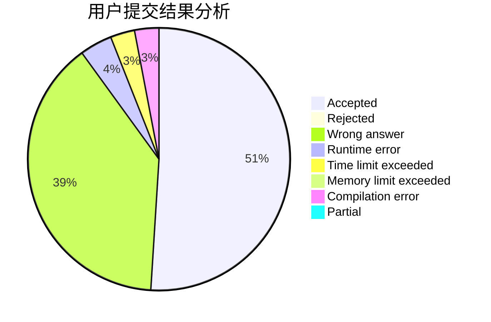
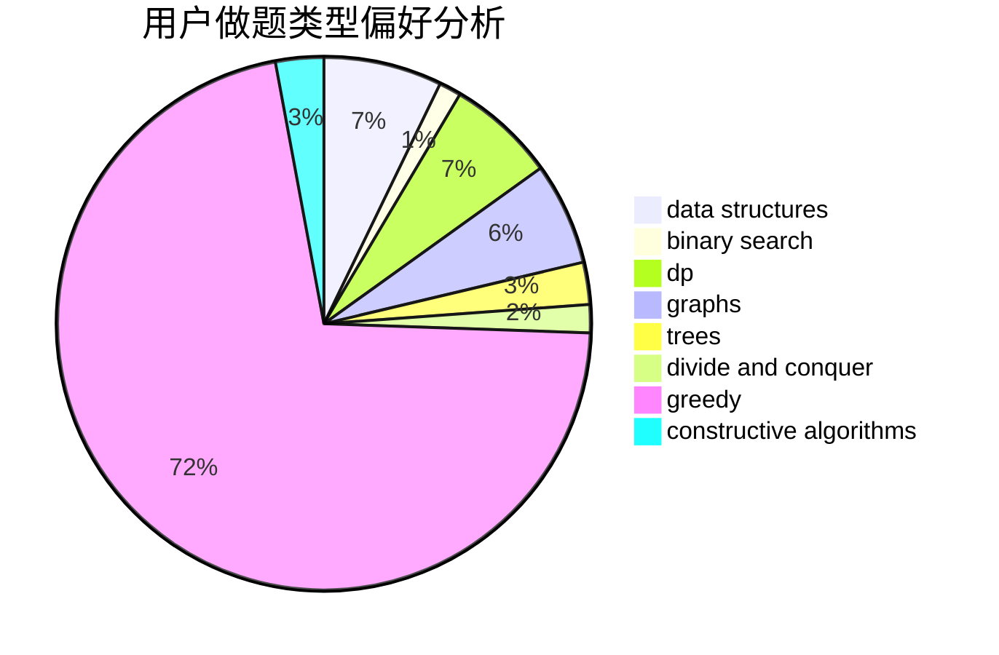
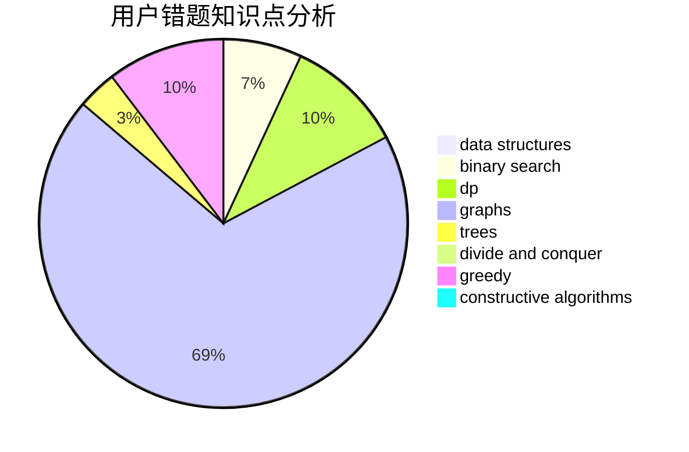

# LZHlzh

<!-- tabs:start -->

#### **用户提交结果分析**

#### **用户做题类型偏好分析**

#### **用户错题知识点分析**

<!-- tabs:end -->
# 推荐题目
[1484C](https://codeforces.com/contest/1484/problem/C)		dsu,graphs,sortings,trees		  
[917D](https://codeforces.com/contest/917/problem/D)		dp,
                        math,
                        matrices,
                        trees		  
[1442B](https://codeforces.com/contest/1442/problem/B)		combinatorics,
                        data structures,
                        dsu,
                        greedy,
                        implementation		  
[38A](https://codeforces.com/contest/38/problem/A)		implementation		  
[235B](https://codeforces.com/contest/235/problem/B)		dp,
                        math,
                        probabilities		  
[1153D](https://codeforces.com/contest/1153/problem/D)		binary search,
                        dfs and similar,
                        dp,
                        greedy,
                        trees		  
[896A](https://codeforces.com/contest/896/problem/A)		binary search,
                        dfs and similar		  
[279A](https://codeforces.com/contest/279/problem/A)		brute force,
                        geometry,
                        implementation		  
[12621](https://codeforces.com/contest/1262/problem/1)		dsu,graphs,sortings,trees		  
[426B](https://codeforces.com/contest/426/problem/B)		implementation		  
