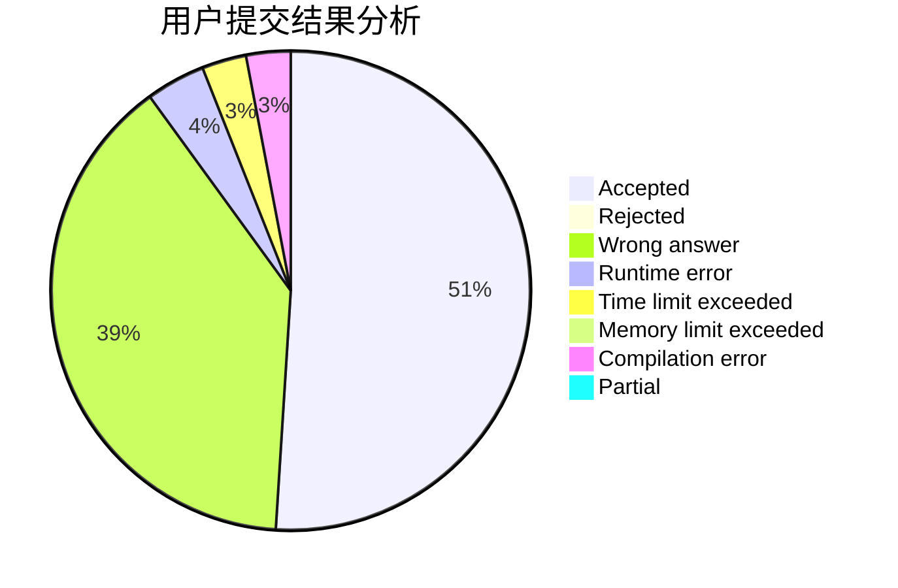
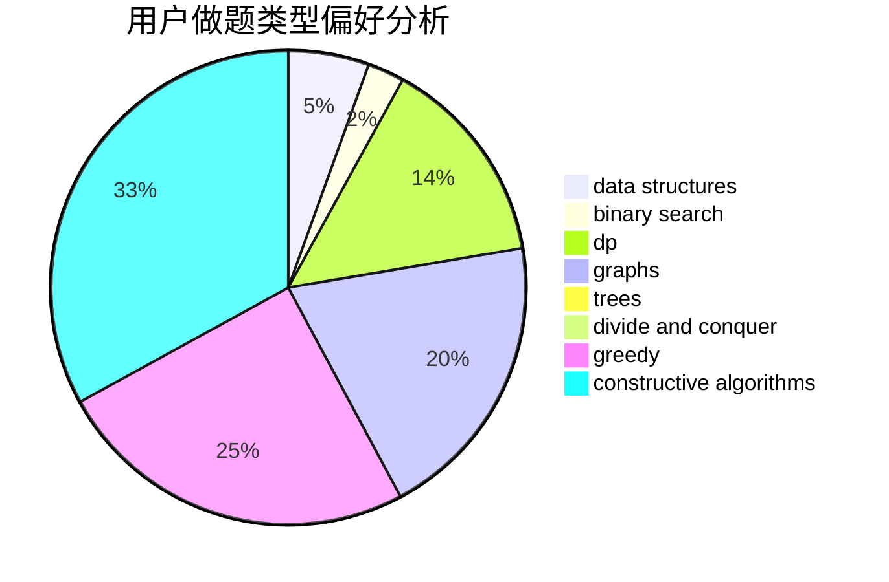
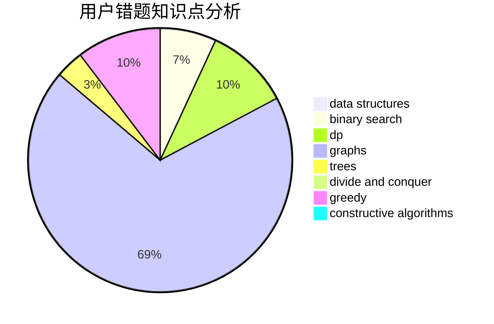

# LZHlzh

<!-- tabs:start -->

#### **用户提交结果分析**

#### **用户做题类型偏好分析**

#### **用户错题知识点分析**

<!-- tabs:end -->
# 推荐题目
[1475F](https://codeforces.com/contest/1475/problem/F)		2-sat,
                        brute force,
                        constructive algorithms		  
[901A](https://codeforces.com/contest/901/problem/A)		constructive algorithms,
                        trees		  
[1432C](https://codeforces.com/contest/1432/problem/C)		dsu,graphs,sortings,trees		  
[363B](https://codeforces.com/contest/363/problem/B)		brute force,
                        dp		  
[215E](https://codeforces.com/contest/215/problem/E)		combinatorics,
                        dp,
                        number theory		  
[1151D](https://codeforces.com/contest/1151/problem/D)		greedy,
                        math,
                        sortings		  
[875F](https://codeforces.com/contest/875/problem/F)		dsu,
                        graphs,
                        greedy		  
[260C](https://codeforces.com/contest/260/problem/C)		constructive algorithms,
                        greedy,
                        implementation		  
[1254D](https://codeforces.com/contest/1254/problem/D)		data structures,
                        probabilities,
                        trees		  
[39D](https://codeforces.com/contest/39/problem/D)		math		  
