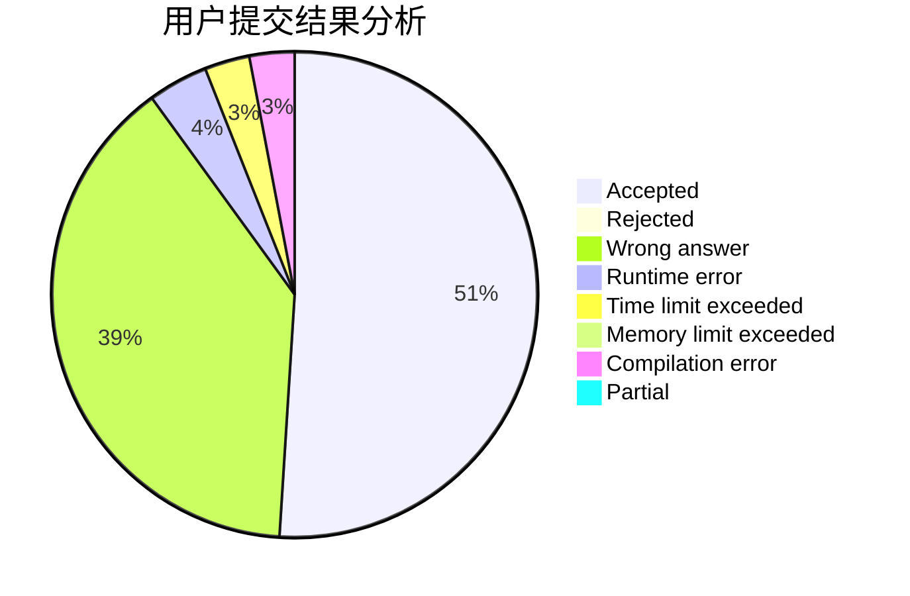
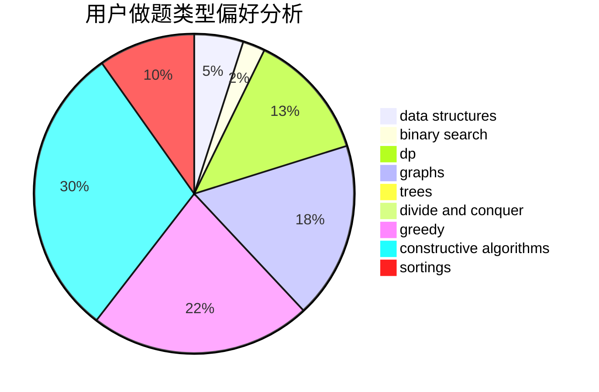
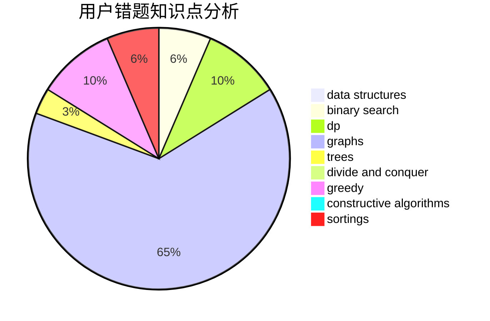

# LZHlzh
<!-- tabs:start -->
#### **用户提交结果分析**

#### **用户做题类型偏好分析**

#### **用户错题知识点分析**

<!-- tabs:end -->
# 推荐题目
[1475F](http://codeforces.com/problemset/problem/1475/F)		2-sat,
                        brute force,
                        constructive algorithms		  
[1432C](https://codeforces.com/contest/1432/problem/C)		math		  
[1254D](http://codeforces.com/problemset/problem/1254/D)		data structures,
                        probabilities,
                        trees		  
[763E](http://codeforces.com/problemset/problem/763/E)		data structures,
                        divide and conquer,
                        dsu		  
[39D](http://codeforces.com/problemset/problem/39/D)		math		  
[808A](http://codeforces.com/problemset/problem/808/A)		implementation		  
[1036E](http://codeforces.com/problemset/problem/1036/E)		fft,
                        geometry,
                        number theory		  
[363B](http://codeforces.com/problemset/problem/363/B)		brute force,
                        dp		  
[215E](http://codeforces.com/problemset/problem/215/E)		combinatorics,
                        dp,
                        number theory		  
[1234D](http://codeforces.com/problemset/problem/1234/D)		data structures		  
<!-- tabs:start -->
#### **data structures**
[1254D](http://codeforces.com/problemset/problem/1254/D)		data structures,
                        probabilities,
                        trees		  
[763E](http://codeforces.com/problemset/problem/763/E)		data structures,
                        divide and conquer,
                        dsu		  
[1234D](http://codeforces.com/problemset/problem/1234/D)		data structures		  
[1077F2](http://codeforces.com/problemset/problem/1077/F2)		data structures,
                        dp		  
[1131G](http://codeforces.com/problemset/problem/1131/G)		data structures,
                        dp,
                        two pointers		  
[555B](http://codeforces.com/problemset/problem/555/B)		data structures,
                        greedy,
                        sortings		  
[938G](http://codeforces.com/problemset/problem/938/G)		bitmasks,
                        data structures,
                        dsu,
                        graphs		  
[1268C](http://codeforces.com/problemset/problem/1268/C)		binary search,
                        data structures		  
[1200A](http://codeforces.com/problemset/problem/1200/A)		brute force,
                        data structures,
                        implementation		  
[1492C](http://codeforces.com/problemset/problem/1492/C)		binary search,
                        data structures,
                        dp,
                        greedy,
                        two pointers		  
#### **binary search**
[702C](http://codeforces.com/problemset/problem/702/C)		binary search,
                        implementation,
                        two pointers		  
[1129E](http://codeforces.com/problemset/problem/1129/E)		binary search,
                        interactive,
                        trees		  
[1268C](http://codeforces.com/problemset/problem/1268/C)		binary search,
                        data structures		  
[1492C](http://codeforces.com/problemset/problem/1492/C)		binary search,
                        data structures,
                        dp,
                        greedy,
                        two pointers		  
[1463D](http://codeforces.com/problemset/problem/1463/D)		binary search,
                        constructive algorithms,
                        greedy,
                        two pointers		  
[1490G](http://codeforces.com/problemset/problem/1490/G)		binary search,
                        data structures,
                        math		  
[1479D](http://codeforces.com/problemset/problem/1479/D)		binary search,
                        bitmasks,
                        brute force,
                        data structures,
                        probabilities,
                        trees		  
[1436E](http://codeforces.com/problemset/problem/1436/E)		binary search,
                        data structures,
                        two pointers		  
[1461D](http://codeforces.com/problemset/problem/1461/D)		binary search,
                        brute force,
                        data structures,
                        divide and conquer,
                        implementation,
                        sortings		  
[1493C](http://codeforces.com/problemset/problem/1493/C)		binary search,
                        brute force,
                        constructive algorithms,
                        greedy,
                        strings		  
#### **dp**
[363B](http://codeforces.com/problemset/problem/363/B)		brute force,
                        dp		  
[215E](http://codeforces.com/problemset/problem/215/E)		combinatorics,
                        dp,
                        number theory		  
[771C](http://codeforces.com/problemset/problem/771/C)		dfs and similar,
                        dp,
                        trees		  
[513E1](http://codeforces.com/problemset/problem/513/E1)		dp		  
[1077F2](http://codeforces.com/problemset/problem/1077/F2)		data structures,
                        dp		  
[1131G](http://codeforces.com/problemset/problem/1131/G)		data structures,
                        dp,
                        two pointers		  
[382E](http://codeforces.com/problemset/problem/382/E)		combinatorics,
                        dp		  
[1202B](http://codeforces.com/problemset/problem/1202/B)		brute force,
                        dp,
                        shortest paths		  
[780F](http://codeforces.com/problemset/problem/780/F)		bitmasks,
                        dp,
                        graphs,
                        matrices		  
[448C](http://codeforces.com/problemset/problem/448/C)		divide and conquer,
                        dp,
                        greedy		  
#### **graph**
[875F](http://codeforces.com/problemset/problem/875/F)		dsu,
                        graphs,
                        greedy		  
[436C](http://codeforces.com/problemset/problem/436/C)		dsu,
                        graphs,
                        greedy,
                        trees		  
[225D](http://codeforces.com/problemset/problem/225/D)		bitmasks,
                        dfs and similar,
                        graphs,
                        implementation		  
[780F](http://codeforces.com/problemset/problem/780/F)		bitmasks,
                        dp,
                        graphs,
                        matrices		  
[387D](http://codeforces.com/problemset/problem/387/D)		graph matchings		  
[938G](http://codeforces.com/problemset/problem/938/G)		bitmasks,
                        data structures,
                        dsu,
                        graphs		  
[1120D](http://codeforces.com/problemset/problem/1120/D)		dfs and similar,
                        dp,
                        dsu,
                        graphs,
                        greedy,
                        trees		  
[1511D](http://codeforces.com/problemset/problem/1511/D)		brute force,
                        constructive algorithms,
                        graphs,
                        greedy,
                        strings		  
[1487C](http://codeforces.com/problemset/problem/1487/C)		brute force,
                        constructive algorithms,
                        dfs and similar,
                        graphs,
                        greedy,
                        implementation,
                        math		  
[1437C](http://codeforces.com/problemset/problem/1437/C)		dp,
                        flows,
                        graph matchings,
                        greedy,
                        math,
                        sortings		  
#### **trees**
[1254D](http://codeforces.com/problemset/problem/1254/D)		data structures,
                        probabilities,
                        trees		  
[771C](http://codeforces.com/problemset/problem/771/C)		dfs and similar,
                        dp,
                        trees		  
[901A](http://codeforces.com/problemset/problem/901/A)		constructive algorithms,
                        trees		  
[436C](http://codeforces.com/problemset/problem/436/C)		dsu,
                        graphs,
                        greedy,
                        trees		  
[1381D](http://codeforces.com/problemset/problem/1381/D)		dfs and similar,
                        dp,
                        greedy,
                        trees,
                        two pointers		  
[1120D](http://codeforces.com/problemset/problem/1120/D)		dfs and similar,
                        dp,
                        dsu,
                        graphs,
                        greedy,
                        trees		  
[1129E](http://codeforces.com/problemset/problem/1129/E)		binary search,
                        interactive,
                        trees		  
[1479D](http://codeforces.com/problemset/problem/1479/D)		binary search,
                        bitmasks,
                        brute force,
                        data structures,
                        probabilities,
                        trees		  
[1511C](http://codeforces.com/problemset/problem/1511/C)		brute force,
                        data structures,
                        implementation,
                        trees		  
[1499F](http://codeforces.com/problemset/problem/1499/F)		combinatorics,
                        dfs and similar,
                        dp,
                        trees		  
#### **divide and conquer**
[763E](http://codeforces.com/problemset/problem/763/E)		data structures,
                        divide and conquer,
                        dsu		  
[448C](http://codeforces.com/problemset/problem/448/C)		divide and conquer,
                        dp,
                        greedy		  
[1461D](http://codeforces.com/problemset/problem/1461/D)		binary search,
                        brute force,
                        data structures,
                        divide and conquer,
                        implementation,
                        sortings		  
[1466G](http://codeforces.com/problemset/problem/1466/G)		combinatorics,
                        divide and conquer,
                        hashing,
                        math,
                        string suffix structures,
                        strings		  
[1490D](http://codeforces.com/problemset/problem/1490/D)		dfs and similar,
                        divide and conquer,
                        implementation		  
[1483C](https://codeforces.com/contest/1483/problem/C)		data structures,
                        divide and conquer,
                        dp		  
[1491E](http://codeforces.com/problemset/problem/1491/E)		brute force,
                        dfs and similar,
                        divide and conquer,
                        number theory,
                        trees		  
[1303G](http://codeforces.com/problemset/problem/1303/G)		data structures,
                        divide and conquer,
                        geometry,
                        trees		  
[1494D](http://codeforces.com/problemset/problem/1494/D)		constructive algorithms,
                        data structures,
                        dfs and similar,
                        divide and conquer,
                        dsu,
                        greedy,
                        sortings,
                        trees		  
[1482E](http://codeforces.com/problemset/problem/1482/E)		data structures,
                        divide and conquer,
                        dp		  
#### **greedy**
[875F](http://codeforces.com/problemset/problem/875/F)		dsu,
                        graphs,
                        greedy		  
[260C](http://codeforces.com/problemset/problem/260/C)		constructive algorithms,
                        greedy,
                        implementation		  
[1158D](http://codeforces.com/problemset/problem/1158/D)		constructive algorithms,
                        geometry,
                        greedy,
                        math		  
[1151D](http://codeforces.com/problemset/problem/1151/D)		greedy,
                        math,
                        sortings		  
[853A](http://codeforces.com/problemset/problem/853/A)		greedy		  
[436C](http://codeforces.com/problemset/problem/436/C)		dsu,
                        graphs,
                        greedy,
                        trees		  
[555B](http://codeforces.com/problemset/problem/555/B)		data structures,
                        greedy,
                        sortings		  
[58A](http://codeforces.com/problemset/problem/58/A)		greedy,
                        strings		  
[568C](http://codeforces.com/problemset/problem/568/C)		2-sat,
                        greedy		  
[448C](http://codeforces.com/problemset/problem/448/C)		divide and conquer,
                        dp,
                        greedy		  
#### **constructive algorithms**
[1475F](http://codeforces.com/problemset/problem/1475/F)		2-sat,
                        brute force,
                        constructive algorithms		  
[260C](http://codeforces.com/problemset/problem/260/C)		constructive algorithms,
                        greedy,
                        implementation		  
[1158D](http://codeforces.com/problemset/problem/1158/D)		constructive algorithms,
                        geometry,
                        greedy,
                        math		  
[901A](http://codeforces.com/problemset/problem/901/A)		constructive algorithms,
                        trees		  
[1511D](http://codeforces.com/problemset/problem/1511/D)		brute force,
                        constructive algorithms,
                        graphs,
                        greedy,
                        strings		  
[1493A](http://codeforces.com/problemset/problem/1493/A)		constructive algorithms,
                        greedy		  
[1463D](http://codeforces.com/problemset/problem/1463/D)		binary search,
                        constructive algorithms,
                        greedy,
                        two pointers		  
[1456B](https://codeforces.com/contest/1456/problem/B)		bitmasks,
                        brute force,
                        constructive algorithms		  
[1492D](http://codeforces.com/problemset/problem/1492/D)		bitmasks,
                        constructive algorithms,
                        greedy,
                        math		  
[1504D](https://codeforces.com/contest/1504/problem/D)		constructive algorithms,
                        games,
                        interactive		  
#### **sortings**
[1151D](http://codeforces.com/problemset/problem/1151/D)		greedy,
                        math,
                        sortings		  
[555B](http://codeforces.com/problemset/problem/555/B)		data structures,
                        greedy,
                        sortings		  
[272D](http://codeforces.com/problemset/problem/272/D)		combinatorics,
                        math,
                        sortings		  
[1444B](http://codeforces.com/problemset/problem/1444/B)		combinatorics,
                        math,
                        sortings		  
[1496C](https://codeforces.com/contest/1496/problem/C)		geometry,
                        greedy,
                        math,
                        sortings		  
[1495A](http://codeforces.com/problemset/problem/1495/A)		geometry,
                        greedy,
                        math,
                        sortings		  
[1497A](http://codeforces.com/problemset/problem/1497/A)		brute force,
                        data structures,
                        greedy,
                        sortings		  
[1427A](http://codeforces.com/problemset/problem/1427/A)		math,
                        sortings		  
[1461D](http://codeforces.com/problemset/problem/1461/D)		binary search,
                        brute force,
                        data structures,
                        divide and conquer,
                        implementation,
                        sortings		  
[1437C](http://codeforces.com/problemset/problem/1437/C)		dp,
                        flows,
                        graph matchings,
                        greedy,
                        math,
                        sortings		  
<!-- tabs:end -->
