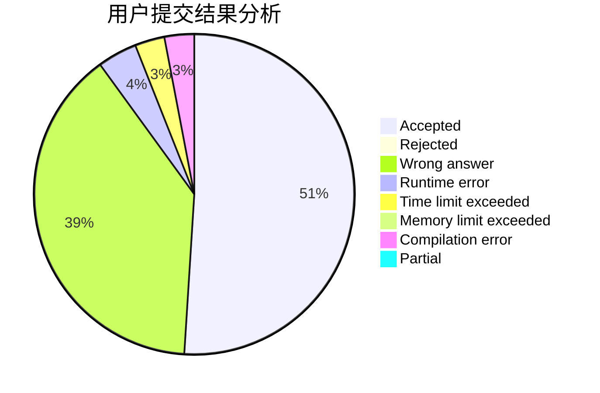
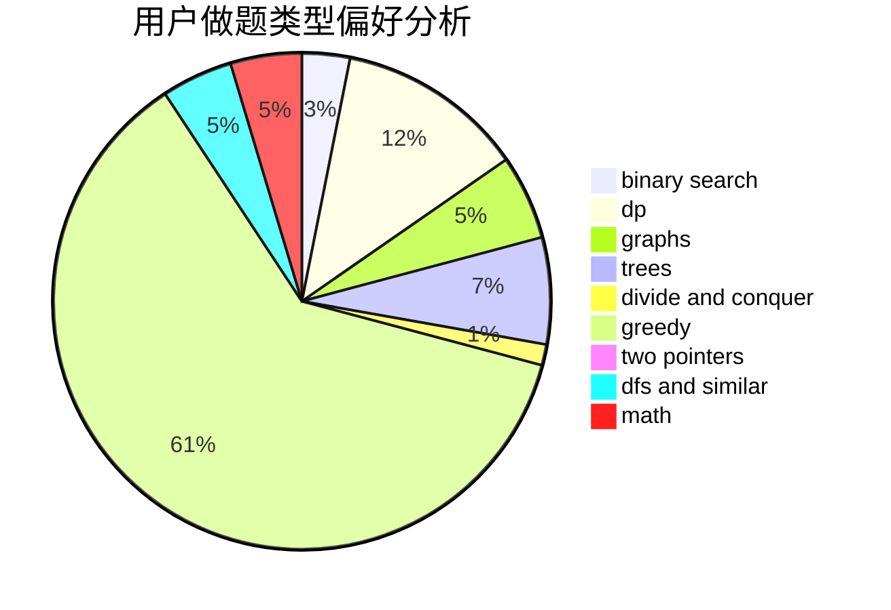

# LZHlzh

<!-- tabs:start -->

#### **用户提交结果分析**

#### **用户做题类型偏好分析**

<!-- tabs:end -->
# 推荐题目
[1484C](https://codeforces.com/contest/1484/problem/C)
[917D](https://codeforces.com/contest/917/problem/D)
[1442B](https://codeforces.com/contest/1442/problem/B)
[38A](https://codeforces.com/contest/38/problem/A)
[235B](https://codeforces.com/contest/235/problem/B)
[1153D](https://codeforces.com/contest/1153/problem/D)
[896A](https://codeforces.com/contest/896/problem/A)
[279A](https://codeforces.com/contest/279/problem/A)
[12621](https://codeforces.com/contest/1262/problem/1)
[426B](https://codeforces.com/contest/426/problem/B)
