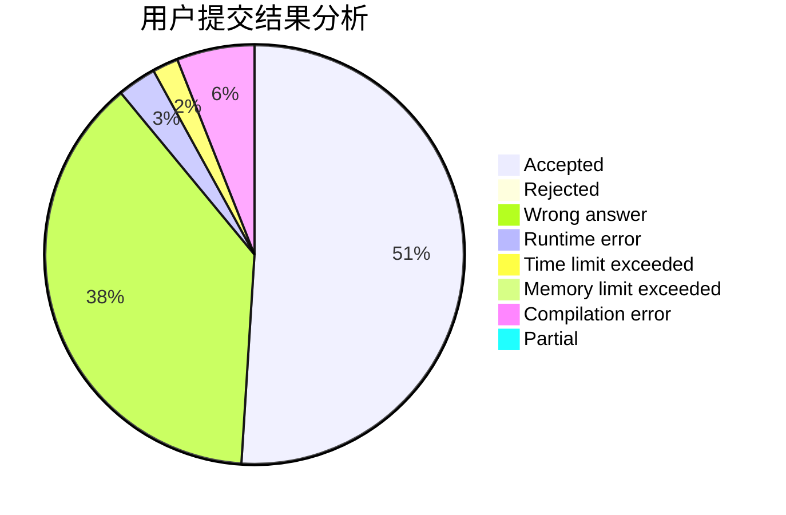
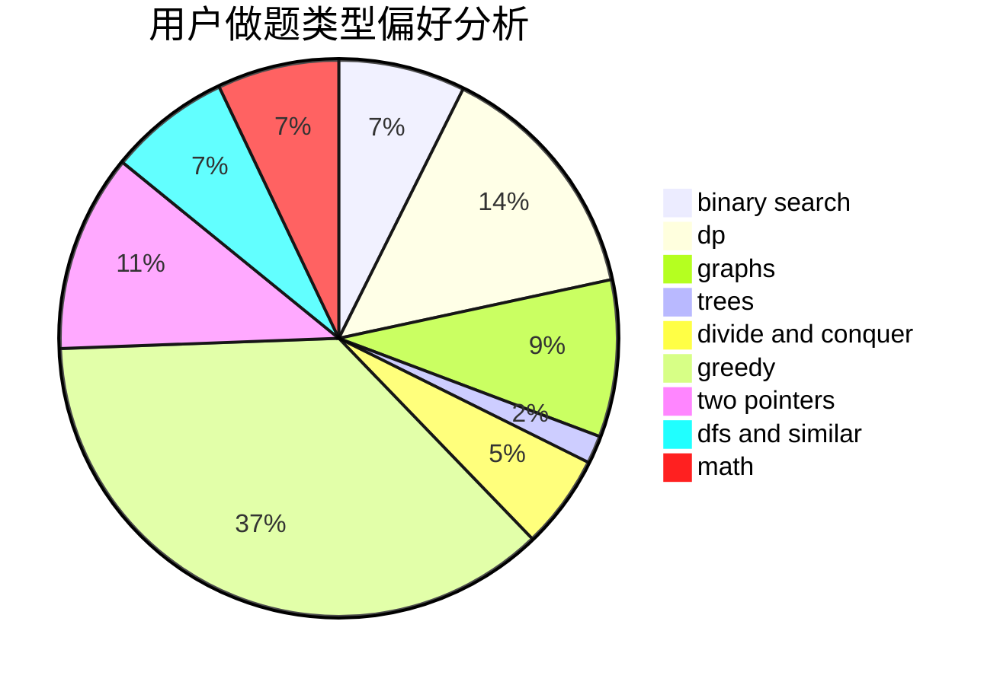

# L_XiXi_L

<!-- tabs:start -->

#### **用户提交结果分析**

#### **用户做题类型偏好分析**

<!-- tabs:end -->
# 推荐题目
[1225E](https://codeforces.com/contest/1225/problem/E)
[1236B](https://codeforces.com/contest/1236/problem/B)
[722C](https://codeforces.com/contest/722/problem/C)
[918A](https://codeforces.com/contest/918/problem/A)
[1117G](https://codeforces.com/contest/1117/problem/G)
[338D](https://codeforces.com/contest/338/problem/D)
[656E](https://codeforces.com/contest/656/problem/E)
[472F](https://codeforces.com/contest/472/problem/F)
[832B](https://codeforces.com/contest/832/problem/B)
[1510F](https://codeforces.com/contest/1510/problem/F)
