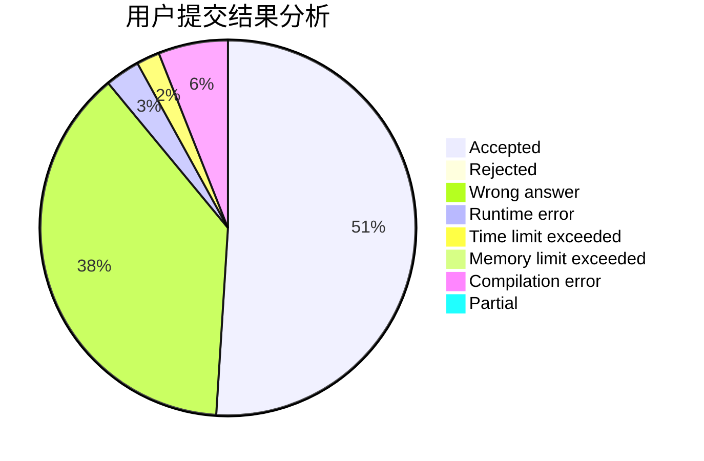
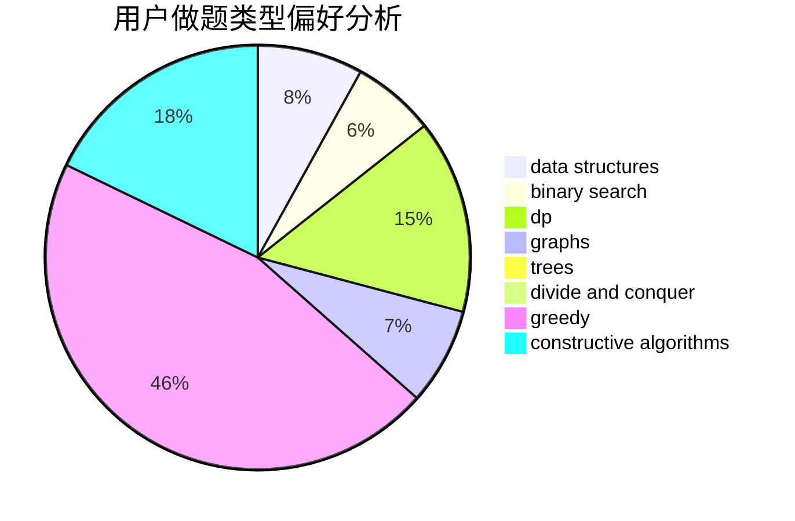
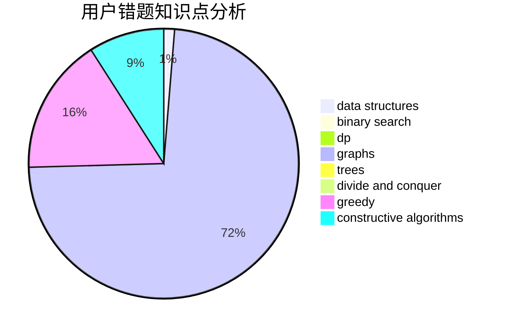

# L_XiXi_L

<!-- tabs:start -->

#### **用户提交结果分析**

#### **用户做题类型偏好分析**

#### **用户错题知识点分析**

<!-- tabs:end -->
# 推荐题目
[1225E](https://codeforces.com/contest/1225/problem/E)		binary search,
                        dp		  
[1236B](https://codeforces.com/contest/1236/problem/B)		combinatorics,
                        math		  
[722C](https://codeforces.com/contest/722/problem/C)		data structures,
                        dsu		  
[918A](https://codeforces.com/contest/918/problem/A)		brute force,
                        implementation		  
[1117G](https://codeforces.com/contest/1117/problem/G)		data structures		  
[338D](https://codeforces.com/contest/338/problem/D)		chinese remainder theorem,
                        math,
                        number theory		  
[656E](https://codeforces.com/contest/656/problem/E)		*special problem		  
[472F](https://codeforces.com/contest/472/problem/F)		constructive algorithms,
                        math,
                        matrices		  
[832B](https://codeforces.com/contest/832/problem/B)		implementation,
                        strings		  
[1510F](https://codeforces.com/contest/1510/problem/F)		nan		  
