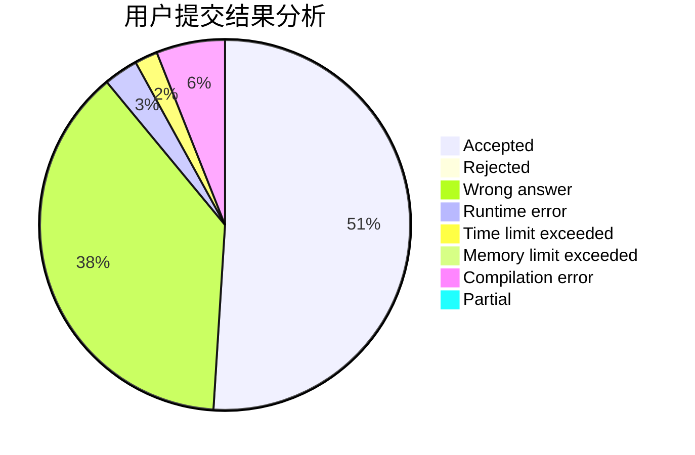
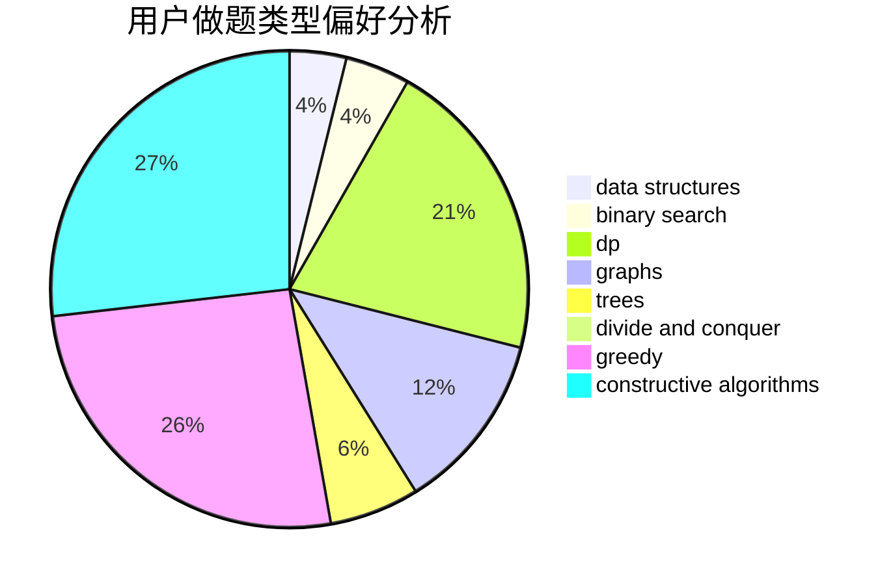
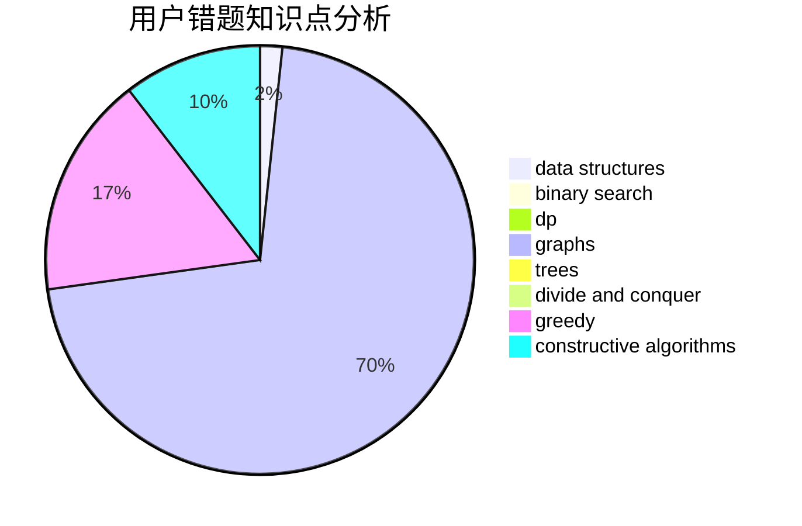

# L_XiXi_L
<!-- tabs:start -->
#### **用户提交结果分析**

#### **用户做题类型偏好分析**

#### **用户错题知识点分析**

<!-- tabs:end -->
# 推荐题目
[Jumping Transformers](http://codeforces.com/problemset/problem/1218/C)		dp		  
[Optimal Subsequences (Hard Version)](http://codeforces.com/problemset/problem/1227/D2)		data structures,
                        greedy		  
[Ilya and Two Numbers](http://codeforces.com/problemset/problem/313/E)		constructive algorithms,
                        data structures,
                        dsu,
                        greedy		  
[Mishka and trip](http://codeforces.com/problemset/problem/703/B)		implementation,
                        math		  
[Birthday](http://codeforces.com/problemset/problem/1068/A)		math		  
[White Lines](http://codeforces.com/problemset/problem/1200/D)		brute force,
                        data structures,
                        dp,
                        implementation,
                        two pointers		  
[Quantum Classification - Dataset 6](http://codeforces.com/problemset/problem/1357/D4)		nan		  
[Count Good Substrings](http://codeforces.com/problemset/problem/451/D)		math		  
[Bubble Cup hypothesis](https://codeforces.com/contest/1424/problem/I)		bitmasks,
                        constructive algorithms,
                        dp,
                        math		  
[Mr. Kitayuta, the Treasure Hunter](http://codeforces.com/problemset/problem/505/C)		dfs and similar,
                        dp,
                        two pointers		  
<!-- tabs:start -->
#### **data structures**
[Jumping Transformers](http://codeforces.com/problemset/problem/1227/D2)		data structures,
                        greedy		  
[Optimal Subsequences (Hard Version)](http://codeforces.com/problemset/problem/313/E)		constructive algorithms,
                        data structures,
                        dsu,
                        greedy		  
[Ilya and Two Numbers](http://codeforces.com/problemset/problem/1200/D)		brute force,
                        data structures,
                        dp,
                        implementation,
                        two pointers		  
[Mishka and trip](http://codeforces.com/problemset/problem/901/C)		binary search,
                        data structures,
                        dfs and similar,
                        dsu,
                        graphs,
                        two pointers		  
[Birthday](https://codeforces.com/contest/1382/problem/C1)		constructive algorithms,
                        data structures,
                        strings		  
[White Lines](http://codeforces.com/problemset/problem/813/F)		data structures,
                        dsu,
                        graphs		  
[Quantum Classification - Dataset 6](http://codeforces.com/problemset/problem/1492/C)		binary search,
                        data structures,
                        dp,
                        greedy,
                        two pointers		  
[Count Good Substrings](http://codeforces.com/problemset/problem/1490/G)		binary search,
                        data structures,
                        math		  
[Bubble Cup hypothesis](http://codeforces.com/problemset/problem/1479/D)		binary search,
                        bitmasks,
                        brute force,
                        data structures,
                        probabilities,
                        trees		  
[Mr. Kitayuta, the Treasure Hunter](http://codeforces.com/problemset/problem/1497/A)		brute force,
                        data structures,
                        greedy,
                        sortings		  
#### **binary search**
[Jumping Transformers](http://codeforces.com/problemset/problem/901/C)		binary search,
                        data structures,
                        dfs and similar,
                        dsu,
                        graphs,
                        two pointers		  
[Optimal Subsequences (Hard Version)](http://codeforces.com/problemset/problem/1098/E)		binary search,
                        implementation,
                        math,
                        number theory		  
[Ilya and Two Numbers](http://codeforces.com/problemset/problem/1100/C)		binary search,
                        geometry,
                        math		  
[Mishka and trip](http://codeforces.com/problemset/problem/1492/C)		binary search,
                        data structures,
                        dp,
                        greedy,
                        two pointers		  
[Birthday](http://codeforces.com/problemset/problem/1463/D)		binary search,
                        constructive algorithms,
                        greedy,
                        two pointers		  
[White Lines](http://codeforces.com/problemset/problem/1490/G)		binary search,
                        data structures,
                        math		  
[Quantum Classification - Dataset 6](http://codeforces.com/problemset/problem/1479/D)		binary search,
                        bitmasks,
                        brute force,
                        data structures,
                        probabilities,
                        trees		  
[Count Good Substrings](http://codeforces.com/problemset/problem/1436/E)		binary search,
                        data structures,
                        two pointers		  
[Bubble Cup hypothesis](http://codeforces.com/problemset/problem/1461/D)		binary search,
                        brute force,
                        data structures,
                        divide and conquer,
                        implementation,
                        sortings		  
[Mr. Kitayuta, the Treasure Hunter](http://codeforces.com/problemset/problem/1493/C)		binary search,
                        brute force,
                        constructive algorithms,
                        greedy,
                        strings		  
#### **dp**
[Jumping Transformers](http://codeforces.com/problemset/problem/1218/C)		dp		  
[Optimal Subsequences (Hard Version)](http://codeforces.com/problemset/problem/1200/D)		brute force,
                        data structures,
                        dp,
                        implementation,
                        two pointers		  
[Ilya and Two Numbers](https://codeforces.com/contest/1424/problem/I)		bitmasks,
                        constructive algorithms,
                        dp,
                        math		  
[Mishka and trip](http://codeforces.com/problemset/problem/505/C)		dfs and similar,
                        dp,
                        two pointers		  
[Birthday](http://codeforces.com/problemset/problem/14/E)		dp		  
[White Lines](http://codeforces.com/problemset/problem/448/C)		divide and conquer,
                        dp,
                        greedy		  
[Quantum Classification - Dataset 6](http://codeforces.com/problemset/problem/401/D)		bitmasks,
                        brute force,
                        combinatorics,
                        dp,
                        number theory		  
[Count Good Substrings](http://codeforces.com/problemset/problem/628/D)		dp		  
[Bubble Cup hypothesis](http://codeforces.com/problemset/problem/568/B)		combinatorics,
                        dp,
                        math		  
[Mr. Kitayuta, the Treasure Hunter](http://codeforces.com/problemset/problem/1492/C)		binary search,
                        data structures,
                        dp,
                        greedy,
                        two pointers		  
#### **graph**
[Jumping Transformers](http://codeforces.com/problemset/problem/901/C)		binary search,
                        data structures,
                        dfs and similar,
                        dsu,
                        graphs,
                        two pointers		  
[Optimal Subsequences (Hard Version)](http://codeforces.com/problemset/problem/367/C)		graphs,
                        greedy,
                        sortings		  
[Ilya and Two Numbers](http://codeforces.com/problemset/problem/1343/E)		brute force,
                        graphs,
                        greedy,
                        shortest paths,
                        sortings		  
[Mishka and trip](http://codeforces.com/problemset/problem/813/F)		data structures,
                        dsu,
                        graphs		  
[Birthday](http://codeforces.com/problemset/problem/1487/C)		brute force,
                        constructive algorithms,
                        dfs and similar,
                        graphs,
                        greedy,
                        implementation,
                        math		  
[White Lines](http://codeforces.com/problemset/problem/1437/C)		dp,
                        flows,
                        graph matchings,
                        greedy,
                        math,
                        sortings		  
[Quantum Classification - Dataset 6](http://codeforces.com/problemset/problem/1470/D)		constructive algorithms,
                        dfs and similar,
                        graph matchings,
                        graphs,
                        greedy		  
[Count Good Substrings](http://codeforces.com/problemset/problem/1476/C)		dp,
                        graphs,
                        greedy		  
[Bubble Cup hypothesis](http://codeforces.com/problemset/problem/1304/D)		constructive algorithms,
                        graphs,
                        greedy,
                        two pointers		  
[Mr. Kitayuta, the Treasure Hunter](http://codeforces.com/problemset/problem/1475/C)		combinatorics,
                        graphs,
                        math		  
#### **trees**
[Jumping Transformers](http://codeforces.com/problemset/problem/1479/D)		binary search,
                        bitmasks,
                        brute force,
                        data structures,
                        probabilities,
                        trees		  
[Optimal Subsequences (Hard Version)](http://codeforces.com/problemset/problem/1511/C)		brute force,
                        data structures,
                        implementation,
                        trees		  
[Ilya and Two Numbers](http://codeforces.com/problemset/problem/1499/F)		combinatorics,
                        dfs and similar,
                        dp,
                        trees		  
[Mishka and trip](http://codeforces.com/problemset/problem/1491/E)		brute force,
                        dfs and similar,
                        divide and conquer,
                        number theory,
                        trees		  
[Birthday](http://codeforces.com/problemset/problem/1466/D)		data structures,
                        greedy,
                        sortings,
                        trees		  
[White Lines](http://codeforces.com/problemset/problem/1495/D)		combinatorics,
                        dfs and similar,
                        graphs,
                        math,
                        shortest paths,
                        trees		  
[Quantum Classification - Dataset 6](http://codeforces.com/problemset/problem/1303/G)		data structures,
                        divide and conquer,
                        geometry,
                        trees		  
[Count Good Substrings](http://codeforces.com/problemset/problem/1454/E)		combinatorics,
                        dfs and similar,
                        graphs,
                        trees		  
[Bubble Cup hypothesis](http://codeforces.com/problemset/problem/1494/D)		constructive algorithms,
                        data structures,
                        dfs and similar,
                        divide and conquer,
                        dsu,
                        greedy,
                        sortings,
                        trees		  
[Mr. Kitayuta, the Treasure Hunter](http://codeforces.com/problemset/problem/1292/C)		combinatorics,
                        dfs and similar,
                        dp,
                        greedy,
                        trees		  
#### **divide and conquer**
[Jumping Transformers](http://codeforces.com/problemset/problem/448/C)		divide and conquer,
                        dp,
                        greedy		  
[Optimal Subsequences (Hard Version)](http://codeforces.com/problemset/problem/1461/D)		binary search,
                        brute force,
                        data structures,
                        divide and conquer,
                        implementation,
                        sortings		  
[Ilya and Two Numbers](http://codeforces.com/problemset/problem/1466/G)		combinatorics,
                        divide and conquer,
                        hashing,
                        math,
                        string suffix structures,
                        strings		  
[Mishka and trip](http://codeforces.com/problemset/problem/1490/D)		dfs and similar,
                        divide and conquer,
                        implementation		  
[Birthday](https://codeforces.com/contest/1483/problem/C)		data structures,
                        divide and conquer,
                        dp		  
[White Lines](http://codeforces.com/problemset/problem/1491/E)		brute force,
                        dfs and similar,
                        divide and conquer,
                        number theory,
                        trees		  
[Quantum Classification - Dataset 6](http://codeforces.com/problemset/problem/1303/G)		data structures,
                        divide and conquer,
                        geometry,
                        trees		  
[Count Good Substrings](http://codeforces.com/problemset/problem/1494/D)		constructive algorithms,
                        data structures,
                        dfs and similar,
                        divide and conquer,
                        dsu,
                        greedy,
                        sortings,
                        trees		  
[Bubble Cup hypothesis](http://codeforces.com/problemset/problem/1482/E)		data structures,
                        divide and conquer,
                        dp		  
[Mr. Kitayuta, the Treasure Hunter](http://codeforces.com/problemset/problem/566/C)		dfs and similar,
                        divide and conquer,
                        trees		  
#### **greedy**
[Jumping Transformers](http://codeforces.com/problemset/problem/1227/D2)		data structures,
                        greedy		  
[Optimal Subsequences (Hard Version)](http://codeforces.com/problemset/problem/313/E)		constructive algorithms,
                        data structures,
                        dsu,
                        greedy		  
[Ilya and Two Numbers](http://codeforces.com/problemset/problem/58/A)		greedy,
                        strings		  
[Mishka and trip](http://codeforces.com/problemset/problem/367/C)		graphs,
                        greedy,
                        sortings		  
[Birthday](http://codeforces.com/problemset/problem/1043/C)		constructive algorithms,
                        greedy,
                        implementation		  
[White Lines](http://codeforces.com/problemset/problem/1343/E)		brute force,
                        graphs,
                        greedy,
                        shortest paths,
                        sortings		  
[Quantum Classification - Dataset 6](http://codeforces.com/problemset/problem/1003/D)		greedy		  
[Count Good Substrings](http://codeforces.com/problemset/problem/448/C)		divide and conquer,
                        dp,
                        greedy		  
[Bubble Cup hypothesis](http://codeforces.com/problemset/problem/1364/B)		greedy,
                        two pointers		  
[Mr. Kitayuta, the Treasure Hunter](http://codeforces.com/problemset/problem/1397/A)		greedy,
                        strings		  
#### **constructive algorithms**
[Jumping Transformers](http://codeforces.com/problemset/problem/313/E)		constructive algorithms,
                        data structures,
                        dsu,
                        greedy		  
[Optimal Subsequences (Hard Version)](https://codeforces.com/contest/1424/problem/I)		bitmasks,
                        constructive algorithms,
                        dp,
                        math		  
[Ilya and Two Numbers](http://codeforces.com/problemset/problem/1043/C)		constructive algorithms,
                        greedy,
                        implementation		  
[Mishka and trip](https://codeforces.com/contest/1382/problem/C1)		constructive algorithms,
                        data structures,
                        strings		  
[Birthday](http://codeforces.com/problemset/problem/1493/A)		constructive algorithms,
                        greedy		  
[White Lines](http://codeforces.com/problemset/problem/1463/D)		binary search,
                        constructive algorithms,
                        greedy,
                        two pointers		  
[Quantum Classification - Dataset 6](https://codeforces.com/contest/1456/problem/B)		bitmasks,
                        brute force,
                        constructive algorithms		  
[Count Good Substrings](http://codeforces.com/problemset/problem/1492/D)		bitmasks,
                        constructive algorithms,
                        greedy,
                        math		  
[Bubble Cup hypothesis](https://codeforces.com/contest/1504/problem/D)		constructive algorithms,
                        games,
                        interactive		  
[Mr. Kitayuta, the Treasure Hunter](https://codeforces.com/contest/1483/problem/A)		brute force,
                        constructive algorithms,
                        greedy,
                        implementation		  
#### **sortings**
[Jumping Transformers](http://codeforces.com/problemset/problem/367/C)		graphs,
                        greedy,
                        sortings		  
[Optimal Subsequences (Hard Version)](http://codeforces.com/problemset/problem/1343/E)		brute force,
                        graphs,
                        greedy,
                        shortest paths,
                        sortings		  
[Ilya and Two Numbers](https://codeforces.com/contest/1496/problem/C)		geometry,
                        greedy,
                        math,
                        sortings		  
[Mishka and trip](http://codeforces.com/problemset/problem/1495/A)		geometry,
                        greedy,
                        math,
                        sortings		  
[Birthday](http://codeforces.com/problemset/problem/1497/A)		brute force,
                        data structures,
                        greedy,
                        sortings		  
[White Lines](http://codeforces.com/problemset/problem/1427/A)		math,
                        sortings		  
[Quantum Classification - Dataset 6](http://codeforces.com/problemset/problem/1461/D)		binary search,
                        brute force,
                        data structures,
                        divide and conquer,
                        implementation,
                        sortings		  
[Count Good Substrings](http://codeforces.com/problemset/problem/1437/C)		dp,
                        flows,
                        graph matchings,
                        greedy,
                        math,
                        sortings		  
[Bubble Cup hypothesis](http://codeforces.com/problemset/problem/1473/A)		greedy,
                        implementation,
                        math,
                        sortings		  
[Mr. Kitayuta, the Treasure Hunter](http://codeforces.com/problemset/problem/1486/B)		binary search,
                        geometry,
                        shortest paths,
                        sortings		  
<!-- tabs:end -->
