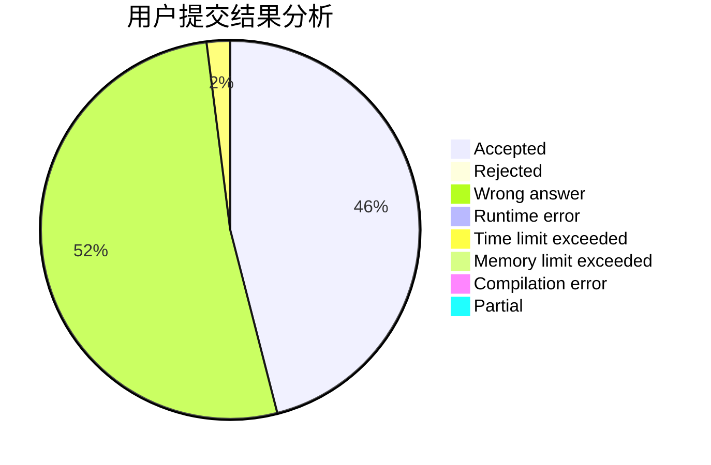
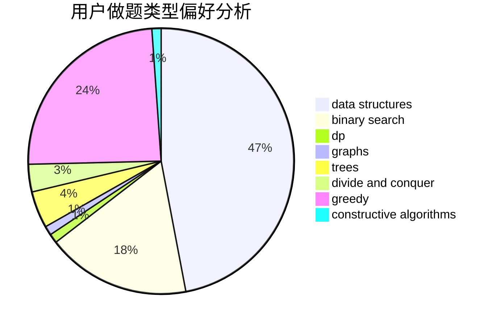
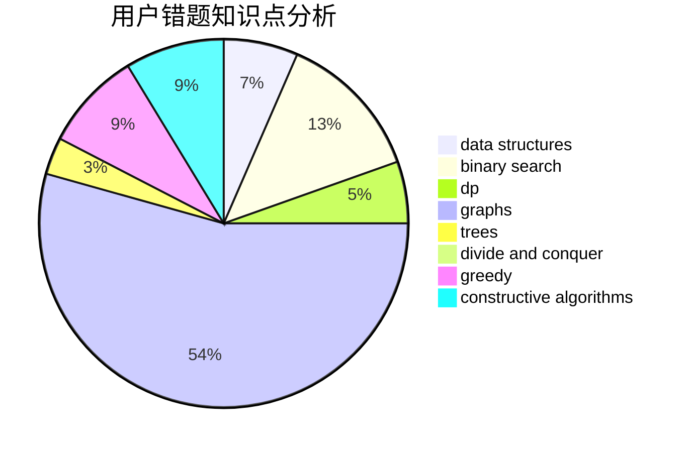

# 5ab

<!-- tabs:start -->

#### **用户提交结果分析**

#### **用户做题类型偏好分析**

#### **用户错题知识点分析**

<!-- tabs:end -->
# 推荐题目
[1391B](https://codeforces.com/contest/1391/problem/B)		brute force,
                        greedy,
                        implementation		  
[1389F](https://codeforces.com/contest/1389/problem/F)		data structures,
                        dp,
                        graph matchings,
                        sortings		  
[1391C](https://codeforces.com/contest/1391/problem/C)		combinatorics,
                        dp,
                        graphs,
                        math		  
[1064E](https://codeforces.com/contest/1064/problem/E)		dsu,graphs,sortings,trees		  
[1388B](https://codeforces.com/contest/1388/problem/B)		greedy,
                        math		  
[1391D](https://codeforces.com/contest/1391/problem/D)		bitmasks,
                        brute force,
                        constructive algorithms,
                        dp,
                        greedy,
                        implementation		  
[1367F1](https://codeforces.com/contest/1367F/problem/1)		dp,
                        greedy,
                        two pointers		  
[1005E1](https://codeforces.com/contest/1005E/problem/1)		sortings		  
[1322E](https://codeforces.com/contest/1322/problem/E)		data structures		  
[1389D](https://codeforces.com/contest/1389/problem/D)		brute force,
                        greedy,
                        implementation,
                        math		  
