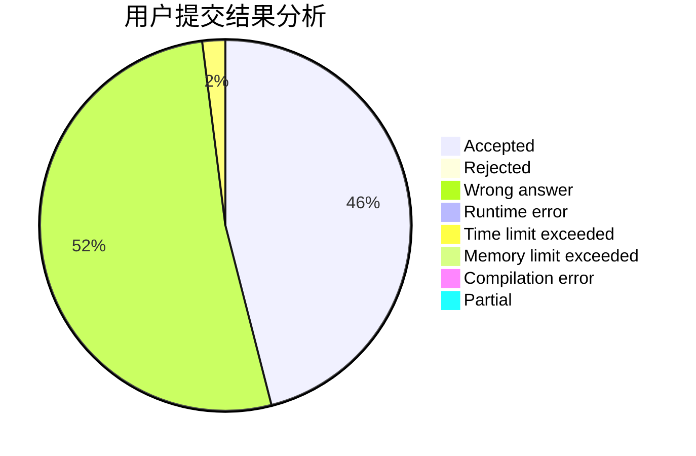
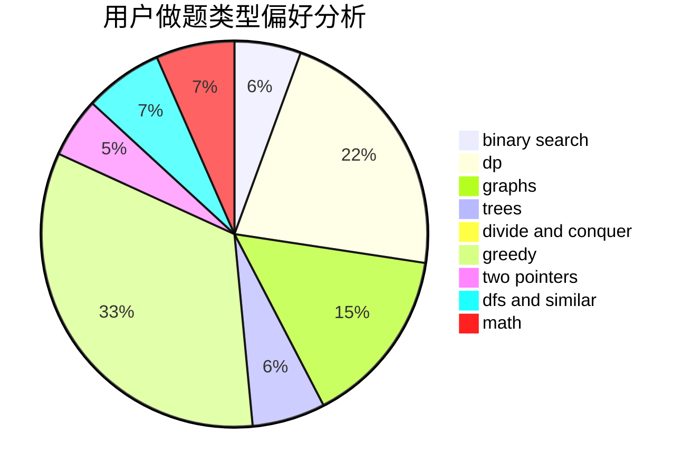

# 5ab

<!-- tabs:start -->

#### **用户提交结果分析**

#### **用户做题类型偏好分析**

<!-- tabs:end -->
# 推荐题目
[1399F](https://codeforces.com/contest/1399/problem/F)
[13992](https://codeforces.com/contest/1399/problem/2)
[139A](https://codeforces.com/contest/139/problem/A)
[1065B](https://codeforces.com/contest/1065/problem/B)
[1397E](https://codeforces.com/contest/1397/problem/E)
[13A](https://codeforces.com/contest/13/problem/A)
[1374C](https://codeforces.com/contest/1374/problem/C)
[1006A](https://codeforces.com/contest/1006/problem/A)
[1329D](https://codeforces.com/contest/1329/problem/D)
[1398G](https://codeforces.com/contest/1398/problem/G)
