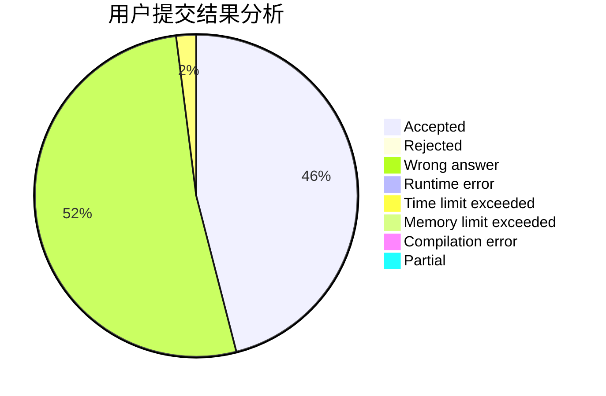
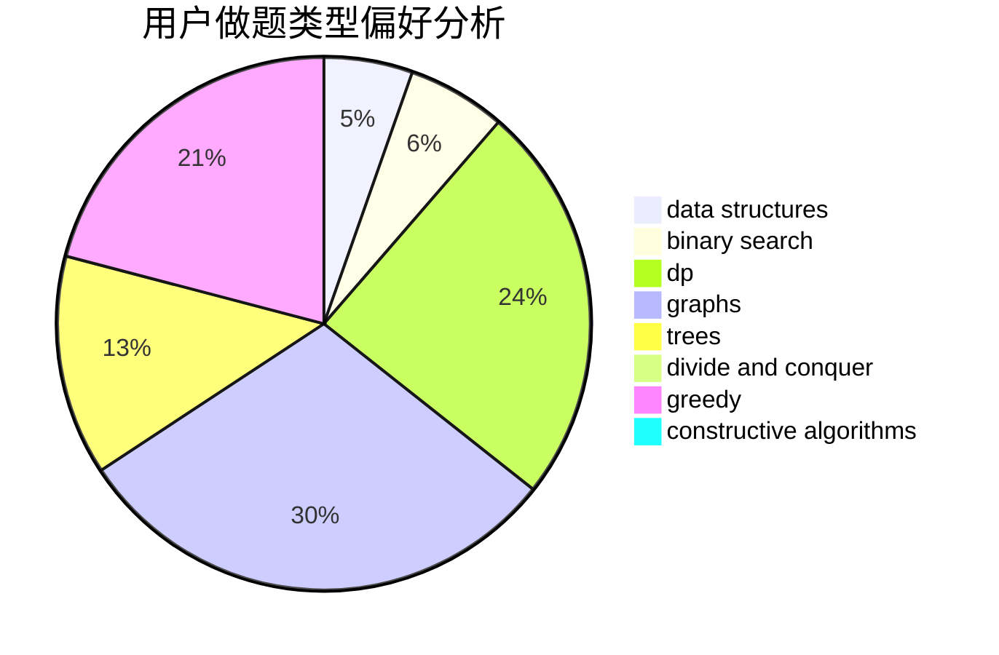
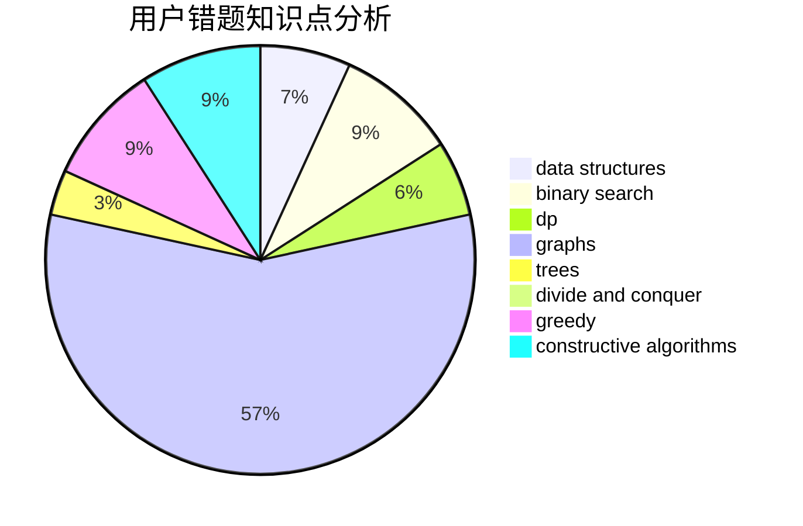

# 5ab

<!-- tabs:start -->

#### **用户提交结果分析**

#### **用户做题类型偏好分析**

#### **用户错题知识点分析**

<!-- tabs:end -->
# 推荐题目
[1399F](https://codeforces.com/contest/1399/problem/F)		data structures,
                        dp,
                        graphs,
                        sortings		  
[13992](https://codeforces.com/contest/1399/problem/2)		dsu,graphs,sortings,trees		  
[139A](https://codeforces.com/contest/139/problem/A)		implementation		  
[1065B](https://codeforces.com/contest/1065/problem/B)		constructive algorithms,
                        graphs		  
[1397E](https://codeforces.com/contest/1397/problem/E)		dsu,graphs,sortings,trees		  
[13A](https://codeforces.com/contest/13/problem/A)		implementation,
                        math		  
[1374C](https://codeforces.com/contest/1374/problem/C)		greedy,
                        strings		  
[1006A](https://codeforces.com/contest/1006/problem/A)		implementation		  
[1329D](https://codeforces.com/contest/1329/problem/D)		constructive algorithms,
                        data structures		  
[1398G](https://codeforces.com/contest/1398/problem/G)		bitmasks,
                        fft,
                        math,
                        number theory		  
