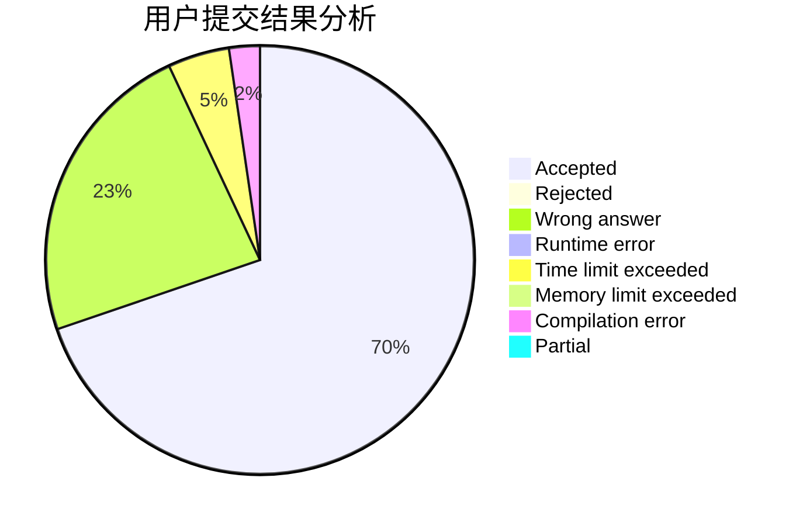
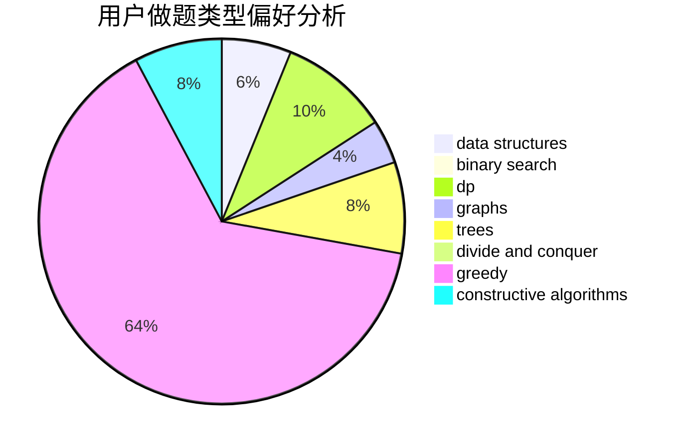

# L__A

<!-- tabs:start -->

#### **用户提交结果分析**

#### **用户做题类型偏好分析**

#### **用户错题知识点分析**

<!-- tabs:end -->
# 推荐题目
[893D](https://codeforces.com/contest/893/problem/D)		data structures,
                        dp,
                        greedy,
                        implementation		  
[463C](https://codeforces.com/contest/463/problem/C)		greedy,
                        hashing,
                        implementation		  
[804D](https://codeforces.com/contest/804/problem/D)		binary search,
                        brute force,
                        dfs and similar,
                        dp,
                        sortings,
                        trees		  
[1230F](https://codeforces.com/contest/1230/problem/F)		dsu,graphs,sortings,trees		  
[386C](https://codeforces.com/contest/386/problem/C)		dp,
                        strings,
                        two pointers		  
[56B](https://codeforces.com/contest/56/problem/B)		implementation		  
[1225A](https://codeforces.com/contest/1225/problem/A)		math		  
[1372F](https://codeforces.com/contest/1372/problem/F)		binary search,
                        divide and conquer,
                        interactive		  
[1477F](https://codeforces.com/contest/1477/problem/F)		combinatorics,
                        fft,
                        math,
                        probabilities		  
[1366E](https://codeforces.com/contest/1366/problem/E)		binary search,
                        brute force,
                        combinatorics,
                        constructive algorithms,
                        dp,
                        two pointers		  
