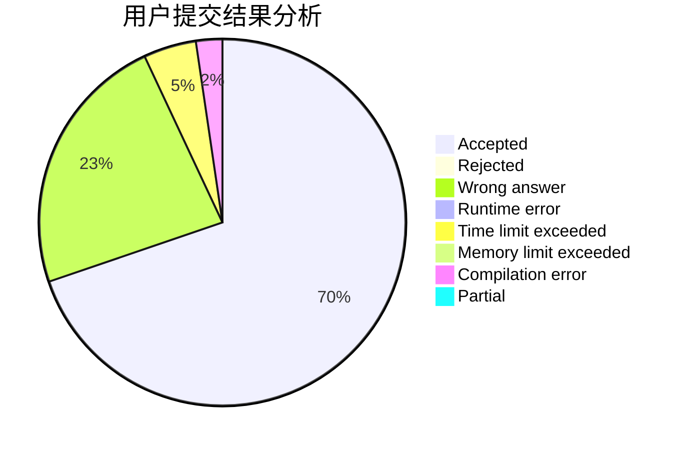
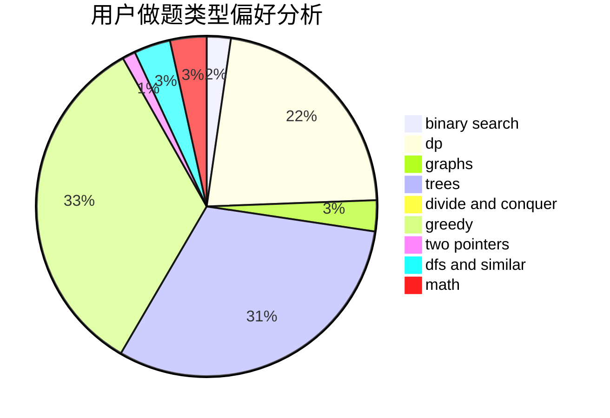

# L__A

<!-- tabs:start -->

#### **用户提交结果分析**

#### **用户做题类型偏好分析**

<!-- tabs:end -->
# 推荐题目
[893D](https://codeforces.com/contest/893/problem/D)
[463C](https://codeforces.com/contest/463/problem/C)
[804D](https://codeforces.com/contest/804/problem/D)
[1230F](https://codeforces.com/contest/1230/problem/F)
[386C](https://codeforces.com/contest/386/problem/C)
[56B](https://codeforces.com/contest/56/problem/B)
[1225A](https://codeforces.com/contest/1225/problem/A)
[1372F](https://codeforces.com/contest/1372/problem/F)
[1477F](https://codeforces.com/contest/1477/problem/F)
[1366E](https://codeforces.com/contest/1366/problem/E)
