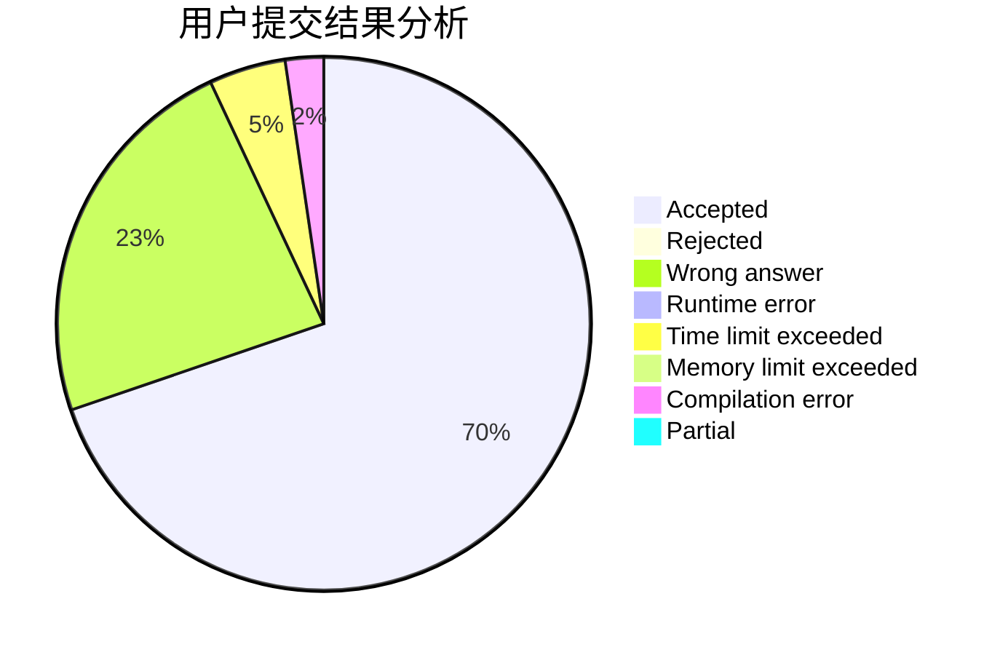
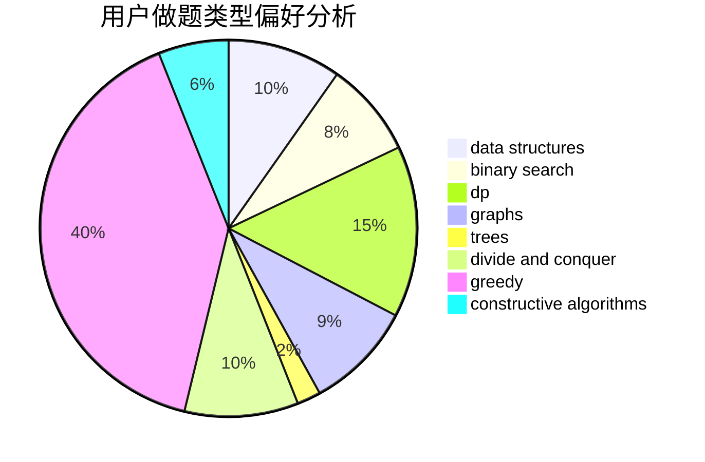

# L__A

<!-- tabs:start -->

#### **用户提交结果分析**

#### **用户做题类型偏好分析**

#### **用户错题知识点分析**

<!-- tabs:end -->
# 推荐题目
[872B](https://codeforces.com/contest/872/problem/B)		dsu,graphs,sortings,trees		  
[442E](https://codeforces.com/contest/442/problem/E)		geometry		  
[789B](https://codeforces.com/contest/789/problem/B)		brute force,
                        implementation,
                        math		  
[1223G](https://codeforces.com/contest/1223/problem/G)		binary search,
                        math,
                        number theory		  
[359C](https://codeforces.com/contest/359/problem/C)		math,
                        number theory		  
[545B](https://codeforces.com/contest/545/problem/B)		greedy		  
[1217D](https://codeforces.com/contest/1217/problem/D)		constructive algorithms,
                        dfs and similar,
                        graphs		  
[1366A](https://codeforces.com/contest/1366/problem/A)		binary search,
                        greedy,
                        math		  
[1469E](https://codeforces.com/contest/1469/problem/E)		bitmasks,
                        brute force,
                        hashing,
                        string suffix structures,
                        strings,
                        two pointers		  
[1358C](https://codeforces.com/contest/1358/problem/C)		math		  
