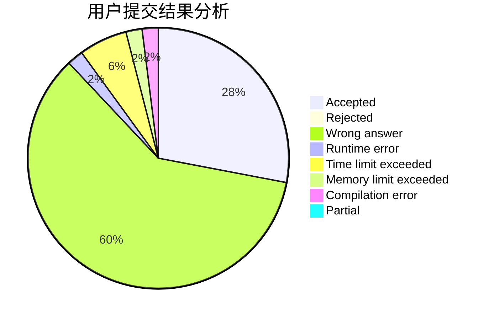
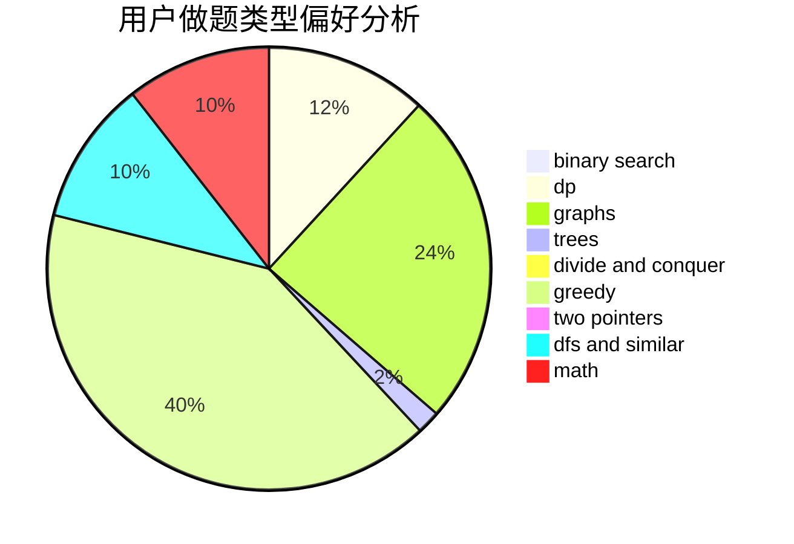

# Labyrinth_builder

<!-- tabs:start -->

#### **用户提交结果分析**

#### **用户做题类型偏好分析**

<!-- tabs:end -->
# 推荐题目
[592C](https://codeforces.com/contest/592/problem/C)
[580D](https://codeforces.com/contest/580/problem/D)
[746B](https://codeforces.com/contest/746/problem/B)
[967D](https://codeforces.com/contest/967/problem/D)
[617B](https://codeforces.com/contest/617/problem/B)
[967E](https://codeforces.com/contest/967/problem/E)
[866E](https://codeforces.com/contest/866/problem/E)
[165A](https://codeforces.com/contest/165/problem/A)
[388A](https://codeforces.com/contest/388/problem/A)
[1295F](https://codeforces.com/contest/1295/problem/F)
