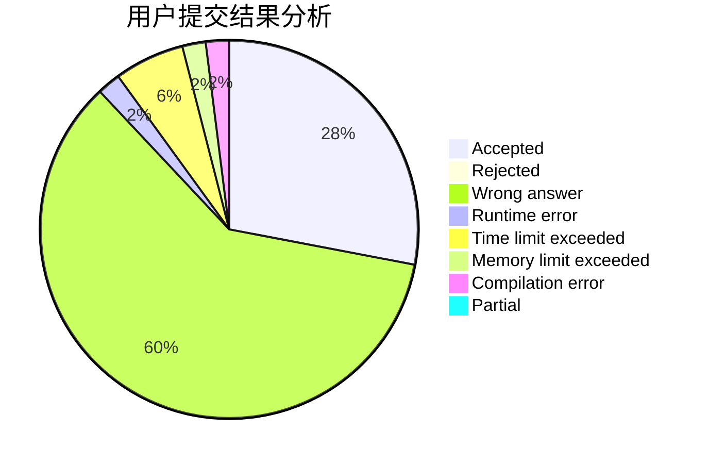
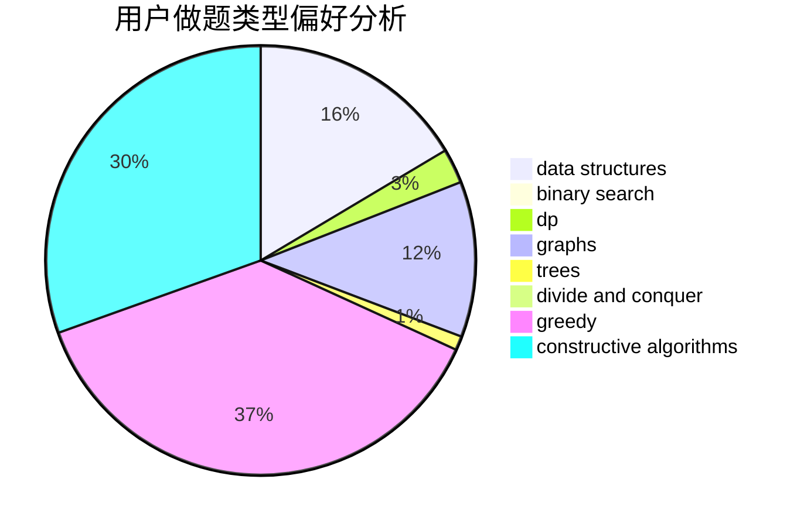
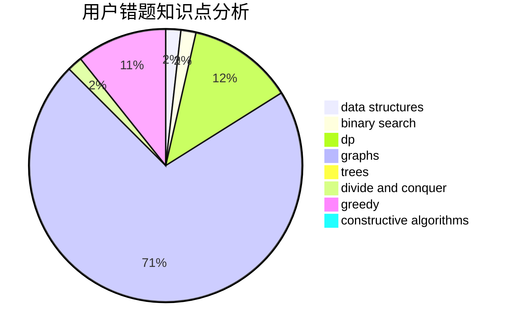

# Labyrinth_builder

<!-- tabs:start -->

#### **用户提交结果分析**

#### **用户做题类型偏好分析**

#### **用户错题知识点分析**

<!-- tabs:end -->
# 推荐题目
[592C](https://codeforces.com/contest/592/problem/C)		math		  
[580D](https://codeforces.com/contest/580/problem/D)		bitmasks,
                        dp		  
[746B](https://codeforces.com/contest/746/problem/B)		implementation,
                        strings		  
[967D](https://codeforces.com/contest/967/problem/D)		dsu,graphs,sortings,trees		  
[617B](https://codeforces.com/contest/617/problem/B)		combinatorics		  
[967E](https://codeforces.com/contest/967/problem/E)		dsu,graphs,sortings,trees		  
[866E](https://codeforces.com/contest/866/problem/E)		dsu,graphs,sortings,trees		  
[165A](https://codeforces.com/contest/165/problem/A)		implementation		  
[388A](https://codeforces.com/contest/388/problem/A)		greedy,
                        sortings		  
[1295F](https://codeforces.com/contest/1295/problem/F)		combinatorics,
                        dp,
                        probabilities		  
