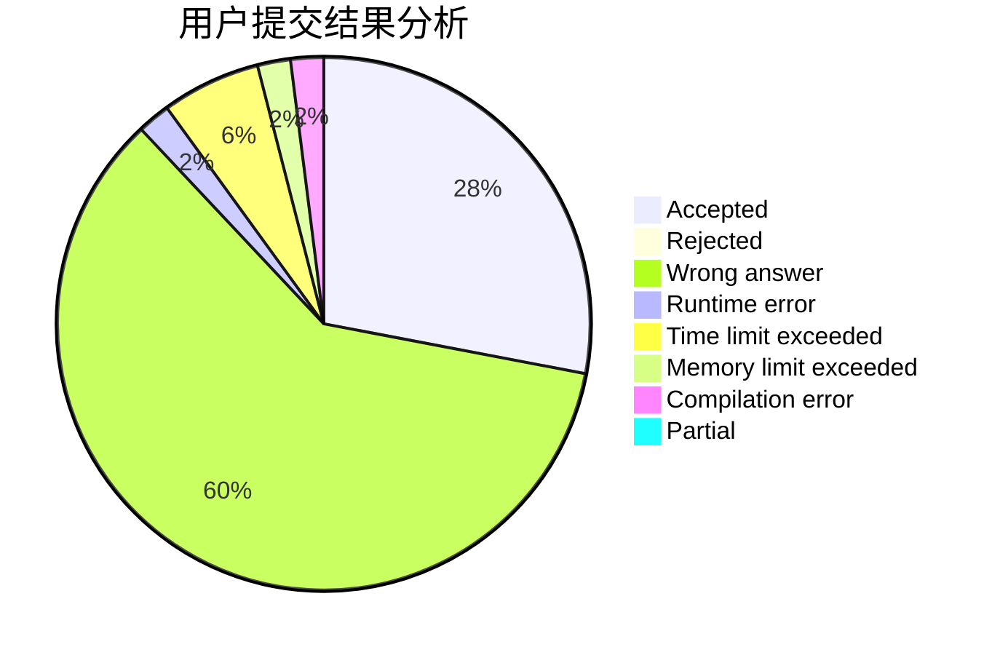
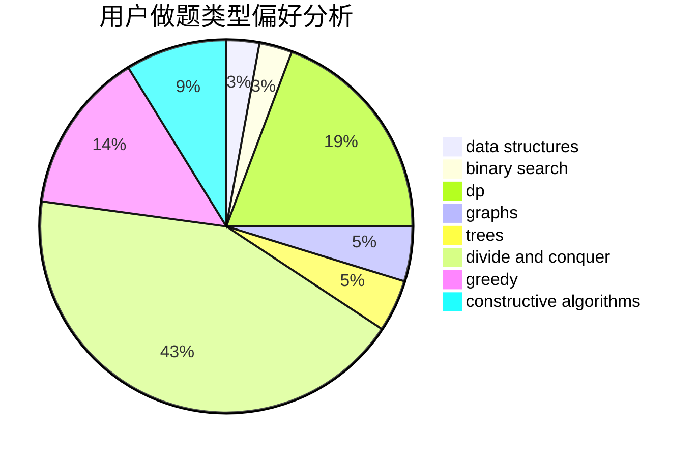
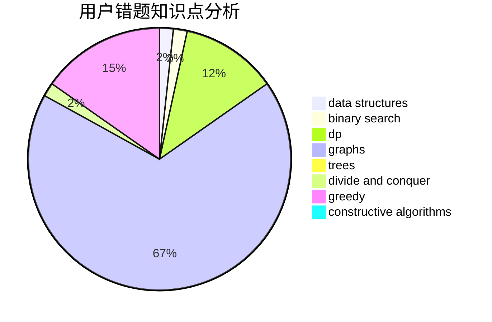

# Labyrinth_builder
<!-- tabs:start -->
#### **用户提交结果分析**

#### **用户做题类型偏好分析**

#### **用户错题知识点分析**

<!-- tabs:end -->
# 推荐题目
[Rooter's Song](http://codeforces.com/problemset/problem/848/B)		constructive algorithms,
                        data structures,
                        geometry,
                        implementation,
                        sortings,
                        two pointers		  
[Arthur and Table](http://codeforces.com/problemset/problem/557/C)		brute force,
                        data structures,
                        dp,
                        greedy,
                        math,
                        sortings		  
[Arrays](http://codeforces.com/problemset/problem/572/A)		sortings		  
[Intercepted Message](http://codeforces.com/problemset/problem/950/B)		greedy,
                        implementation		  
[Repainting Street](http://codeforces.com/problemset/problem/1415/B)		brute force,
                        brute force,
                        greedy		  
[Clusterization Counting](http://codeforces.com/problemset/problem/1408/G)		combinatorics,
                        dp,
                        dsu,
                        fft,
                        graphs,
                        trees		  
[Zebras](https://codeforces.com/contest/950/problem/C)		greedy		  
[Letter](http://codeforces.com/problemset/problem/180/C)		dp		  
[Suborrays](http://codeforces.com/problemset/problem/1391/A)		constructive algorithms,
                        math		  
[Rectangular Game](http://codeforces.com/problemset/problem/177/B2)		number theory		  
<!-- tabs:start -->
#### **data structures**
[Rooter's Song](http://codeforces.com/problemset/problem/848/B)		constructive algorithms,
                        data structures,
                        geometry,
                        implementation,
                        sortings,
                        two pointers		  
[Arthur and Table](http://codeforces.com/problemset/problem/557/C)		brute force,
                        data structures,
                        dp,
                        greedy,
                        math,
                        sortings		  
[Arrays](http://codeforces.com/problemset/problem/653/F)		data structures,
                        string suffix structures,
                        strings		  
[Intercepted Message](http://codeforces.com/problemset/problem/1468/B)		data structures,
                        dsu		  
[Repainting Street](http://codeforces.com/problemset/problem/830/B)		data structures,
                        implementation,
                        sortings		  
[Clusterization Counting](https://codeforces.com/contest/1291/problem/C)		brute force,
                        data structures,
                        implementation		  
[Zebras](http://codeforces.com/problemset/problem/1492/C)		binary search,
                        data structures,
                        dp,
                        greedy,
                        two pointers		  
[Letter](http://codeforces.com/problemset/problem/1490/G)		binary search,
                        data structures,
                        math		  
[Suborrays](http://codeforces.com/problemset/problem/1479/D)		binary search,
                        bitmasks,
                        brute force,
                        data structures,
                        probabilities,
                        trees		  
[Rectangular Game](http://codeforces.com/problemset/problem/1497/A)		brute force,
                        data structures,
                        greedy,
                        sortings		  
#### **binary search**
[Rooter's Song](http://codeforces.com/problemset/problem/1288/D)		binary search,
                        bitmasks,
                        dp		  
[Arthur and Table](http://codeforces.com/problemset/problem/1492/C)		binary search,
                        data structures,
                        dp,
                        greedy,
                        two pointers		  
[Arrays](http://codeforces.com/problemset/problem/1463/D)		binary search,
                        constructive algorithms,
                        greedy,
                        two pointers		  
[Intercepted Message](http://codeforces.com/problemset/problem/1490/G)		binary search,
                        data structures,
                        math		  
[Repainting Street](http://codeforces.com/problemset/problem/1479/D)		binary search,
                        bitmasks,
                        brute force,
                        data structures,
                        probabilities,
                        trees		  
[Clusterization Counting](http://codeforces.com/problemset/problem/1436/E)		binary search,
                        data structures,
                        two pointers		  
[Zebras](http://codeforces.com/problemset/problem/1461/D)		binary search,
                        brute force,
                        data structures,
                        divide and conquer,
                        implementation,
                        sortings		  
[Letter](http://codeforces.com/problemset/problem/1493/C)		binary search,
                        brute force,
                        constructive algorithms,
                        greedy,
                        strings		  
[Suborrays](http://codeforces.com/problemset/problem/1487/D)		binary search,
                        brute force,
                        math,
                        number theory		  
[Rectangular Game](http://codeforces.com/problemset/problem/1486/B)		binary search,
                        geometry,
                        shortest paths,
                        sortings		  
#### **dp**
[Rooter's Song](http://codeforces.com/problemset/problem/557/C)		brute force,
                        data structures,
                        dp,
                        greedy,
                        math,
                        sortings		  
[Arthur and Table](http://codeforces.com/problemset/problem/1408/G)		combinatorics,
                        dp,
                        dsu,
                        fft,
                        graphs,
                        trees		  
[Arrays](http://codeforces.com/problemset/problem/180/C)		dp		  
[Intercepted Message](http://codeforces.com/problemset/problem/729/B)		dp,
                        implementation		  
[Repainting Street](http://codeforces.com/problemset/problem/1288/D)		binary search,
                        bitmasks,
                        dp		  
[Clusterization Counting](http://codeforces.com/problemset/problem/148/D)		dp,
                        games,
                        math,
                        probabilities		  
[Zebras](http://codeforces.com/problemset/problem/1406/B)		brute force,
                        dp,
                        greedy,
                        implementation,
                        sortings		  
[Letter](https://codeforces.com/contest/759/problem/D)		brute force,
                        combinatorics,
                        dp,
                        string suffix structures		  
[Suborrays](http://codeforces.com/problemset/problem/1492/C)		binary search,
                        data structures,
                        dp,
                        greedy,
                        two pointers		  
[Rectangular Game](https://codeforces.com/contest/1457/problem/C)		brute force,
                        dp,
                        implementation		  
#### **graph**
[Rooter's Song](http://codeforces.com/problemset/problem/1408/G)		combinatorics,
                        dp,
                        dsu,
                        fft,
                        graphs,
                        trees		  
[Arthur and Table](http://codeforces.com/problemset/problem/1381/C)		constructive algorithms,
                        graph matchings,
                        greedy,
                        implementation,
                        sortings,
                        two pointers		  
[Arrays](http://codeforces.com/problemset/problem/1320/B)		dfs and similar,
                        graphs,
                        shortest paths		  
[Intercepted Message](http://codeforces.com/problemset/problem/1487/C)		brute force,
                        constructive algorithms,
                        dfs and similar,
                        graphs,
                        greedy,
                        implementation,
                        math		  
[Repainting Street](http://codeforces.com/problemset/problem/1437/C)		dp,
                        flows,
                        graph matchings,
                        greedy,
                        math,
                        sortings		  
[Clusterization Counting](http://codeforces.com/problemset/problem/1470/D)		constructive algorithms,
                        dfs and similar,
                        graph matchings,
                        graphs,
                        greedy		  
[Zebras](http://codeforces.com/problemset/problem/1476/C)		dp,
                        graphs,
                        greedy		  
[Letter](http://codeforces.com/problemset/problem/1304/D)		constructive algorithms,
                        graphs,
                        greedy,
                        two pointers		  
[Suborrays](http://codeforces.com/problemset/problem/1475/C)		combinatorics,
                        graphs,
                        math		  
[Rectangular Game](http://codeforces.com/problemset/problem/553/E)		dp,
                        fft,
                        graphs,
                        math,
                        probabilities		  
#### **trees**
[Rooter's Song](http://codeforces.com/problemset/problem/1408/G)		combinatorics,
                        dp,
                        dsu,
                        fft,
                        graphs,
                        trees		  
[Arthur and Table](http://codeforces.com/problemset/problem/1479/D)		binary search,
                        bitmasks,
                        brute force,
                        data structures,
                        probabilities,
                        trees		  
[Arrays](http://codeforces.com/problemset/problem/1511/C)		brute force,
                        data structures,
                        implementation,
                        trees		  
[Intercepted Message](http://codeforces.com/problemset/problem/1499/F)		combinatorics,
                        dfs and similar,
                        dp,
                        trees		  
[Repainting Street](http://codeforces.com/problemset/problem/1491/E)		brute force,
                        dfs and similar,
                        divide and conquer,
                        number theory,
                        trees		  
[Clusterization Counting](http://codeforces.com/problemset/problem/1466/D)		data structures,
                        greedy,
                        sortings,
                        trees		  
[Zebras](http://codeforces.com/problemset/problem/1495/D)		combinatorics,
                        dfs and similar,
                        graphs,
                        math,
                        shortest paths,
                        trees		  
[Letter](http://codeforces.com/problemset/problem/1303/G)		data structures,
                        divide and conquer,
                        geometry,
                        trees		  
[Suborrays](http://codeforces.com/problemset/problem/1454/E)		combinatorics,
                        dfs and similar,
                        graphs,
                        trees		  
[Rectangular Game](http://codeforces.com/problemset/problem/1494/D)		constructive algorithms,
                        data structures,
                        dfs and similar,
                        divide and conquer,
                        dsu,
                        greedy,
                        sortings,
                        trees		  
#### **divide and conquer**
[Rooter's Song](http://codeforces.com/problemset/problem/1461/D)		binary search,
                        brute force,
                        data structures,
                        divide and conquer,
                        implementation,
                        sortings		  
[Arthur and Table](http://codeforces.com/problemset/problem/1466/G)		combinatorics,
                        divide and conquer,
                        hashing,
                        math,
                        string suffix structures,
                        strings		  
[Arrays](http://codeforces.com/problemset/problem/1490/D)		dfs and similar,
                        divide and conquer,
                        implementation		  
[Intercepted Message](https://codeforces.com/contest/1483/problem/C)		data structures,
                        divide and conquer,
                        dp		  
[Repainting Street](http://codeforces.com/problemset/problem/1491/E)		brute force,
                        dfs and similar,
                        divide and conquer,
                        number theory,
                        trees		  
[Clusterization Counting](http://codeforces.com/problemset/problem/1303/G)		data structures,
                        divide and conquer,
                        geometry,
                        trees		  
[Zebras](http://codeforces.com/problemset/problem/1494/D)		constructive algorithms,
                        data structures,
                        dfs and similar,
                        divide and conquer,
                        dsu,
                        greedy,
                        sortings,
                        trees		  
[Letter](http://codeforces.com/problemset/problem/1482/E)		data structures,
                        divide and conquer,
                        dp		  
[Suborrays](http://codeforces.com/problemset/problem/566/C)		dfs and similar,
                        divide and conquer,
                        trees		  
[Rectangular Game](http://codeforces.com/problemset/problem/1428/F)		binary search,
                        data structures,
                        divide and conquer,
                        dp,
                        two pointers		  
#### **greedy**
[Rooter's Song](http://codeforces.com/problemset/problem/557/C)		brute force,
                        data structures,
                        dp,
                        greedy,
                        math,
                        sortings		  
[Arthur and Table](http://codeforces.com/problemset/problem/950/B)		greedy,
                        implementation		  
[Arrays](http://codeforces.com/problemset/problem/1415/B)		brute force,
                        brute force,
                        greedy		  
[Intercepted Message](https://codeforces.com/contest/950/problem/C)		greedy		  
[Repainting Street](http://codeforces.com/problemset/problem/1393/A)		greedy,
                        math		  
[Clusterization Counting](http://codeforces.com/problemset/problem/1381/C)		constructive algorithms,
                        graph matchings,
                        greedy,
                        implementation,
                        sortings,
                        two pointers		  
[Zebras](http://codeforces.com/problemset/problem/1406/B)		brute force,
                        dp,
                        greedy,
                        implementation,
                        sortings		  
[Letter](http://codeforces.com/problemset/problem/1492/C)		binary search,
                        data structures,
                        dp,
                        greedy,
                        two pointers		  
[Suborrays](https://codeforces.com/contest/1496/problem/C)		geometry,
                        greedy,
                        math,
                        sortings		  
[Rectangular Game](http://codeforces.com/problemset/problem/1493/A)		constructive algorithms,
                        greedy		  
#### **constructive algorithms**
[Rooter's Song](http://codeforces.com/problemset/problem/848/B)		constructive algorithms,
                        data structures,
                        geometry,
                        implementation,
                        sortings,
                        two pointers		  
[Arthur and Table](http://codeforces.com/problemset/problem/1391/A)		constructive algorithms,
                        math		  
[Arrays](https://codeforces.com/contest/950/problem/D)		constructive algorithms,
                        math		  
[Intercepted Message](http://codeforces.com/problemset/problem/1392/E)		bitmasks,
                        constructive algorithms,
                        interactive,
                        math		  
[Repainting Street](http://codeforces.com/problemset/problem/1381/C)		constructive algorithms,
                        graph matchings,
                        greedy,
                        implementation,
                        sortings,
                        two pointers		  
[Clusterization Counting](http://codeforces.com/problemset/problem/1401/C)		constructive algorithms,
                        math,
                        number theory,
                        sortings		  
[Zebras](http://codeforces.com/problemset/problem/820/B)		constructive algorithms,
                        geometry,
                        math		  
[Letter](http://codeforces.com/problemset/problem/1493/A)		constructive algorithms,
                        greedy		  
[Suborrays](http://codeforces.com/problemset/problem/1463/D)		binary search,
                        constructive algorithms,
                        greedy,
                        two pointers		  
[Rectangular Game](https://codeforces.com/contest/1456/problem/B)		bitmasks,
                        brute force,
                        constructive algorithms		  
#### **sortings**
[Rooter's Song](http://codeforces.com/problemset/problem/848/B)		constructive algorithms,
                        data structures,
                        geometry,
                        implementation,
                        sortings,
                        two pointers		  
[Arthur and Table](http://codeforces.com/problemset/problem/557/C)		brute force,
                        data structures,
                        dp,
                        greedy,
                        math,
                        sortings		  
[Arrays](http://codeforces.com/problemset/problem/572/A)		sortings		  
[Intercepted Message](http://codeforces.com/problemset/problem/599/C)		sortings		  
[Repainting Street](http://codeforces.com/problemset/problem/830/B)		data structures,
                        implementation,
                        sortings		  
[Clusterization Counting](http://codeforces.com/problemset/problem/1381/C)		constructive algorithms,
                        graph matchings,
                        greedy,
                        implementation,
                        sortings,
                        two pointers		  
[Zebras](http://codeforces.com/problemset/problem/1401/C)		constructive algorithms,
                        math,
                        number theory,
                        sortings		  
[Letter](http://codeforces.com/problemset/problem/1406/B)		brute force,
                        dp,
                        greedy,
                        implementation,
                        sortings		  
[Suborrays](https://codeforces.com/contest/1496/problem/C)		geometry,
                        greedy,
                        math,
                        sortings		  
[Rectangular Game](http://codeforces.com/problemset/problem/1495/A)		geometry,
                        greedy,
                        math,
                        sortings		  
<!-- tabs:end -->
