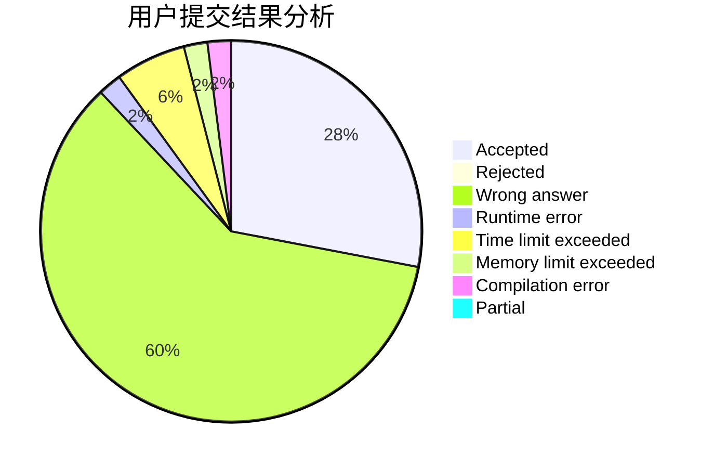
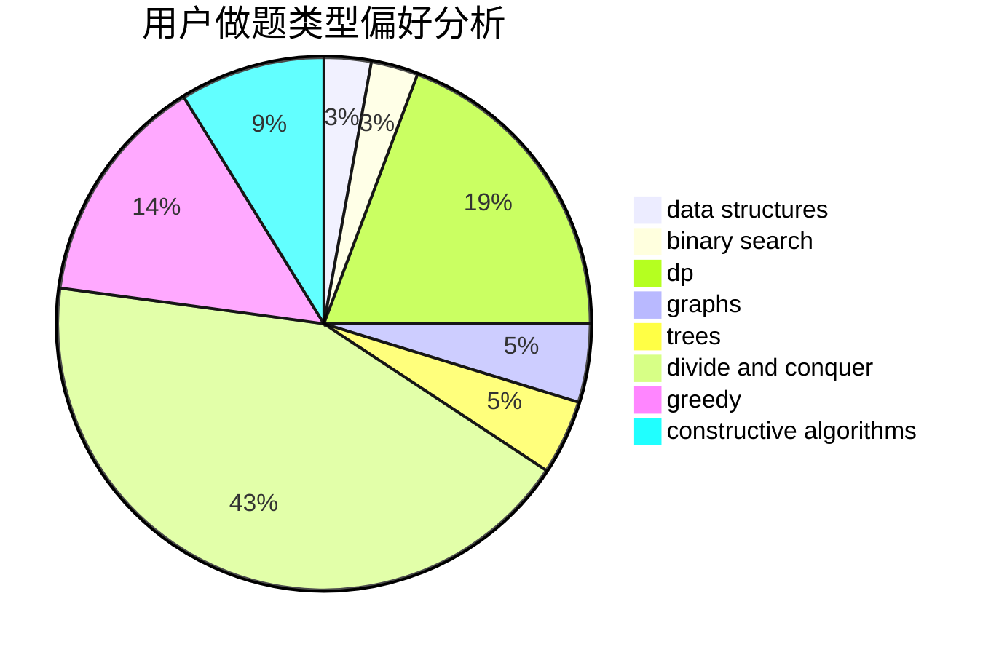
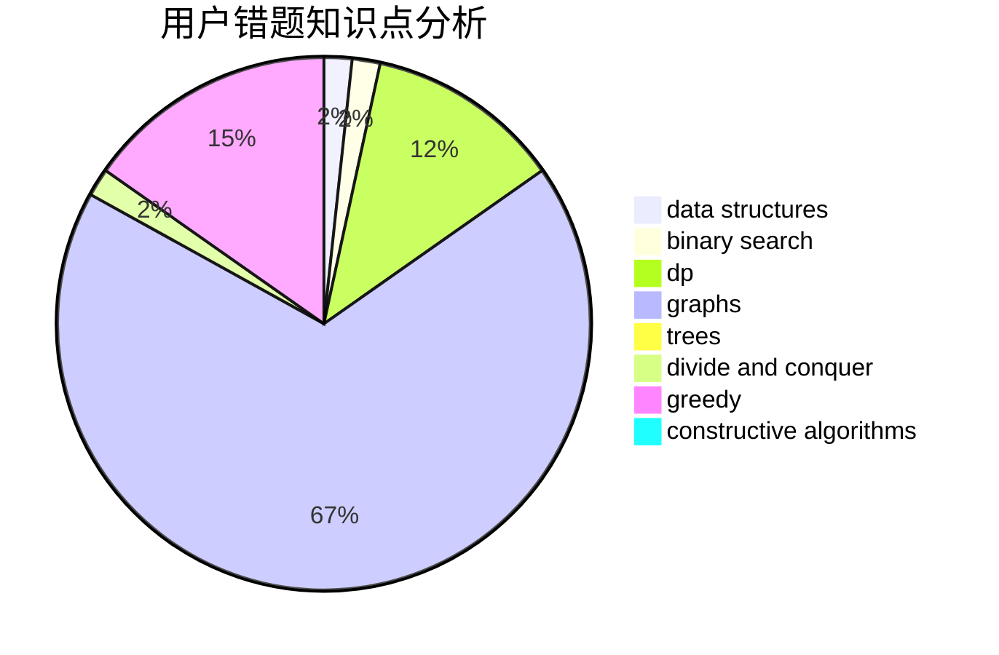

# Labyrinth_builder

<!-- tabs:start -->

#### **用户提交结果分析**

#### **用户做题类型偏好分析**

#### **用户错题知识点分析**

<!-- tabs:end -->
# 推荐题目
[572A](https://codeforces.com/contest/572/problem/A)		sortings		  
[557C](https://codeforces.com/contest/557/problem/C)		brute force,
                        data structures,
                        dp,
                        greedy,
                        math,
                        sortings		  
[729B](https://codeforces.com/contest/729/problem/B)		dp,
                        implementation		  
[950B](https://codeforces.com/contest/950/problem/B)		greedy,
                        implementation		  
[599C](https://codeforces.com/contest/599/problem/C)		sortings		  
[950C](https://codeforces.com/contest/950/problem/C)		dsu,graphs,sortings,trees		  
[848B](https://codeforces.com/contest/848/problem/B)		constructive algorithms,
                        data structures,
                        geometry,
                        implementation,
                        sortings,
                        two pointers		  
[1510E](https://codeforces.com/contest/1510/problem/E)		nan		  
[35C](https://codeforces.com/contest/35/problem/C)		brute force,
                        dfs and similar,
                        shortest paths		  
[1288D](https://codeforces.com/contest/1288/problem/D)		binary search,
                        bitmasks,
                        dp		  
